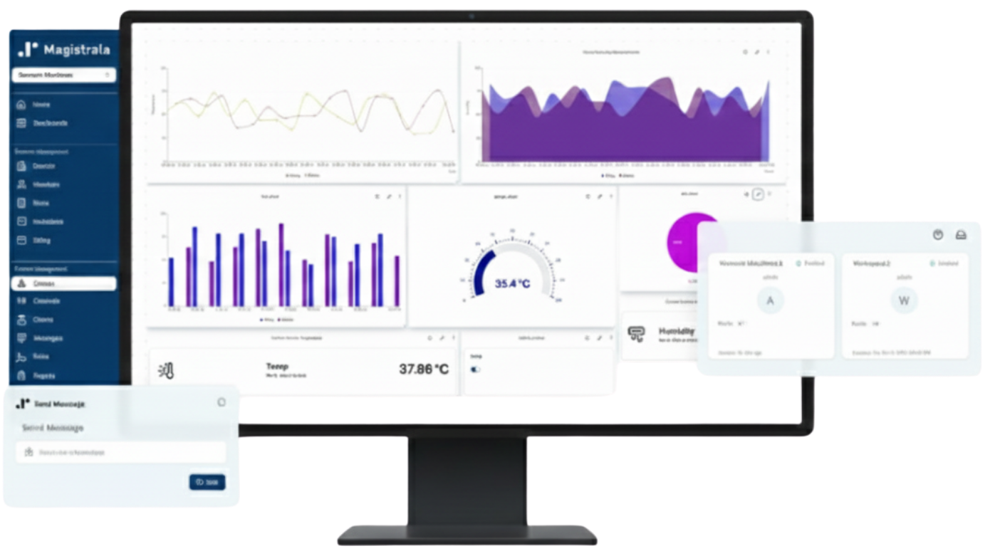

## About

### What is Magistrala?

Magistrala is a cutting-edge, open-source IoT cloud platform built on top of [SuperMQ][supermq]. It serves as a robust middleware solution for building complex IoT applications. With Magistrala, you can connect and manage IoT devices seamlessly using multi-protocol support, all while ensuring security and scalability.

It accepts user and client connections over various network protocols (i.e. HTTP, MQTT, WebSocket, CoAP), thus making a seamless bridge between them. It is used as the IoT middleware for building complex IoT solutions as one of its capabilities in modern software as a service functionalities.

### Features

- Protocol bridging (i.e. HTTP, MQTT, WebSocket, CoAP).
- Device management and provisioning.
- Fine-grained access control.
- Platform logging and instrumentation support.
- Container-based deployment using Docker.
- Data ingestion, processing and storage.
- Scalable and distributed by design.
- Multi-tenancy support.
- Multi-User Platform.
- Extensibility and customization support.
- Mutual TLS Authentication (mTLS).
- Message Persistance.
- Rules Engine.
- Alarms and Triggers.
- Event Sourcing.
- Edge and IoT ready.
- Developer Tools with comprehensive SDK and CLI.
- Domain-Driven Design.

## Contributing to Magistrala

Thank you for your interest in Magistrala and the desire to contribute!

Take a look at our [open issues][open-issues]. The [good-first-issue][good-first-issue] label is specifically for issues that are great for getting started. Checkout the [contribution guide][contribution-guide] to learn more about our style and conventions. Make your changes compatible to our workflow.

## License

[Apache-2.0][license]

[open-issues]: https://github.com/absmach/magistrala/issues
[good-first-issue]: https://github.com/absmach/magistrala/labels/good-first-issue
[contribution-guide]: https://github.com/absmach/magistrala/blob/main/CONTRIBUTING.md
[license]: https://github.com/absmach/magistrala/blob/main/LICENSE
[supermq]: https://github.com/absmach/supermq
