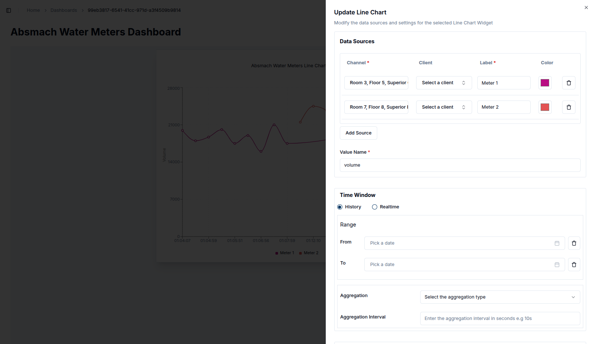
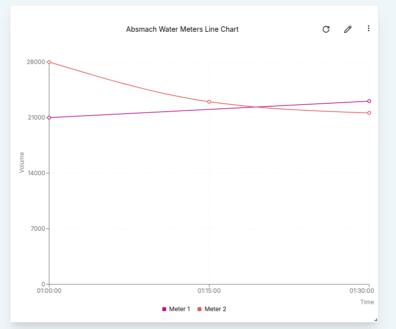

### **1. Line Chart**

To create a Line Chart, first ensure that the dashboard is in **Edit Mode**.
Click on the '+ Add Widget' button, which will open a dialog box displaying all the available widgets.
Select the **Line Chart** option from the list.

This will open the **Create Line Chart** dialog, where you can configure the chart's settings and data sources. Let’s start by setting up a single data source.

1. **Value Name**: Enter the name of the value that will be used to fetch the messages.
2. **Channel**: Choose the channel connected to the device you want to track.
3. **Client**: Select the client (device/entity) connected to the specified channel.
4. **Label**: Provide a label to track each data source clearly on the chart.
5. **Line Color**: Use the color picker to choose the color for the line.

After configuring the data sources, you can define a **Time Window** by specifying the "From" and "To" dates to constrain the data within a specific time interval.

In the **Settings** tab, you can also adjust the **Line Width** to set the thickness of the lines, depending on your visual preference.

Once you're satisfied with your settings, click the **Create** button to save the Line Chart widget.
This will close the dialog and add the new Line Chart to your dashboard.

You can edit the chart at any time by clicking the **Pencil Icon** on the widget. This will open a settings sheet on the right, where you can modify the chart’s data sources, labels, intervals, and title.

At this stage, you can also edit the labels, intervals, and chart title:

Clicking on Update button will save the changes and adjust the chart to match the new settings.
A confirmation message (toast notification) will appear to confirm the update has been applied.

This data can be further manipulated using the **Time Window** settings.
We can restrict the data shown to a specific interval for example an hour as shown in these settings:

This will adjust the chart to display data within the defined time frame, ensuring the final data point is at or before the specified _To_ date.

Additionally, you can apply **Aggregation** to the data points. Aggregation requires a "From" value, a "To" value, and an interval. These settings help structure the query to the database for aggregated data.

In the example above, the chart is set to show the **Maximum** value over 10-minute intervals within a 100-minute time window.

The resulting chart will look like this:

Aggregation options include:

- **Maximum**
- **Minimum**
- **Sum**
- **Count**
- **Average**
