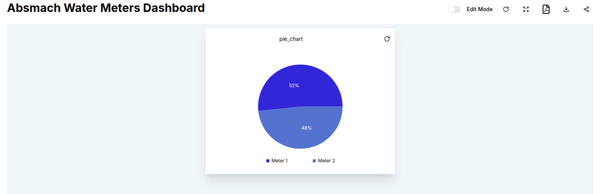
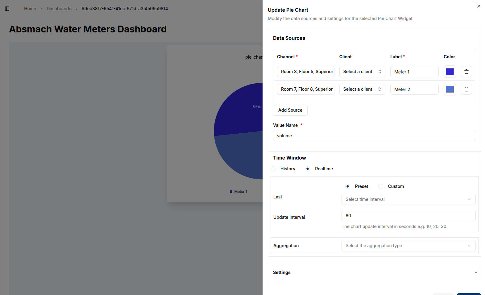
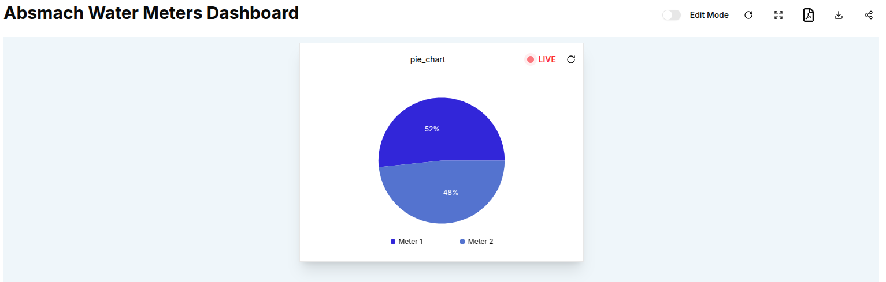

Pie Charts offer a simple yet effective way to compare different data points by visualizing them as proportions of a whole.
Unlike other timeseries charts, Pie Charts only display the **latest value** from each data source, making them ideal for showing the most recent data from multiple sources in a comparative manner.

To create a Pie Chart, ensure that your dashboard is in **Edit Mode**.
Click the '+ Add Widget' button, and from the list of available widgets, select **Pie Chart**.

This opens the **Create Pie Chart** dialog, where you will configure the chart’s data sources and settings.

After filling in the required fields of valueName and dataSources, you can add a unique title and adjust the refresh interval.

These are the required fields to configure the Pie Chart;

1. **Value Name**: Enter the name of the value that will be displayed, such as voltage or temperature.
2. **Channel**: Select the channel that provides the data. Ensure to select more than one channel by clicking "Add Source"
3. **Thing**: Choose the entity or device connected to the respective channels.
4. **Label**: Provide a label for each data source, as it will help distinguish the different segments of the pie.
5. **Color**: Select a color for each data source slice in the Pie Chart.

Once you have configured the data sources, you can define a **Time Window** by specifying the "From" and "To" dates in order to use historical data.
The Pie Chart will display the latest message within this time window, locking onto the last message received during the specified period.
In the **Settings** tab, you can adjust the **Update Interval** to determine how often the chart refreshes with new data.

Once everything is set, click the **Create** button to save the Pie Chart widget and add it to your dashboard.

To edit a Pie Chart, click the **Pencil Icon** on the top-right corner of the widget.
This will open the edit sheet on the right, where you can adjust the data sources, labels, colors, time window, and other settings.

1. **Adding More Data Sources**: You can add additional data sources to compare more metrics.
2. **Modifying Time Window**: Adjust the "From" and "To" dates to capture the desired time period for the latest values.
3. **Delete a Data Source**: Use the **Trash Icon** to remove any data source.

After making the necessary changes, click the **Update** button to apply the modifications.
The chart will refresh, displaying the updated data and settings.
This is an edited chart showing live data.

Pie Charts also support **Aggregation**, allowing you to show a summary value (such as **Maximum**, **Minimum**, **Sum**, **Count**, or **Average**) from the data in each time window.
However, unlike other timeseries charts, you don’t need to specify an interval—the time window itself defines the aggregation range, and the chart will only display the aggregated value for each data source.

For example, setting the aggregation to **Maximum** will display the highest value of each data source within the specified time window, helping you understand the overall distribution of data across different sources.

#### Customizing Pie Charts

- **Multiple Data Sources**: To get the most out of Pie Charts, it’s recommended to add multiple data sources. This way, you can easily compare how different data points relate to each other.
- **Color Customization**: Each slice in the pie chart represents a different data source, and the color picker allows you to easily distinguish between them.

With the ability to lock onto the latest message in a time window and aggregate data over specific periods, Pie Charts are a powerful tool for comparing real-time or recent data from multiple devices or channels in a visually appealing format.
