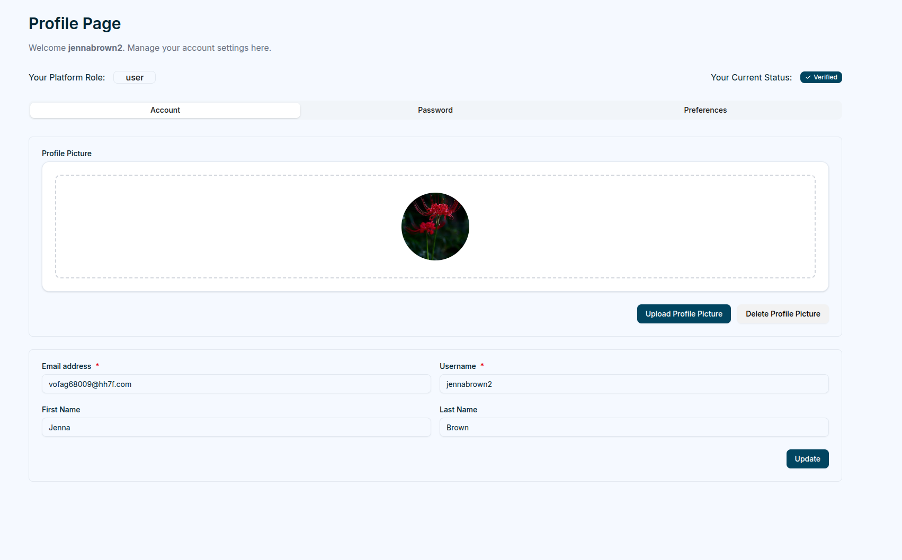

## User Profile

Each user has access to a **Profile Page**, where personal information, security settings, and preferences can be updated.

Clicking on the `user profile picture` or `avatar` at the top right opens a popover.

#### Standard User Menu

- **Profile**
- **Domains**
- **Logout**

Selecting the Profile option reveals three main tabs:

### Account
The **Account** tab allows users to update their names, email and upload a profile picture.

### Password
The **Password** tab focuses on security. Users can change their password by entering their current password, followed by the new password (which MUST pass verification) and its confirmation.
> **Note:** After updating the password, the current session will be terminated, requiring the user to log in again with the new credentials.

### Preferences
The **Preferences** tab enables users to customize language and theme settings.

Magistrala currently supports **English**, **German**, and **Serbian** languages and offers four different themes to choose from.

## Password Recovery

If a user forgets their password, they can click the `Forgot Password` link on the login page. This directs them to a page where they enter their email address to receive a password reset link.

The reset password link contains a unique token. Clicking the link redirects the user to the **Reset Password** page, where a new password can be created and confirmed. After resetting the password, the user can log into the system with the new credentials.
