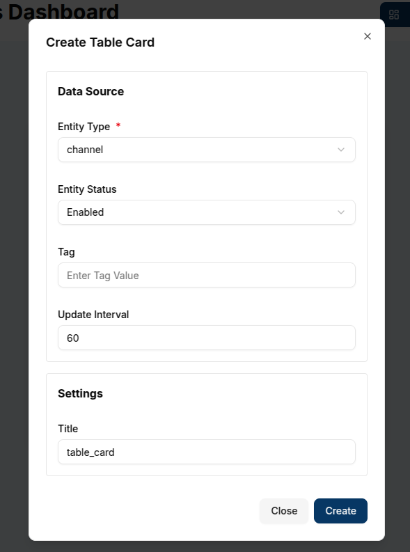

A **Table Card** displays a list of entities (such as devices, members, or groups) within a domain, showing both enabled and disabled entities.
It also includes pagination to help manage large lists effectively.

## Create a Table Card

To create a Table Card, ensure your dashboard is in **Edit Mode**.
Click the **+ Add Widget** button and select **Table Card** from the list of available widgets.

This will open the **Create Table Card** dialog, where you can configure the card's data source and appearance.

### Configuring the Table Card

1. **Entity Type**: Select the type of entity you wish to display in the table. The available options include:
   - **Client** (device)
   - **Channel**
   - **Member**- the users assigned to the currently logged in domain.
   - **Group**

2. **Entity Status**: Choose whether to display only enabled entities, disabled entities, or both.
3. **Tag**: Optionally, you can filter the entities shown by specifying a tag. Only entities with the given tag will be displayed.
4. **Update Interval**: Set the interval for how often the table should refresh to show the latest data. For example, an interval of `60` seconds will refresh the table every minute.
5. **Title**: Provide a title for your table card. This will be displayed at the top of the widget.

   

Once all the necessary fields are completed, click the **Create** button to add the Table Card to your dashboard.

The table card will immediately display the list of entities based on the selected data source and filters.

The table will include columns like:

- **Name**: The name of the entity (e.g., device name).
- **Status**: Whether the entity is enabled or disabled.
- **Created At**: The timestamp of when the entity was created.

   

The card also includes pagination at the bottom, allowing you to navigate through multiple pages of entities.

You can edit a Table Card by clicking the **Pencil Icon** in the top-right corner of the widget.
This will open a sheet on the right, allowing you to adjust the data source, entity status, tag, and other settings.

## Edit the Table Card

1. **Data Source**: Modify the **Entity Type**, **Status**, or **Tag** to change the entities displayed in the table.
2. **Update Interval**: Adjust how often the table should refresh with the latest data.
3. **Title**: Update the title of the table card to reflect any new data or focus.

   

Once the updates are made, click **Update** to save the changes.

The table card will refresh with the new data and settings.

   

### Customizing Table Cards

- **Entity Types**: Table Cards are versatile because they can display a variety of entities (Clients, Channels, Members, Groups). Each selection offers relevant insights into your domain's structure and activity.

- **Tags**: By applying tags, you can filter the list to show specific groups of entities, which is useful for managing large numbers of devices or users.
- **Pagination**: For larger datasets, the pagination feature allows you to control the number of rows displayed per page, ensuring better performance and ease of navigation.

With Table Cards, you can effectively monitor and manage lists of entities within a domain, making them ideal for reviewing the status of devices, members, or groups in an organized and customizable format.
