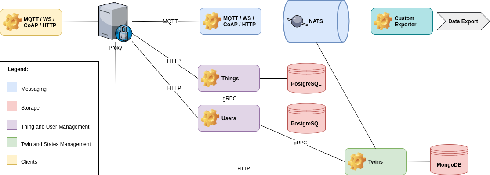

## Twins Service
*Mainflux twins service is built on top of the Mainflux platform. In order to fully understand what follows, be sure to get acquainted with [overall Mainflux architecture](architecture.md).*

### What is Digital Twin
**Twin** refers to a **digital representation** of a **real world data system** consisting of possibly multiple data sources/producers and/or destinations/consumers (data agents).

For example, an industrial machine can use multiple protocols such as MQTT, OPC-UA, a regularly updated machine hosted CSV file etc. to send measurement data - such as flowrate, material temperature, etc. - and state metadata - such as engine and chassis temperature, engine rotations per seconds, identity of the current human operator, etc. - as well as to receive control, i.e. actuation messages - such as, turn on/off light, increment/decrement borer speed, change blades, etc.

Digital twin is an abstract - and usually less detailed - digital replica of a real world system such as the industrial machine we have just described. It is used to create and store information about system's state at any given moment, to compare system state over a given period of time - so-called diffs or deltas - as well as to control agents composing the system.

### Mainflux Digital Twin
Any data producer or data consumer - which we refer to here collectively as data agent - or an interrelated system of data agents, can be represented by means of possibly multiple [Mainflux things, channels and subtopics](architecture.md). For example, an OPC-UA server can be represented as a Mainflux thing and its nodes can be represented as multiple Mainflux channels or multiple subtopics of a single Mainflux channel. What is more, you can invert the representation: you can represent server as a channel and node as things. Mainflux platform is meant to empower you with the freedom of expression so you can make a digital representation of any data agent according to your needs.

Although this works well, satisfies the requirements of a wide variety of use cases and corresponds to the intended use of Mainlfux IoT platform, this setup can be insufficient in two important ways. Firstly, different things, channels, and their connections - i.e. Mainflux representations of different data agent structures - are unrelated to each other, i.e. they do not form a **meaningful whole** and, as a consequence, they do not represent a **single unified system**. Secondly, the **semantic** aspect, i.e. the **meaning** of different things and channels is not transparent and defined by the sole use of Mainflux platform entities (channels and things).

Certainly, we can try to describe things and channels connections and relations as well as their meaning - i.e. their role, position, function in the overall system - by means of their [metadata](provision.md). Although this might work well - with a proviso of a lot of additional effort of writing the relatively complex code to create and parse metadata - it is not a practical approach and we still don't get - at least not out of the box - a readable and useful overview of the system as a whole. Also, this approach does not enable us to answer a simple but very important question, i.e. what was the detailed state of a complete system at a certain moment in time.

To overcome these problems, Mainflux comes with a **digital twin service**. The twins service is built on top of the Mainflux platform and relies on its architecture and entities, more precisely, on Mainflux users, things and channels. The primary task of the twin service is to handle Mainflux digital twins. Mainflux digital twin consists of three parts:

- General data about twin itself, i.e. **twin's metadata**,
- History of twin's **definitions**, including current definition,
- History of twin's **states**, including current state.

### Mainflux Platform and Mainflux Twins Service
Mainflux Twins service depends on the Mainflux IoT platform. The following diagram shows the place of the twins service in the overall [Mainflux architecture](architecture.md):



You use an HTTP client to communicate with the twins service. Every request sent to the twins service is authenticated by users service. Twins service handles CRUD requests and creates, retrieves, updates and deletes twins. The CRUD operations depend on the database to persist and fetch already saved twins.

Twins service listens to NATS server and intercepts messages passing *via* NATS broker. Every Mainflux message contains information about subchannel and topic used to send a message. Twins service compares this info with attribute definitions of twins persisted in the database, fetches the corresponding twins and updates their respective states.

Before we dwell into twin's anatomy, it is important to realize that in order to use Mainflux twin service, you have to [provision Mainflux things and channels](provision.md) and you have to connect things and channels beforehand. As you go, you can modify your things, channels and connections and you can modify your digital twin to reflect these modifications, but you have to have at least a minimal setup in order to use the twin service.

### Twin's Anatomy
Twin's **general information** stores twin's owner email - owner is represented by Mainflux user -, twin's ID (unique) and name (not necessarily unique), twin's creation and update dates as well as twin's revision number. The latter refers to the sequential number of twin's definition.

The twin's **definition** is meant to be a semantic representation of system's data sources and consumers (data agents). Each data data agent is represented by means of **attribute**. Attribute consists of data agent's name, Mainflux channel and subtopic over which it communicates. Nota bene: each attribute is uniquely defined by the combination of channel and subtopic and we cannot have two or more attributes with the same channel and subtopic in the same definition.

Attributes have a state persistence flag that determines whether the messages communicated by its corresponding channel and subtopic trigger the creation of a new twin state. Twin states are persisted in the separate collection of the same database. Currently, twins service uses the MongoDB. InfluxDB support for twins and states persistence is on the roadmap.

When we define our digital twin, its JSON representation might look like this:

```json
{
    "owner": "john.doe@email.net",
    "id": "a838e608-1c1b-4fea-9c34-def877473a89",
    "name": "grinding machine 2",
    "revision": 2,
    "created": "2020-05-05T08:41:39.142Z",
    "updated": "2020-05-05T08:49:12.638Z",
    "definitions": [
        {
            "id": 0,
            "created": "2020-05-05T08:41:39.142Z",
            "attributes": [],
            "delta": 1000000
        },
        {
            "id": 1,
            "created": "2020-05-05T08:46:23.207Z",
            "attributes": [
                {
                    "name": "engine temperature",
                    "channel": "7ef6c61c-f514-402f-af4b-2401b588bfec",
                    "subtopic": "engine",
                    "persist_state": true
                },
                {
                    "name": "chassis temperature",
                    "channel": "7ef6c61c-f514-402f-af4b-2401b588bfec",
                    "subtopic": "chassis",
                    "persist_state": true
                },
                {
                    "name": "rotations per sec",
                    "channel": "a254032a-8bb6-4973-a2a1-dbf80f181a86",
                    "subtopic": "",
                    "persist_state": false
                }
            ],
            "delta": 1000000
        },
        {
            "id": 2,
            "created": "2020-05-05T08:49:12.638Z",
            "attributes": [
                {
                    "name": "engine temperature",
                    "channel": "7ef6c61c-f514-402f-af4b-2401b588bfec",
                    "subtopic": "engine",
                    "persist_state": true
                },
                {
                    "name": "chassis temperature",
                    "channel": "7ef6c61c-f514-402f-af4b-2401b588bfec",
                    "subtopic": "chassis",
                    "persist_state": true
                },
                {
                    "name": "rotations per sec",
                    "channel": "a254032a-8bb6-4973-a2a1-dbf80f181a86",
                    "subtopic": "",
                    "persist_state": false
                },
                {
                    "name": "precision",
                    "channel": "aed0fbca-0d1d-4b07-834c-c62f31526569",
                    "subtopic": "",
                    "persist_state": true
                }
            ],
            "delta": 1000000
        }
    ]
}
```

In the case of the upper twin, we begin with an empty definition, the one with the `id` **0** - we could have provided the definition immediately - and over the course of time, we add two more definitions, so the total number of revisions is **2** (revision index is zero-based). We decide not to persist the number of rotation per second in our digital twin state. We define it, though, because the definition and its attributes are used not only to define states of a complex data agent system, but also to define the semantic structure of the system. `delta` is the number of nanoseconds used to determine whether the received attribute value should trigger the generation of the new state or the same state should be updated. The reason for this is to enable state sampling over the regular intervals of time. Discarded values are written to the database of choice by Mainflux [writers](storage.md), so you can always retrieve intermediate values if need be.

**states** are created according to the twin's current definition. A state stores twin's ID - every state belongs to a single twin -, its own ID, twin's definition number, creation date and the actual payload. **Payload** is a set of key-value pairs where a key corresponds to the attribute name and a value is the actual value of the attribute. All [SenML value types](https://tools.ietf.org/html/rfc8428#section-4.3) are supported.

A JSON representation of a partial list of states might look like this:

```json
{
    "total": 28,
    "offset": 10,
    "limit": 5,
    "states": [
        {
            "twin_id": "a838e608-1c1b-4fea-9c34-def877473a89",
            "id": 11,
            "definition": 1,
            "created": "2020-05-05T08:49:06.167Z",
            "payload": {
                "chassis temperature": 0.3394171011161684,
                "engine temperature": 0.3814079472715233
            }
        },
        {
            "twin_id": "a838e608-1c1b-4fea-9c34-def877473a89",
            "id": 12,
            "definition": 1,
            "created": "2020-05-05T08:49:12.168Z",
            "payload": {
                "chassis temperature": 1.8116442194724147,
                "engine temperature": 0.3814079472715233
            }
        },
        {
            "twin_id": "a838e608-1c1b-4fea-9c34-def877473a89",
            "id": 13,
            "definition": 2,
            "created": "2020-05-05T08:49:18.174Z",
            "payload": {
                "chassis temperature": 1.8116442194724147,
                "engine temperature": 3.2410616702795814
            }
        },
        {
            "twin_id": "a838e608-1c1b-4fea-9c34-def877473a89",
            "id": 14,
            "definition": 2,
            "created": "2020-05-05T08:49:19.145Z",
            "payload": {
                "chassis temperature": 3.2410616702795814,
                "engine temperature": 3.2410616702795814,
                "precision": 8.922156489392854
            }
        },
        {
            "twin_id": "a838e608-1c1b-4fea-9c34-def877473a89",
            "id": 15,
            "definition": 2,
            "created": "2020-05-05T08:49:24.178Z",
            "payload": {
                "chassis temperature": 0.8694383878692546,
                "engine temperature": 3.2410616702795814,
                "precision": 8.922156489392854
            }
        }
    ]
}
```

As you can see, the first two states correspond to the definition **1** and have only two attributes in the payload. The rest of the states is based on the definition **2**, where we persist three attributes and, as a consequence, its payload consists of three entries.

### Authentication and Authorization
Twin belongs to a Mainflux user, tenant representing a physical person or an organization. User owns Mainflux things and channels as well as twins. Mainflux user provides authorization and authentication mechanisms to twins service. For more details, please see [Authentication with Mainflux keys](authentication.md). In practical terms, we need to create a Mainflux user in order to create a digital twin. Every twin belongs to exactly one user. One user can have unlimited number of digital twins.

### Twin Operations
For more information about the Twins service HTTP API please refer to the [twins service OpenAPI file](https://github.com/mainflux/mainflux/blob/master/api/twins.yml).

#### Create and Update
Create and update requests use JSON body to initialize and modify, respectively, twin. You can omit every piece of data - every key-value pair - from the JSON. However, you must send at least an empty JSON body.

```json
{
  "name": "twin_name",
  "definition": {
    "attributes": [
      {
        "name": "temperature",
        "channel": "3b57b952-318e-47b5-b0d7-a14f61ecd03b",
        "subtopic": "temperature",
        "persist_state": true
      },
      {
        "name": "humidity",
        "channel": "3b57b952-318e-47b5-b0d7-a14f61ecd03b",
        "subtopic": "humidity",
        "persist_state": false
      },
      {
        "name": "pressure",
        "channel": "7ef6c61c-f514-402f-af4b-2401b588bfec",
        "subtopic": "",
        "persist_state": true
      }
    ],
    "delta": 1
  }
}
```

##### Create
Create request uses POST HTTP method to create twin:

```bash
curl -s -S -i -X POST -H "Content-Type: application/json" -H "Authorization: <user_auth_token>" http://localhost:8191/twins -d '<twin_data>'
```

If you do not suply the definition, the empty definition of the form

```json
{
    "id": 0,
    "created": "2020-05-05T08:41:39.142Z",
    "attributes": [],
    "delta": 1000000
}
```

will be created.

##### Update
```bash
curl -s -S -i -X PUT -H "Content-Type: application/json" -H "Authorization: <user_auth_token>" http://localhost:8191/<twin_id> -d '<twin_data>'
```

#### View
```bash
curl -s -S -i -X GET -H "Authorization: <user_auth_token>" http://localhost:8191/twins/<twin_id>
```

#### List

```bash
curl -s -S -i -X GET -H "Authorization: <user_auth_token>" http://localhost:8191/twins
```

List requests accepts `limit` and `offset` query parameters. By default, i.e. without these parameters, list requests fetches only first ten twins (or less, if there are less then ten twins).

You can fetch twins [10-29) like this:

```bash
curl -s -S -i -X GET -H "Authorization: <user_auth_token>" http://localhost:8191/twins?offset=10&limit=20
```

#### Delete
```bash
curl -s -S -i -X DELETE -H "Authorization: <user_auth_token>" http://localhost:8191/twins/<twin_id>
```

### STATES operations
#### List
```bash
curl -s -S -i -X GET -H "Authorization: <user_auth_token>" http://localhost:8191/states/<twin_id>
```

List requests accepts `limit` and `offset` query parameters. By default, i.e. without these parameters, list requests fetches only first ten states (or less, if there are less then ten states).

You can fetch states [10-29) like this:
```bash
curl -s -S -i -X GET -H "Authorization: <user_auth_token>" http://localhost:8191/states/<twin_id>?offset=10&limit=20
```

### Notifications
Every twin and states related operation publishes notifications *via* NATS. To fully understand what follows, please read about [Mainflux messaging](messaging.md) capabilities and utilities.

In order to pick up this notifications, you have to create a Mainflux channel before you start the twins service and inform the twins service about the channel by means of the environment variable, like this:

```bash
export MF_TWINS_CHANNEL_ID=f6894dfe-a7c9-4eef-a614-637ebeea5b4c
```

The twins service will use this channel to publish notifications related to twins creation, update, retrieval and deletion. It will also publish notifications related to state saving into the database.

All notifications will be published on the following NATS subject:

```
channels.<mf_twins_channel_id>.<optional_subtopic>
```

where `<optional_subtopic>` is one of the following:

- `create.success` - on successful twin creation,
- `create.failure` - on twin creation failure,
- `update.success` - on successful twin update,
- `update.failure` - on twin update failure,
- `get.success` - on successful twin retrieval,
- `get.failure` - on twin retrieval failure,
- `remove.success` - on successful twin deletion,
- `remove.failure` - on twin deletion failure,
- `save.success` - on successful state save
- `save.failure` - on state save failure.

Normally, you can use NATS wildcards. In order to learn more about Mainflux channel topic composition, please read about [subtopics](messaging.md). The point is to be able to subscribe to all subjects or any operation pair subject - e.g. create.success/failure - by means of one connection and read all messages or all operation related messages in the context of the same subscription.

Since messages published on NATS are republished on any other protocol supported by Mainflux - HTTP, MQTT, CoAP and WS - you can use any supported protocol client to pick up notifications.
