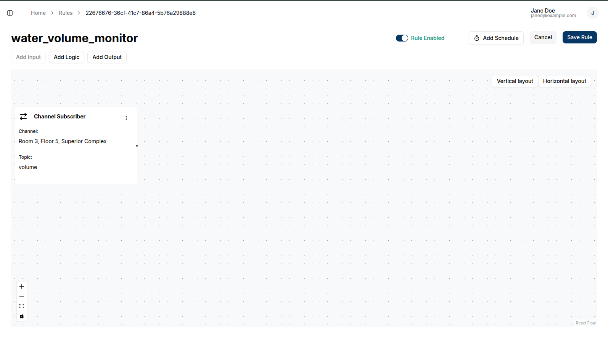
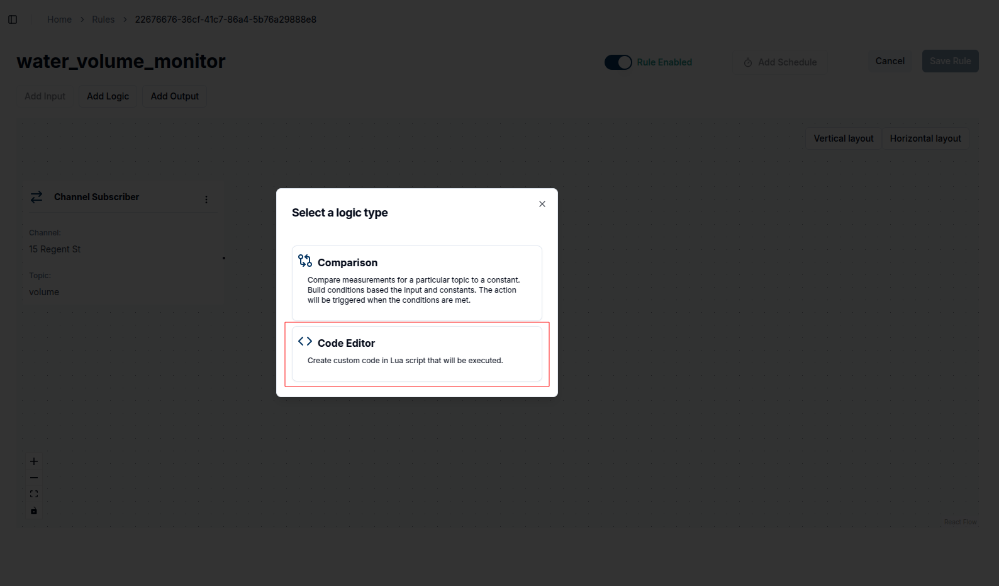
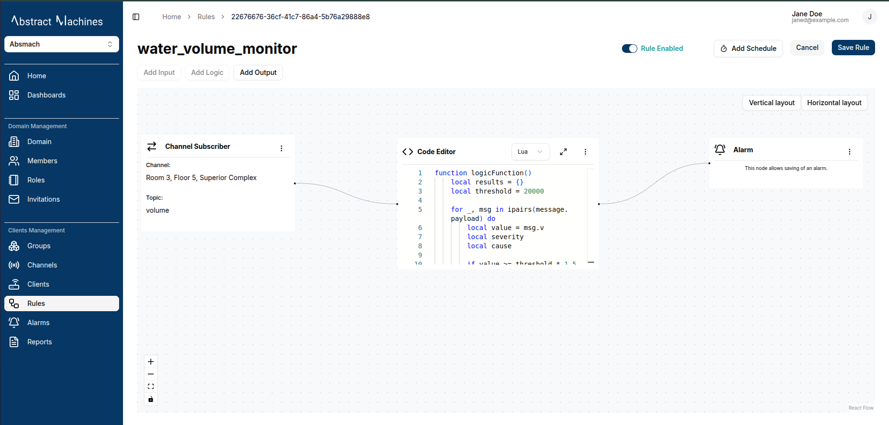
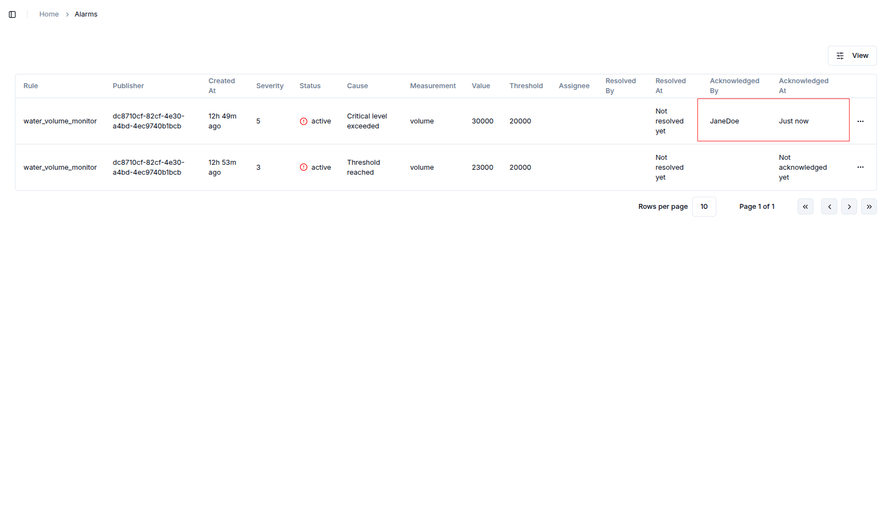
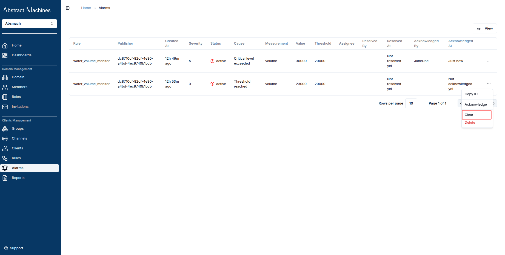
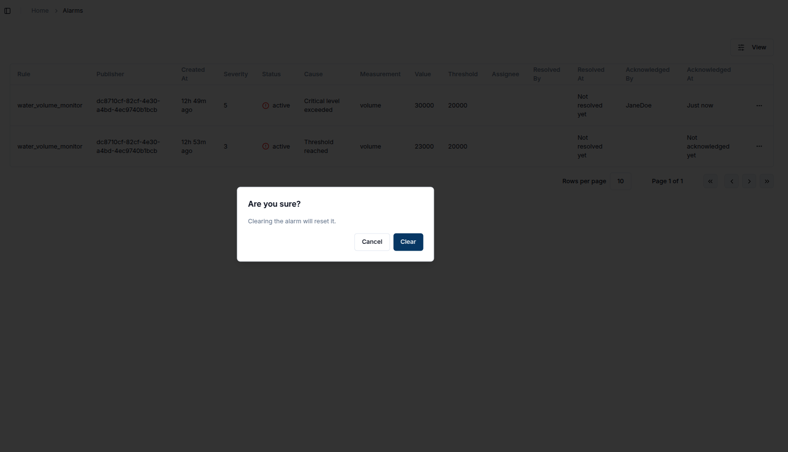
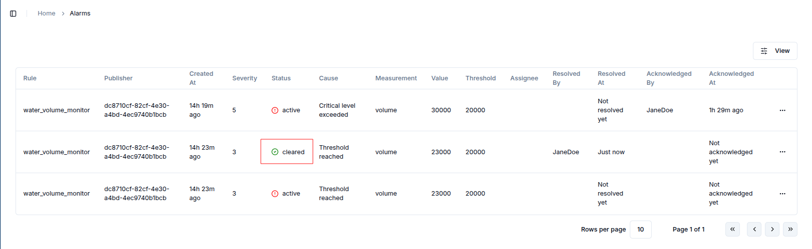
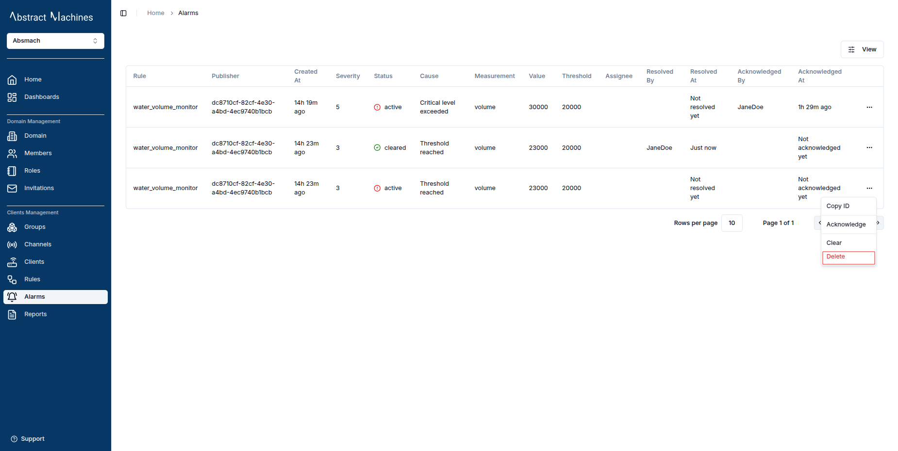

## Overview

Alarms service allows the creation of alarms based on certain thresholds applied to rules. A user is able to create an alarm using the Rules Engine service.

To create an alarm you can add the following fields in the returned alarm object:

| Option            | Description                                                    | Required             |
| ----------------- | -------------------------------------------------------------- | -------------------- |
| `id`              | Unique identifier of the alarm                                 | ❌                   |
| `rule_id`         | ID of the rule that triggered the alarm                        | ✅ (added by system) |
| `domain_id`       | ID of the domain this alarm belongs to                         | ✅ (added by system) |
| `channel_id`      | ID of the channel related to the alarm                         | ✅ (added by system) |
| `client_id`       | ID of the client that reported or is associated with the alarm | ✅ (added by system) |
| `subtopic`        | Subtopic of the message that triggered the alarm               | ❌                   |
| `status`          | Current status of the alarm (e.g., active, cleared)            | ❌                   |
| `measurement`     | Name of the measurement involved in the alarm condition        | ✅                   |
| `value`           | Value that triggered the alarm                                 | ✅                   |
| `unit`            | Unit of the measurement value                                  | ❌                   |
| `threshold`       | Threshold value set in the rule that triggered the alarm       | ✅                   |
| `cause`           | Explanation or reason why the alarm was triggered              | ✅                   |
| `severity`        | Severity level of the alarm (e.g., 1 = low, 5 = critical)      | ✅                   |
| `assignee_id`     | ID of the user currently assigned to resolve the alarm         | ❌                   |
| `created_at`      | Timestamp when the alarm was created                           | ❌                   |
| `updated_at`      | Timestamp when the alarm was last updated                      | ❌                   |
| `updated_by`      | ID of the user who last updated the alarm                      | ❌                   |
| `assigned_at`     | Timestamp when the alarm was assigned                          | ❌                   |
| `assigned_by`     | ID of the user who assigned the alarm                          | ❌                   |
| `acknowledged_at` | Timestamp when the alarm was acknowledged                      | ❌                   |
| `acknowledged_by` | ID of the user who acknowledged the alarm                      | ❌                   |
| `resolved_at`     | Timestamp when the alarm was resolved                          | ❌                   |
| `resolved_by`     | ID of the user who resolved the alarm                          | ❌                   |
| `metadata`        | Additional metadata related to the alarm                       | ❌                   |

## Create Alarm

To create an alarm, a user needs to create an alarm rule first.

1. Navigate to the Rules page and create a new rule.

   

2. Click on the rule on the table to view the rule.

   

3. Add an input node providing the channel and topic.

   

   

   

4. Add an editor block as the logic node.

   

   

5. Add the alarm node as the output node.

   

6. Save the Rule.



An example of a Lua script code for an alarm is

```Lua title="Code that checks if the temperature value has exceeded certain thresholds"
function logicFunction()
    local results = {}
    local threshold = 30

    for _, msg in ipairs(message.payload) do
        local value = msg.v
        local severity
        local cause

        if value >= threshold * 1.5 then
            severity = 5
            cause = "Critical level exceeded"
        elseif value >= threshold * 1.2 then
            severity = 4
            cause = "High level detected"
        elseif value >= threshold then
            severity = 3
            cause = "Threshold reached"
        end

        table.insert(results, {
            measurement = msg.n,
            value = tostring(value),
            threshold = tostring(threshold),
            cause = cause,
            unit = msg.unit,
            severity = severity,
        })
    end

    return results
end
```

:::info

We limit our severity values to values from 1 to 5 with 1 being the lowest and 5 being the highest.

:::

## View Alarms

To view alarms, navigate to the alarms page on the sidebar. This page shows a list of all your alarms.


## Acknowledge Alarm

To acknowledge an alarm click on the quick links button on the end of the rule and click the acknowledge option in the drop-down options.




## Clear Alarm

To clear an alarm click on the quick links button on the end of the rule and click the clear option in the drop-down options.







## Delete Alarm

To delete an alarm click on the quick links button on the end of the rule and click the delete option in the drop-down options.




