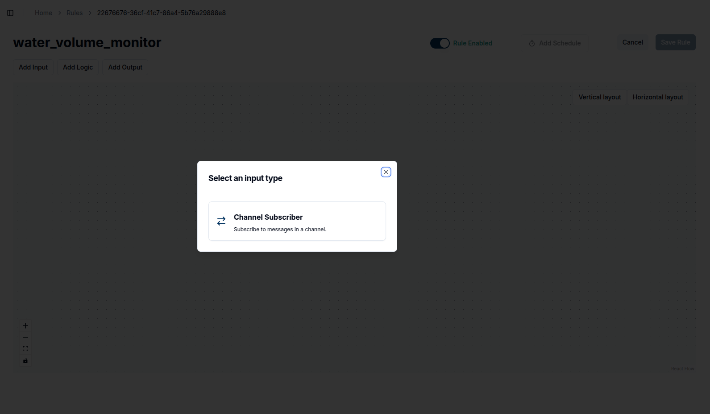
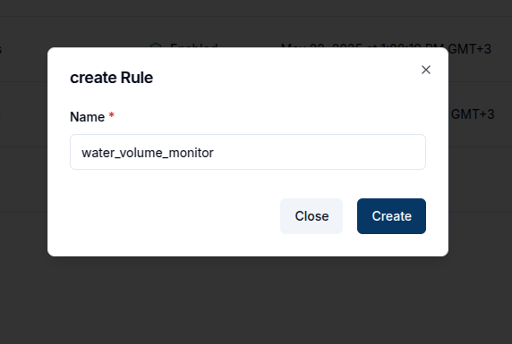
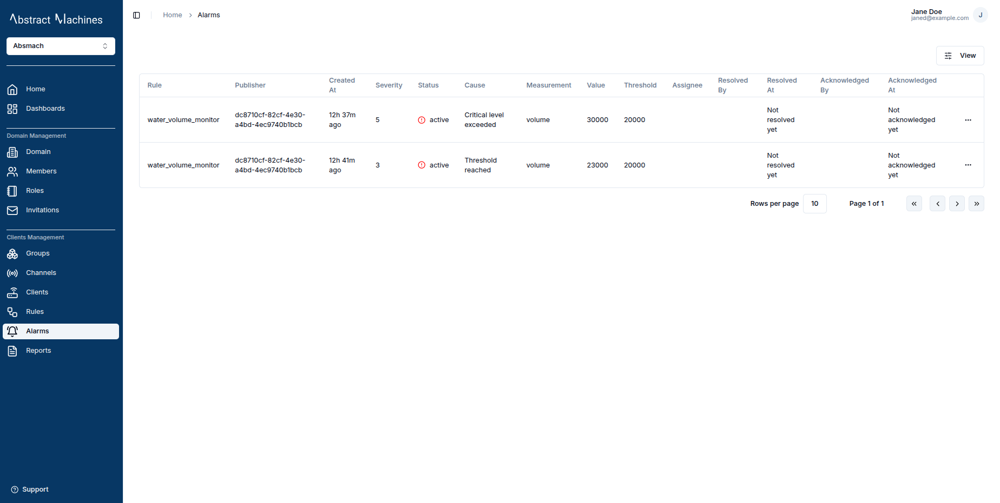
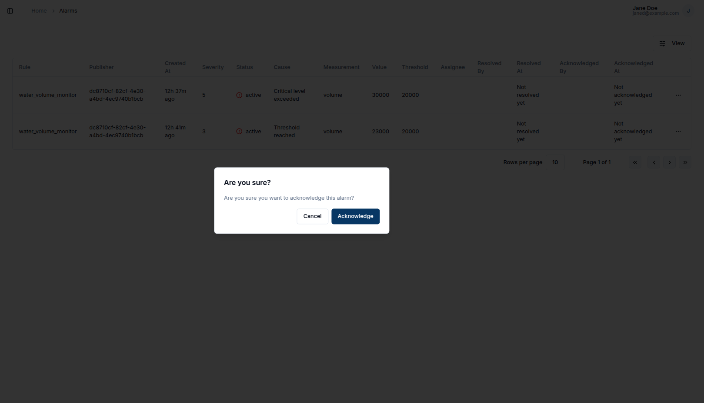
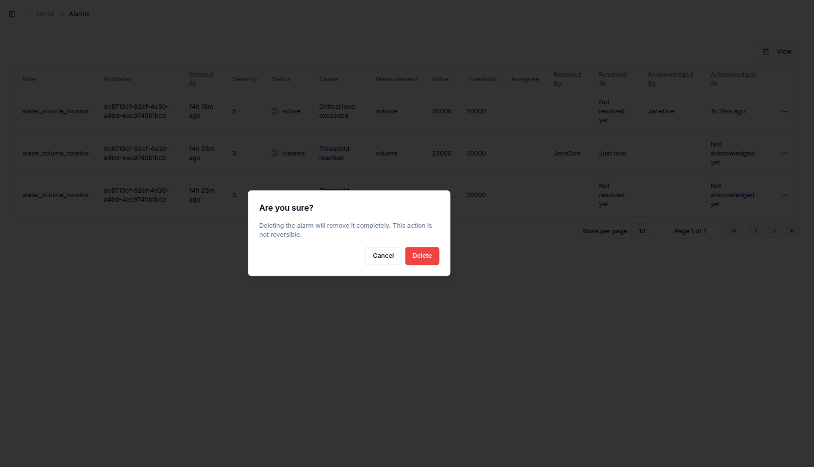

## Overview

The Alarms service allows users to create alarms triggered by threshold conditions defined in the Rules Engine. When a rule is triggered, the system generates an alarm with relevant information.

The returned alarm object includes the following fields:

| Option            | Description                                               | Required             |
| ----------------- | --------------------------------------------------------- | -------------------- |
| `id`              | Unique identifier of the alarm                            | ❌                   |
| `rule_id`         | ID of the rule that triggered the alarm                   | ✅ (added by system) |
| `domain_id`       | ID of the domain this alarm belongs to                    | ✅ (added by system) |
| `channel_id`      | ID of the channel related to the alarm                    | ✅ (added by system) |
| `client_id`       | ID of the client associated with the alarm                | ✅ (added by system) |
| `subtopic`        | Subtopic of the message that triggered the alarm          | ❌                   |
| `status`          | Current status of the alarm (e.g., active, cleared)       | ❌                   |
| `measurement`     | Name of the measurement involved in the alarm condition   | ✅                   |
| `value`           | Value that triggered the alarm                            | ✅                   |
| `unit`            | Unit of the measurement value                             | ❌                   |
| `threshold`       | Threshold value set in the rule that triggered the alarm  | ✅                   |
| `cause`           | Explanation of why the alarm was triggered                | ✅                   |
| `severity`        | Severity level of the alarm (e.g., 1 = low, 5 = critical) | ✅                   |
| `assignee_id`     | ID of the user assigned to resolve the alarm              | ❌                   |
| `created_at`      | Timestamp when the alarm was created                      | ❌                   |
| `updated_at`      | Timestamp when the alarm was last updated                 | ❌                   |
| `updated_by`      | ID of the user who last updated the alarm                 | ❌                   |
| `assigned_at`     | Timestamp when the alarm was assigned                     | ❌                   |
| `assigned_by`     | ID of the user who assigned the alarm                     | ❌                   |
| `acknowledged_at` | Timestamp when the alarm was acknowledged                 | ❌                   |
| `acknowledged_by` | ID of the user who acknowledged the alarm                 | ❌                   |
| `resolved_at`     | Timestamp when the alarm was resolved                     | ❌                   |
| `resolved_by`     | ID of the user who resolved the alarm                     | ❌                   |
| `metadata`        | Additional metadata related to the alarm                  | ❌                   |

## Use Cases

Here are some example scenarios where alarms are useful in IoT systems:

- **Temperature Monitoring**: Raise an alarm when a temperature sensor reports values above or below safe thresholds in environments like server rooms, greenhouses, or refrigerators.
- **Power Consumption Alerts**: Trigger alarms if energy usage exceeds defined limits, helping to prevent overload or equipment damage.
- **Air Quality Monitoring**: Detect hazardous gas levels (e.g., CO₂, smoke) in smart buildings and alert relevant personnel.
- **Water Leak Detection**: Set alarms when water sensors detect unexpected moisture levels in industrial facilities or homes.
- **Machine Failure Prediction**: Generate alarms based on vibration or noise thresholds from industrial machines, allowing preventive maintenance.
- **Security Events**: Detect unauthorized access attempts or motion in restricted areas using motion sensors or door sensors.

## Create Alarm

To create an alarm, first define an alarm rule in the Rules Engine.

1. Go to the **Rules** page and create a new rule.

   

2. Click the `+ Create Rule` button in the table to open a new rule page.

   

3. Add an **Input** node, providing the channel and topic.

   

   

   

4. Add an **Editor** block as the logic node.

   

   


5. Add the **Alarm** node as the output node.

   

6. Save the rule by clicking on `Save Rule` which will open a popover for the Alarm Rule name.

   

7. You can then view the Rule.

   

Below are examples of Lua and Go scripts for checking water level thresholds:

```Lua title="Lua script"
function logicFunction()
    local results = {}
    local threshold = 20000

    for _, msg in ipairs(message.payload) do
        local value = msg.v
        local severity
        local cause

        if value >= threshold * 1.5 then
            severity = 5
            cause = "Critical level exceeded"
        elseif value >= threshold * 1.2 then
            severity = 4
            cause = "High level detected"
        elseif value >= threshold then
            severity = 3
            cause = "Threshold reached"
        end

        table.insert(results, {
            measurement = msg.n,
            value = tostring(value),
            threshold = tostring(threshold),
            cause = cause,
            unit = msg.unit,
            severity = severity,
        })
    end

    return results
end
return logicFunction()
```

```go title="Go script"
package main

import (
  m "messaging"
  "fmt"
  "strconv"
)


type alarm struct {
  Measurement string
  Value       string
  Threshold   string
  Cause       string
  Unit        string
  Severity    uint8
}

func logicFunction() any {
  results := []alarm{}
  threshold := 20000.0
  pld, ok := m.message.Payload.([]any)
  if !ok {
  panic("invalid payload")
  }
  for _, m := range pld {
  if m == nil {
  continue
  }
  msg, ok := m.(map[string]any)
  if !ok {
    panic("not map")
  }

  value := msg["v"].(float64)
  unit := msg["u"].(string)
  msmnt := msg["n"].(string)
  var severity uint8
  var cause string

  switch {
  case value >= threshold*1.5:
  severity = 5
  cause = "Critical level exceeded"
  case value >= threshold*1.2:
   severity = 4
  cause = "High level detected"
  case value >= threshold:
   severity = 3
   cause = "Threshold reached"
  }

  result := alarm{
   Measurement: msmnt,
   Value:       strconv.FormatFloat(value, 'f', -1, 64),
   Threshold:   strconv.FormatFloat(threshold, 'f', -1, 64),
   Cause:       cause,
   Unit:        unit,
   Severity:    severity,
  }
  results = append(results, result)
 }
 fmt.Println("returning", len(results))

 return results
}
```

:::info

Severity values range from 1 to 5, with 1 being the lowest and 5 the highest.

:::

## View Alarms

To view existing alarms, go to the Alarms page via the sidebar. This page lists all generated alarms.



## Acknowledge Alarm

To acknowledge an alarm:

1. Click the quick links button next to the alarm.

2. Select **Acknowledge** from the dropdown menu.





## Clear Alarm

To clear an alarm:

1. Click the quick links button next to the alarm.

2. Select **Clear** from the dropdown menu.


## Delete Alarm

To delete an alarm:

1. Click the quick links button next to the alarm.

2. Select **Delete** from the dropdown menu.



