**Channels** act as message conduits. They are responsible for the messages exchange between clients and act as message topics that can be **published** or **subscribed** to by multiple Clients.

Clients are able to **publish** or **subscribe** to a channel depending on their connection.

## Create a Channel

To create a channel, click on the `+ Create` button present on the top-left corner of the page. You can also create multiple channels by clicking on the `+ Upload` button and uploading a _.csv_ file.

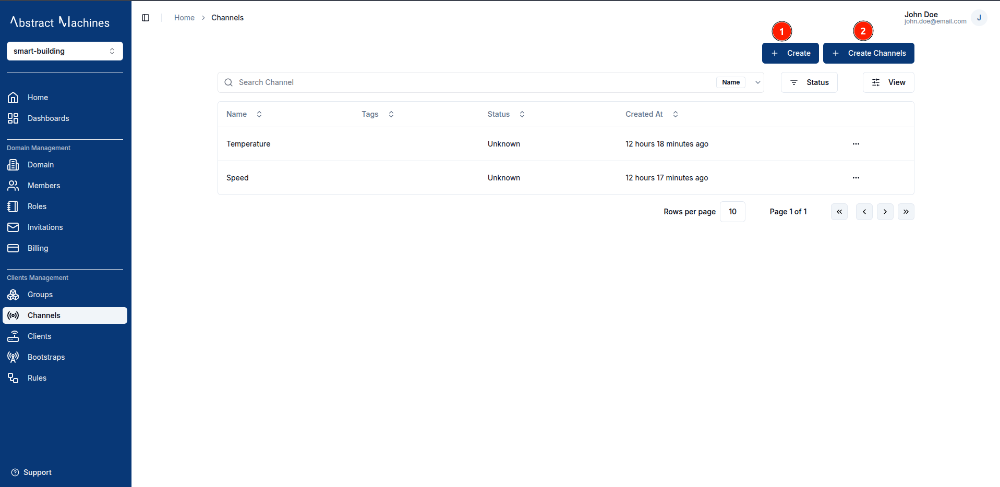

### Channel Information

Add a channel **_name_** and optionally **_tags_** and **_metadata_**.

### Bulk Creation

You can be able to create channels in bulk by uploading a _.csv_ file with the following fields in order:

1. Name (Required)
2. Metadata
3. Tags

A sample of the channels _.csv_ file can be found [here](https://github.com/absmach/magistrala-ui/blob/main/samples/channels.csv).

## View a Channel

After creating a channel, it will appear in the channels table. To view that channel click on the **row** or the **view** button in the row actions.

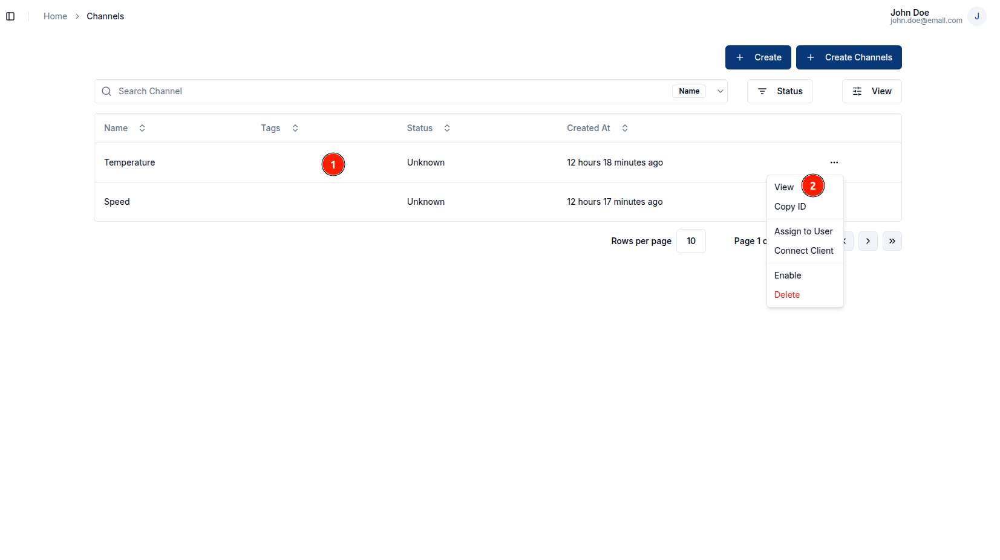

This will lead you to the Channel Settings page, where you can view the channel's **Name**, **ID**, **Metadata**, **Tags** and **Status**.

## Update a Channel

In the channel settings page, you will be able to update the following channel details as long as you have the required permissions:

1. Name
2. Metadata
3. Status
4. Tags

To update a field, click on the `pencil` icon on the far end of the field to edit. Once you have updated the value, click on the `check` icon to update the changes or the `cross` icon to cancel the change. To update the channel status, toggle the switch on the far end of the status field.

This is an example of updating tags.

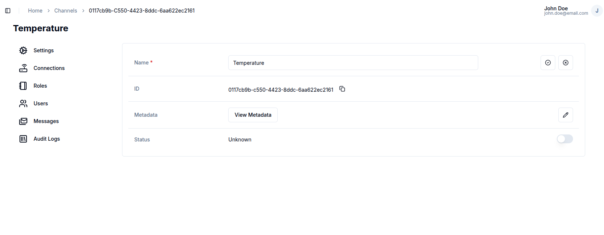

## Connect to a Client

Navigate to the `Connections` section of the channel navigation. This will lead you to the connections page where you can view the clients connected to a channel.

In this page you are able to add a connection by clicking on the `Connect` button on the top right corner.

This opens up a dialog box that allows you to select the clients you want to connect and with which connection type.

There are two connection type options:

1. **Publish**: Allows the client to send messages in the channel
2. **Subscribe**: Allows the client to read messages in the channel

 A client can have both connection types selected.  

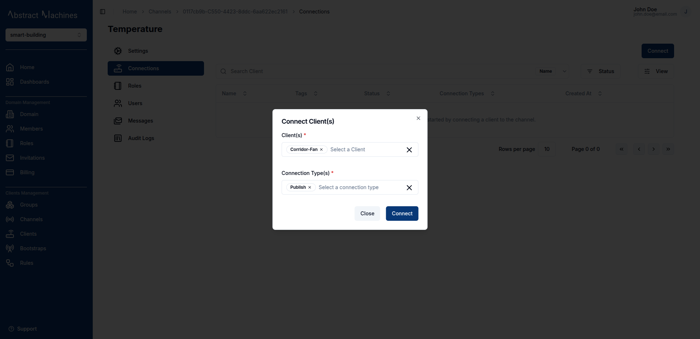

To disconnect the client, click on the `Disconnect` button at the end of the channel row.

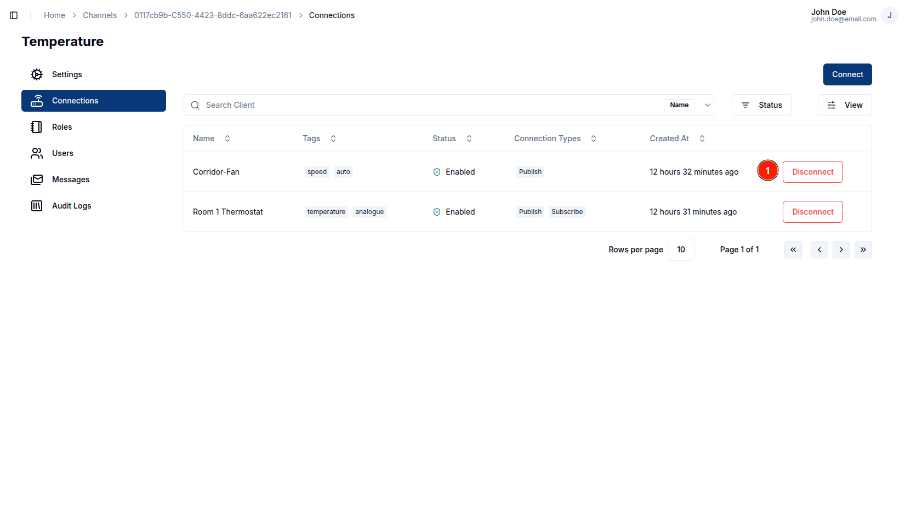

This will open up a dialog that allows you to select which connection type you want to remove. You can remove one or both of the connection types if there are multiple.

## Channel Roles

Roles allow you to group a specific set of actions and allocate them to users.
Navigate to the **Roles** section of the channel sidebar. This will lead you to a table of all the available roles in the channel.

To create a role, navigate to the roles section on the client navbar. Click on the `+ Create` button and provide a role name. The actions and members are optional fields.

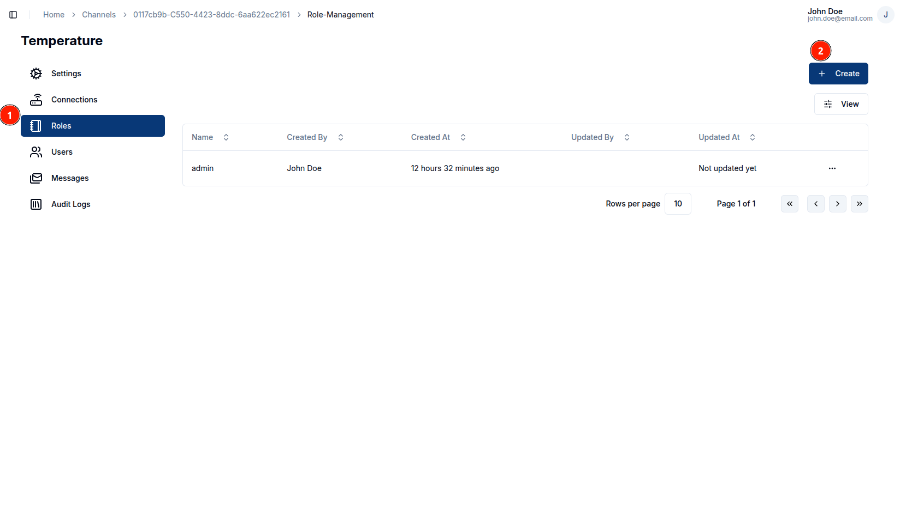

### Channel Role Information

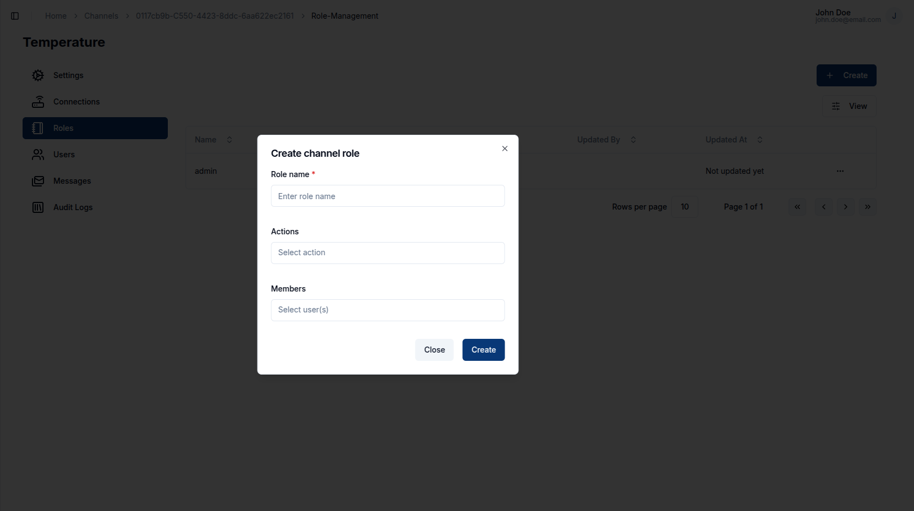

The **Role Name** is compulsory.
You can provide the role actions by selecting from the available actions in the dropdown menu depending on which permissions you would wish each member to have access to.
You can also optionally provide the members by searching for a user with their **username**.

The following is the list of available actions for a channel:

- update
- read
- delete
- set_parent_group
- connect_to_client
- publish
- subscribe
- manage_role
- add_role_users
- remove_role_users
- view_role_users

### Update Channel Role Name

Clicking on a Channel Role leads you to the Role page with itss Role Actions and Role Members table.
To update a role name, click on the `pencil` icon on the far right end of the field, update the value then click on the `check` icon to update the changes or the `cross` icon to cancel the changes.

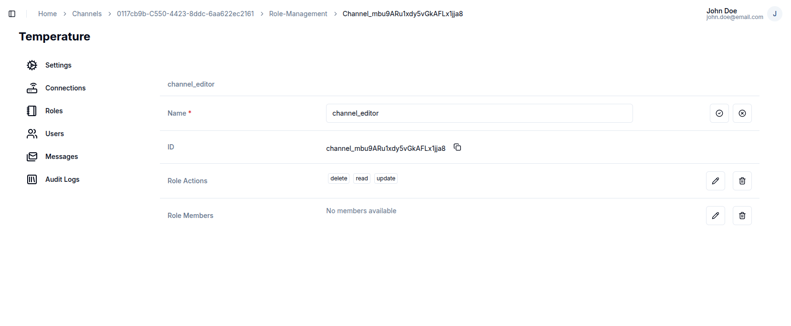

### Update Channel Role Actions

To update the **role actions**, click the pencil icon on the row. Updating Role Actions will open a dialog box allowing you to select the Role Actions you want to add. This list will include all available actions that are not currently among your Role Actions.

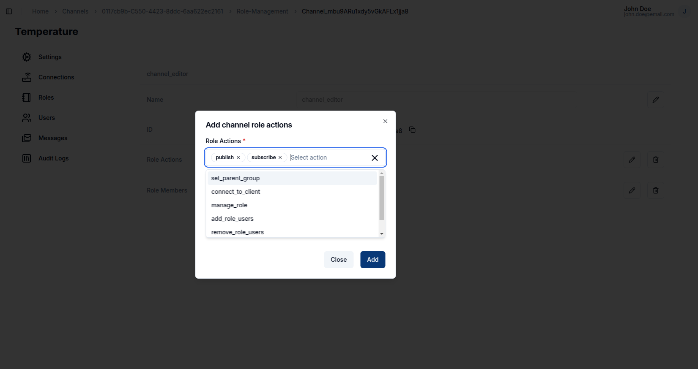

### Update Channel Role Members

Members are listed in a separate table below the **Role Actions** section.

To add new members to the channel under the current role click on `Add Members` button. The pop-up dialog will allow you to add any user that is a member of the domain to the channel. The users will show up on a dropdown menu.

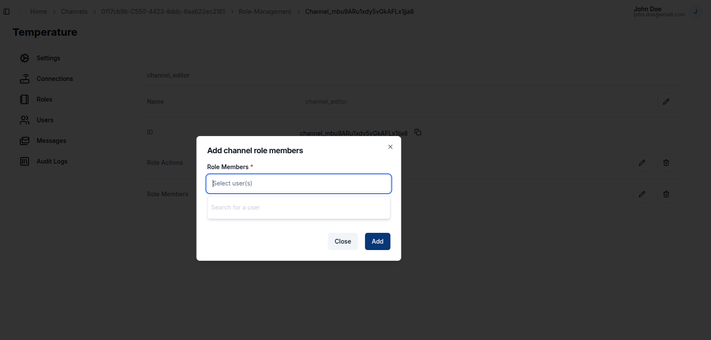

### Delete Channel Role

If you would like to remove or delete any Role Action, click on the `Trash` icon. It pops up a dialog that allows you to select which Role Action you want to remove. Optionally you can delete all of the Role Actions by clicking on the `Delete All Actions` button.

### Delete Channel Role Members

Clicking on the `Delete All Members` button will open an alert pop-up that requests for confirmation to delete the channel Role Members.

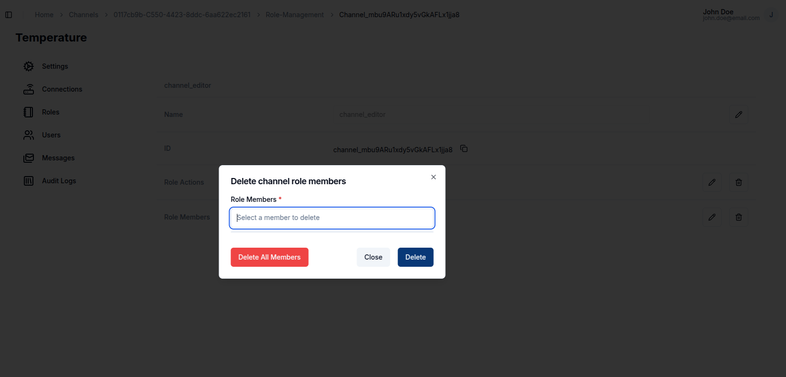

To delete individual members in a channel role, click on the `trash` icon on the Member row. This will open up a confirmation dialog.

## Channel Members

A channel can have multiple users assigned to it with various roles. Much like the Channel Role Members users can create, update and delete any Members from this segment.

### View Channel Members

Navigate to the Members tab under the Channel Menu. This will lead you to a table of all the available members as well their roles.
The roles present here are the same roles as the Channel Roles in the section just above

### Assign Channel Members

Members can be assigned to a channel by clicking on the `Assign Member` button.
This will open up a dialog that allows you to select from amongst the Domain Members present from a dropdown list.
The roles presented will also be the very same Channel Roles from above.

### Unassign Channel Members

To unassign a specific member from a channel, simply click on the `Trash` Icon on their row in the table. This will bring up a confirmation dialog.

## Messages

While on channels, a user can view, send and download messages associated to the channel.

### Send Messages

A connected client can be used as a publisher to send a message via the _HTTP_ protocol while on the Magistrala UI.
To send a message navigate to the Messages section and click on the `Send Message` button.
On the dialog that comes up there are some key fields that must be filled.
These fields include:

1. **Name** - This is the base name of the message.
2. **Value Type** - This would determine the nature of the payload being sent. It could vary between _number_, _boolean_, _string_, or _data-value_.
3. **Value** - This is the actual value received from the sensor.
4. **Publisher** - This is the **connected** Client which can be selected from an infinite select. From this client the backend will get the special _Client-Key_ which will be used to send the message.

Additional optional fields that help enhance message clarity:

- **Unit** - This is the unit of the Value of the payload being sent.
- **Subtopic** - This is a field that can assist in classifying the messages sent. This field **MUST** match the Rules Engine Publisher topic for the message to be saved in the database.

Messages sent are in SenML format.
The Magistrala UI also sends these messages via _HTTP_.
A user can send their messages using the command terminal over other protocols such as MQTT or WebSocket.
Further information on these protocols is discussed [here](../../dev-guide/messaging.md).

For a message to be saved on the Magistrala database, a Rule must be created in Rules Engine in relation to the specific channel and topic. This has been further discussed in the [**Rules Engine** documentation](../rules-engine.md).

The messages table will then update to include the message sent with the latest message appearing first.

### Filter Messages

Magistrala provides a detailed **Messages Filter Panel** to help you query and view only the messages you’re interested in. By clicking on the `Filter` button in the Messages section, a filter menu appears with various filtering options:

  

You can filter messages by:

- **Protocol** – Select the communication protocol used (e.g., MQTT, HTTP).
- **Publisher** – Choose the client that published the message.
- **Value** – Input specific values to filter by.
- **Boolean Value** – Filter by true/false type messages.
- **String Value / Data Value** – Provide string or data-specific content to match.
- **Time Range** – Use the **From** and **To** date fields to filter messages over a specific time window.
- **Aggregation** – Select aggregation methods like `avg`, `sum`, `min`, `max` etc. for time-series aggregation.
- **Interval** – Set intervals for the aggregation (e.g., `1m`, `10s`, `1h`).

Once filters are selected, click the **Update** button to refresh the message list.

You can also reset all filters by clicking the **Clear All** button.

### Download Messages

To download messages for reporting or analysis, click on the `Download` button. A dialog will appear that lets you customize which messages are downloaded:

In the download dialog, you can configure:

- **Offset & Limit** – Control pagination of the result set.
- **Name** – Filter messages by message name.
- **Protocol** – Choose protocol type.
- **Publisher** – Filter by client who published the messages.
- **Value** – Match a specific message value.
- **File Name** – Customize the name of the downloaded file. If a name is not provided we will default to using the Channel ID as the csv file name.

Click **Download** to generate and download the CSV file containing the matching messages.

## Audit Logs

Audit logs track all **channel-related events**, including **creation**, **updates**, **disabling**, **connectivity** and **role changes**.

Each log entry displays the **operation type**, a **timestamp**, and optional **details** for deeper inspection.

You can search logs by operation type using the search input above the log table.

The most recent operations—such as `channel.view`, `channel.create`, and `channel.connect`—are displayed at the top.

