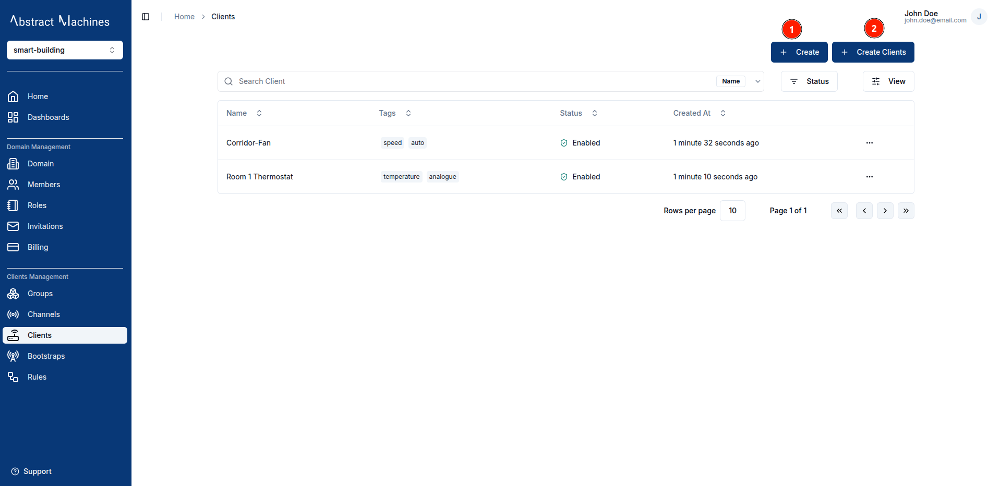
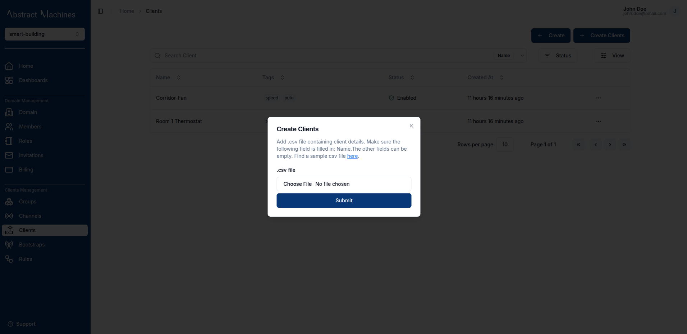
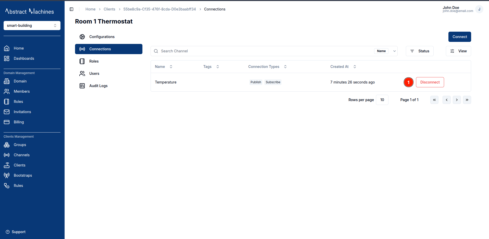

A **Client** in Magistrala can be either a **device** or an **application** that publishes or subscribes to messages.

## Create a Client

To create a client, click on the `+ Create` button present at the top-left of the page.
You can also create multiple clients at once by clicking on the `+ Create Clients` button and uploading a _.csv_ file with client **names** and any other fields you would like to add.

### Client Information

Each client requires a **name**.  
You may also add an optional **key** (must be unique), **tags**, and **metadata**.

The **client key** is used to authorize the device when sending messages.

### Bulk Creation

Clients can be created in bulk using a `.csv` file with the following fields (in order):

1. **Name** (Required)  
2. **Secret**  
3. **Tags**  
4. **Metadata**

A [sample clients CSV file](https://github.com/absmach/magistrala-ui/blob/main/samples/clients.csv) is available.

## View a Client

After creation, clients are listed in the **Clients table**.  
Click a row (or the **View** button in the row actions) to open the client’s configuration page.

## Configurations

The **Configuration page** displays key details about a client, including tags and metadata that help with classification and search.

### Edit Client Configuration

You can update the following fields:

1. **Name**  
2. **Client Key**  
3. **Tags** (press `Enter` after each tag to confirm)  
4. **Metadata** (must be valid JSON)  
5. **Status**

To edit, click the **pencil** icon next to a field.  
Confirm changes with **check** or cancel with **cross**.  
Toggle the **Status** switch to enable or disable a client.

> Metadata MUST be a valid JSON object to be considered valid. Tags require the user to click `Enter` after each tag to have the entry recognised as valid Tag.

<!-- ### Bootstrap Configuration

Bootstrap configuration of a client allows bootstrapping of the device (self-starting process that proceeds without external input). Further details of bootstrapping are discussed in the [Bootstrap section](bootstraps.md).

To add a bootstrap configuration, click on the `Add Configuration` button.

A dialog box will appear allowing you to enter the following fields

1. Name (required) - A unique name for the bootstrap configuration
2. External ID (required)
3. External Key (required)
4. Channels (required) - The channels the client will connect to.
5. Content (optional)
6. Encryption Settings (optional)
   - Client Cert
   - Client Key
   - CA Cert

 -->

## Connect to a Channel

Navigate to the **Connections** tab of the client sidebar to see connected channels.

In this page you are able to add a connection by clicking on the `Connect` button on the top right corner.

A dialog will open where you can select channels and connection types. A client can have both connection types selected.  
There are two connection type options:

1. **Publish**: allows the client to send messages in the channel
2. **Subscribe**: allows the client to read messages in the channel

To disconnect from the channel, click on the `Disconnect` button at the end of the channel row.

This will open up a dialog that allows you to select which connection type you want to remove. You can remove one or both of the connection types if you have multiple.

## Client Roles

Roles define a set of actions that can be allocated to users.

To create a role, navigate to the **Roles** tab on the client sidebar. Click on the `+ Create` button and provide a role name. The actions and members are optional fields.

### Role Information

The **Role name** is complusory. You can optionally provide the role actions by selecting from the available actions. You can also optionally provide the members by searching for a user with their **username**.

The following is the list of available actions for a client:

- update
- read
- delete
- set_parent_group
- connect_to_channel
- manage_role
- add_role_users
- view_role_users
- remove_role_users

#### Update Client Roles

Click a role in the **Roles table** to open its page. The page has two tables for the **Role Actions** and the assigned **Role Members**.

To update a **role name**, click on the **pencil** icon on the far right end of the field, update the value then click on the **check** icon to update the changes or the **cross** icon to cancel the changes.

To update the **Role Actions** click on the **pencil** icon, it will pop up a dialog box allowing you to select the actions you want to add.

To update the **Role Members**, click the **Add Members** button. A popup dialog will appear with the list of Domain Members from which a user can select.

#### Delete Client Roles

You can also delete actions and members by clicking on the **trash** icon. It pops up a dialog that allows you to select which action you want to remove. There is also an option for clearing the whole list if that is needed as well.

When it comes to **Role Members**, you can clear the whole table with the `Delete All Members` which will lead to this alert dialog:

To delete specific members from the Role Members Table, click on the **trash** icon.

## Client Members

While we can create new members from the **Roles** section alongside the new roles actions, we can also assign members to the client through the **Members** Section.

Clicking on the **Assign Member** button will open a dialog box that allows the user to select amongst the Domain Members present as well as the Roles present in the Client.

## Client Alarms

The **Alarms** section displays all alarms triggered by this specific client. This provides a focused view of alerts related to the client's activity and helps with targeted troubleshooting.

From this page, you can perform all standard alarm management actions:

- View alarm details
- Assign alarms to team members
- Acknowledge alarms
- Clear/resolve alarms
- Delete alarms

For detailed instructions on managing alarms, see the [Alarms documentation](../alarms.md#view-alarms).

## Audit Logs

Audit logs track all **client-related events**, including **creation**, **updates**, **disabling**, **connectivity** and **role changes**

Each log entry displays the **operation type**, a **timestamp**, and optional **details** for deeper inspection.

You can search logs by operation type using the search input above the log table.

The most recent operations—such as `client.view`, `client.create`, and `client.connect`—are displayed at the top.

Clicking on the `Details` button at the end of each row opens a modal displaying structured details about the selected operation.

These details may include:

- `created_at`: Timestamp of creation  
- `updated_at`: Timestamp of the last update  
- `id`: Unique client ID  
- `name`: Full client name, e.g., `"Apartment A1 Floor 1 135 W 135th St Water Meter"`  
- `status`: Whether the client is `"enabled"` or `"disabled"`  
- `super_admin`: Indicates if the client was flagged as a super admin  
- `domain`: Associated domain UUID  
- `user_id`: UUID of the user who performed the action  
- `updated_by`: Same as `user_id` for updates  
- `request_id`: Unique request UUID for tracing  
- `tags`: A list of contextual tags like `"Harlem Block A"`, `"New York"`, `"Water Meter"`  
- `token_type`: The type of token used for the action (e.g., `"access token"`)

This enables users to **trace changes**, **audit security**, and **diagnose issues** efficiently.

