**Groups** in Magistrala are flexible containers used to organize clients and channels. This enables assigning of users to a group of channels and clients with a particular role.

## Create a Group

To create a group, click on the `+ Create` button present on the top-left corner of the page. You can also create multiple groups by uploading a _.csv_ file with group **names** and any other fields you would like to add.

### Group Information

Add a group _name_ and optionally a _description_, _metadata_ and a _parent group_.

The parent group would add hierarchy to the group making it a child of the parent group you have selected. Actions within a role in the parent group trickle down to the children groups.

On the group sidebar there is a levelled family tree section shows a group's parent-child relationship.

## View a Group

After creating a group, it will show up on the page as the first group created.

## Update a Group

While on the View Group Page, you are allowed to update the group details such as the name, description, metadata and the status.  
To update a field, click on the `pencil` icon on the far end of the field to edit. Once you have updated the value, click on the `check` icon to update the changes or the `cross` icon to cancel the change.

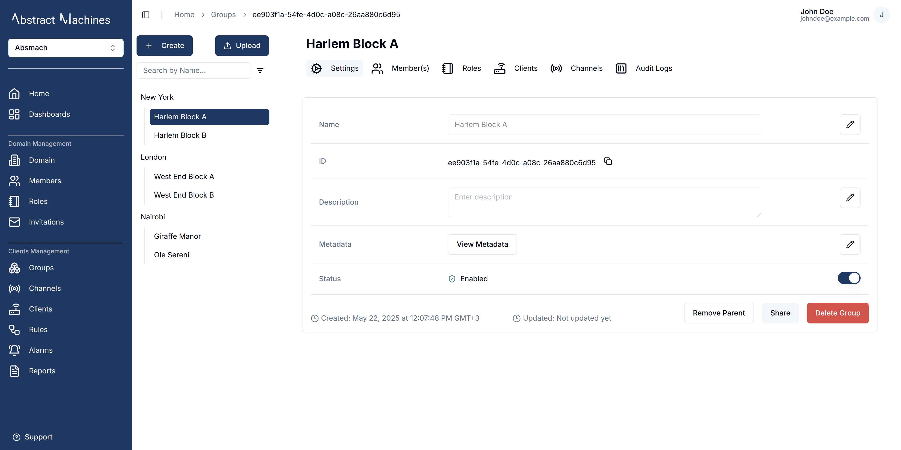

A group can also be disabled or enabled by toggling the switch on the far end of the status field.

You can delete a group permanently from the database by clicking on the `Delete Group` button.
This will open an alert dialog that will prompt you to enter the complete group name correctly to ensure confirmation of the deletion.

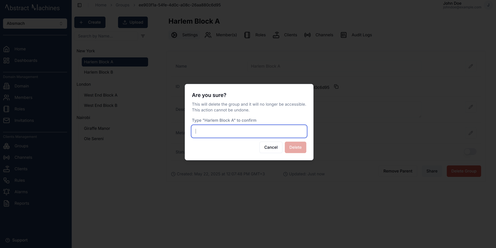

A group can also be shared to another domain member with specific group roles attached. Clicking on the `Share` button opens up a dialog that needs a Member as well as a Role.
We will discuss these Group Roles in the next section.

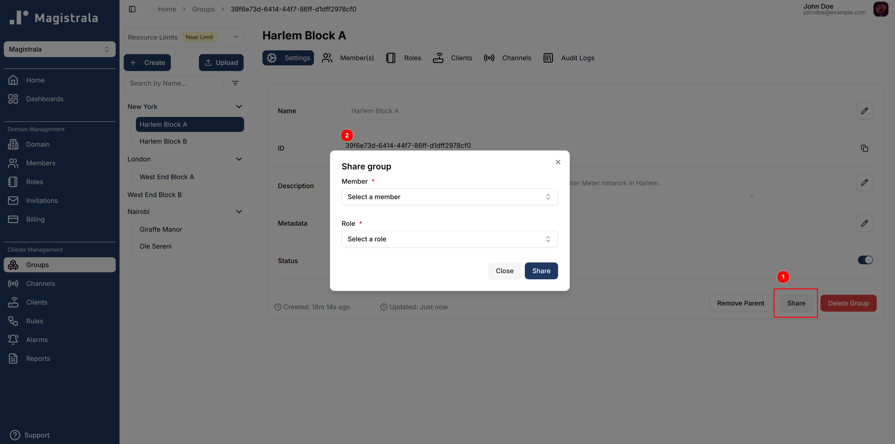

To remove a child from the hierarchy it currently resides in, simply click on the `Remove Parent` button. This will remove it from the tier in the group sidebar and have it lose all the role actions and members it previously had access to.

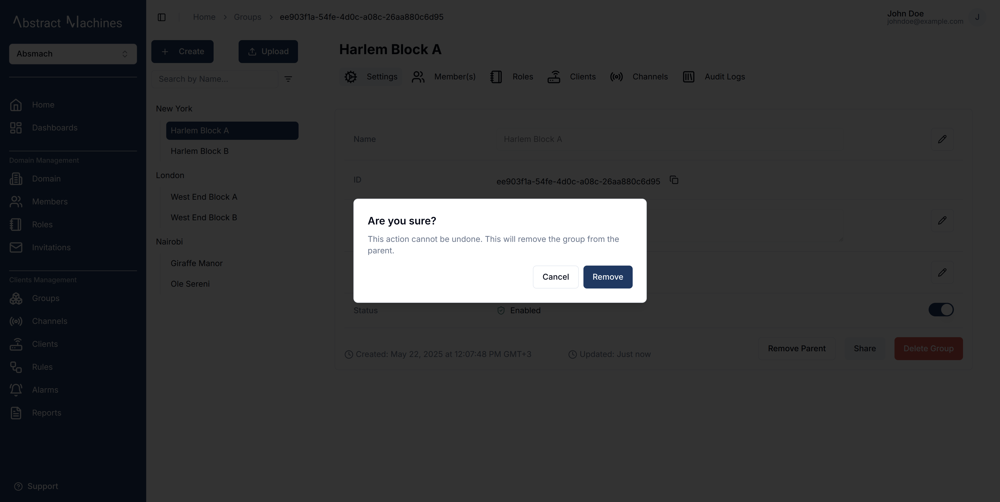

In the case of a group without a Parent, the button will instead prompt you to select a Parent group from the current list of groups.

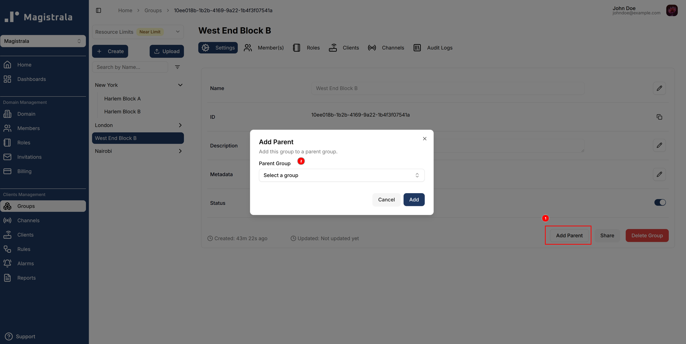

## Group Roles

### Create Group Roles

Roles allow you to group a specific set of actions and allocate them to users.
To create a role, navigate to the **Roles** section on the group navbar. Click on the `+ Create` button and provide a role name. The actions and members are optional fields.

#### Role Information

When creating the Group Role, the role name is compulsory. You can optionally provide the role actions by selecting from the available actions. You can also optionally provide the members by searching for a user with their **username**. These Users must be members of the same domain however.

The following is the list of available actions for a group:

- **Group Management**

  - read
  - update
  - membership
  - delete

- **Hierarchy Management**

  - set_child
  - set_parent

- **Role Management**

  - manage_role
  - add_role_users
  - remove_role_users
  - view_role_users

- **Client Management**

  - client_create
  - client_update
  - client_read
  - client_delete
  - client_set_parent_group
  - client_connect_to_channel
  - client_manage_role
  - client_add_role_users
  - client_remove_role_users
  - client_view_role_users

- **Channel Management**

  - channel_create
  - channel_update
  - channel_read
  - channel_delete
  - channel_set_parent_group
  - channel_connect_to_client
  - channel_publish
  - channel_subscribe
  - channel_manage_role
  - channel_add_role_users
  - channel_remove_role_users
  - channel_view_role_users

- **Subgroup Management**
  - subgroup_create
  - subgroup_channel_create
  - subgroup_client_create
  - subgroup_client_update
  - subgroup_client_read
  - subgroup_client_delete
  - subgroup_client_set_parent_group
  - subgroup_client_connect_to_channel
  - subgroup_read
  - subgroup_membership
  - subgroup_delete
  - subgroup_update
  - subgroup_set_child
  - subgroup_set_parent
  - subgroup_add_role_users
  - subgroup_manage_role
  - subgroup_remove_role_users
  - subgroup_view_role_users

#### Update Group Roles

To update a role name, click on the `pencil` icon on the far right end of the field, update the value then click on the `check` icon to update the changes or the `cross` icon to cancel the changes.

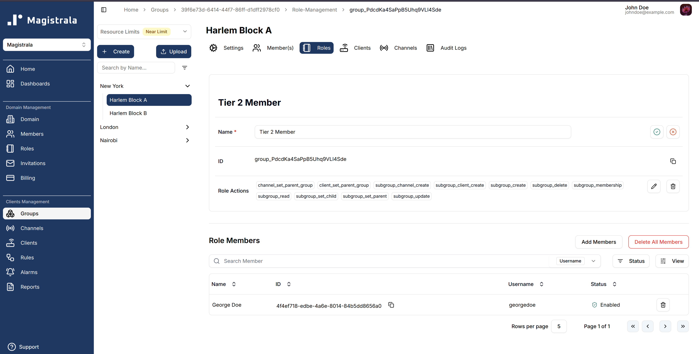

To update the **actions** click on the `pencil` icon, it will pop up a dialog box allowing you to select the actions you want to add.

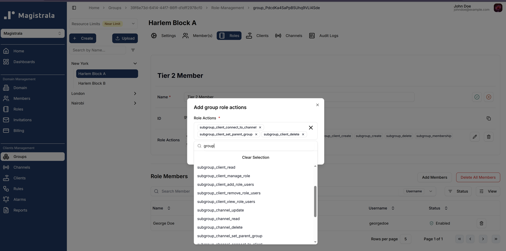

When it comes to the Group Role Members, we have a separate table for the users. You can add more members by clicking on the `Add Members` button which will open up a dialog.

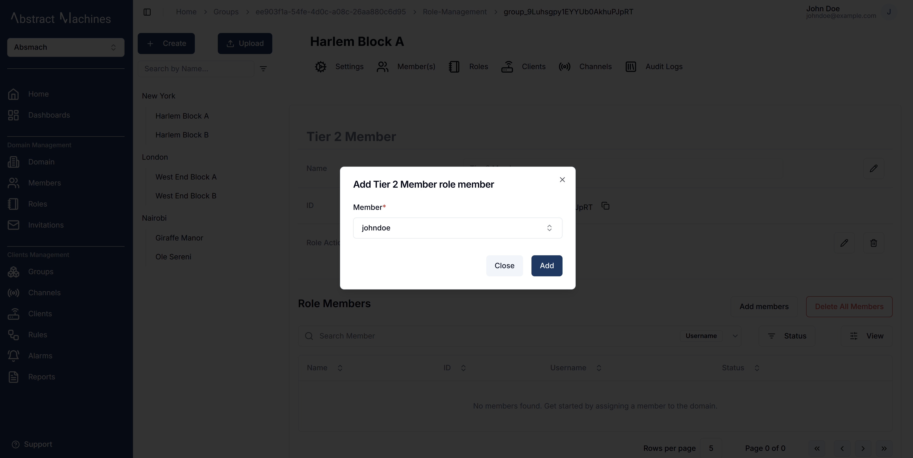

#### Delete Group Roles

You can also delete actions and members by clicking on the `trash` icon. It pops up a dialog that allows you to select which action you want to remove. Optionally you can delete all of the actions by clicking on the `Delete All Actions` buttons.

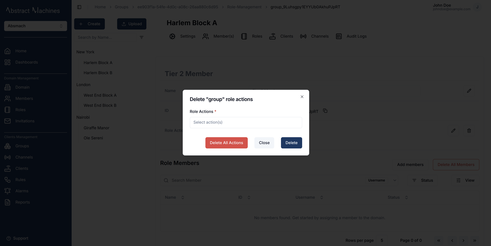

To delete All the Members in the Role simply use the `Delete All Members` button and click on the confirmation.

The Members table also has individual `trash` icons on each row which facilitates deleting specific Role Members.

## Group Members

We can assign a user to a group by adding them as role members. This allows a user to be able to carry out the actions present in the role over the specific group.  
To add role members, one can add them when creating a role or in the specific role page. This has been discussed in the earlier **Roles** section.

We have the capacity to add users by assigning them to a group in the **Members** section of the group. This will allow you to assign a user to a group by adding them to a specific role.

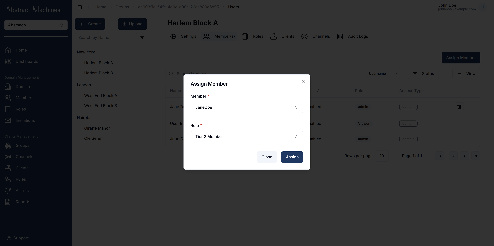

Through the use of the `trash` icon on each row to delete specific members from the group.

## Group Clients

Magistrala provides the capacity to create clients directly in the group level.  
A user is able to **create**, **update**, **disable**, **enable**, **delete**, **assign**, and **connect** clients on the group level. These functionalities are described better in the [clients](clients.md) section

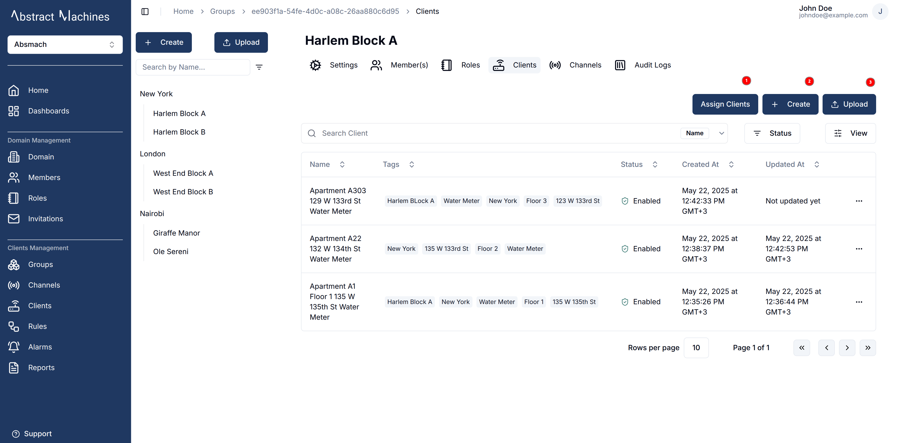

## Group Channels

Magistrala provides the capacity to create channels directly in the group level.  
A user is able to **create**, **update**, **disable**, **enable**, **delete**, **assign**, and **connect** channels on the group level. These functionalities are described better in the [channels](channels.md) section

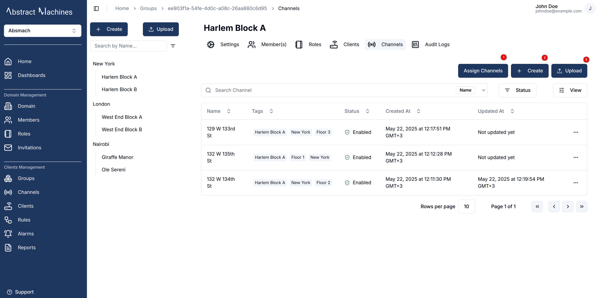

## Audit Logs

Audit logs track all **group events**, from **creation** to **updates** and **disabling**.
