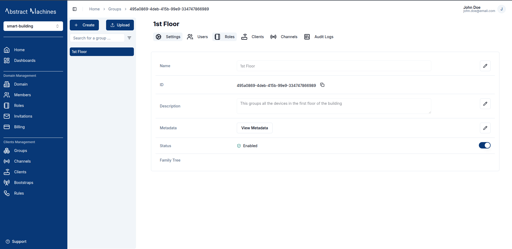
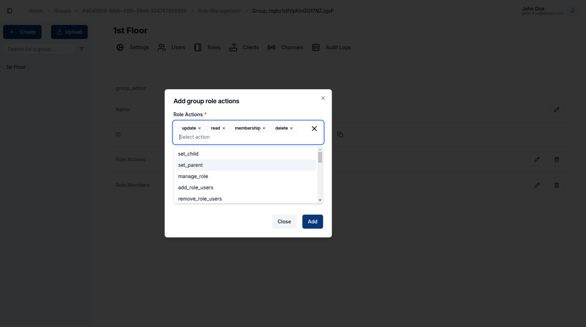
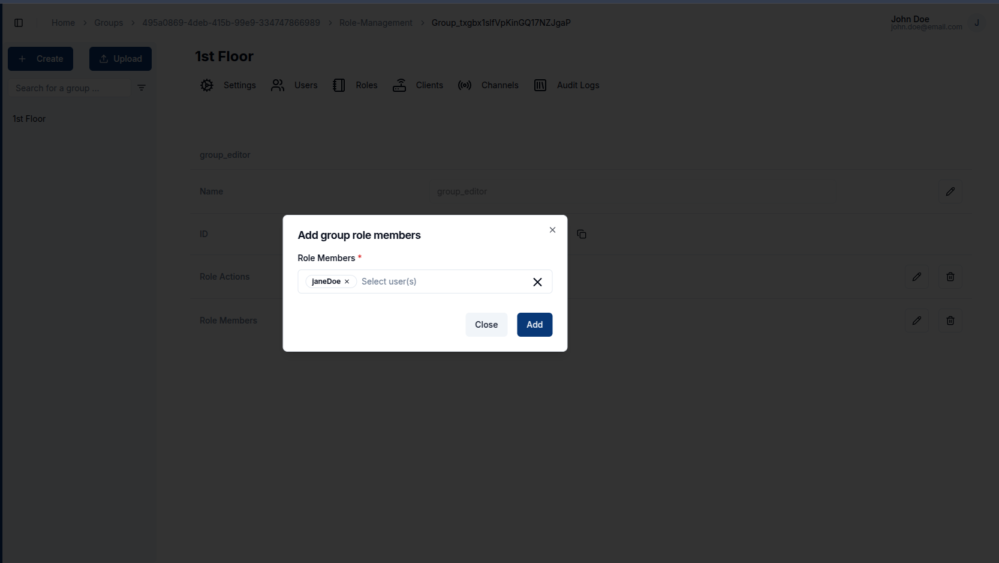
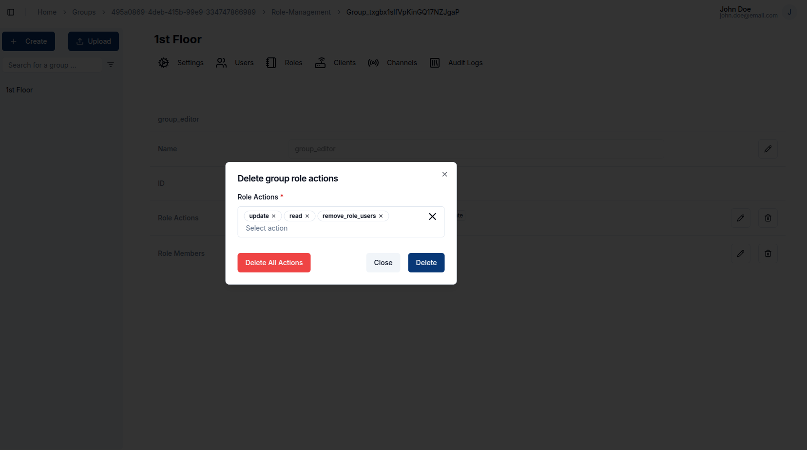

**Groups** in Magistrala can be anything really. They are used to group clients and channels together. This enables assigning of users to a group of channels and clients with a particular role.

## Create a Group

To create a group, click on the `+ Create` button present on the top-left corner of the page. You can also create multiple groups by uploading a _.csv_ file with group **names** and any other fields you would like to add.

### Group Information

Add a group _name_ and optionally a _description_, _metadata_ and a _parent group_.

The parent group would add hierarchy to the group making it a child of the parent group you have selected. Actions within a role in the parent group trickle down to the children groups.

## View a Group

After creating a group, it will show up on the page as the first group created.

> The family tree section shows a group's parent-child relationship (This feature is still under development :hammer: )

## Update a Group

While on the View Group Page, you are allowed to update the group details such as the name, description, metadata and the status.  
To update a field, click on the `pencil` icon on the far end of the field to edit. Once you have updated the value, click on the `tick` icon to update the changes or the `cross` icon to cancel the change.

A group can also be disabled or enabled by toggling the switch on the far end of the status field.

## Group Members

### Roles

#### Create

Roles allow you to group a specific set of actions and allocate them to users.
To create a role, navigate to the roles section on the group navbar. Click on the `+ Create` button and provide a role name. The actions and members are optional fields.

##### Role Information

The role name is complusory. You can optionally provide the role actions by selecting from the available actions. You can also optionally provide the members by searching for a user with their **username**.
The following is the list of available actions for a group:

- **Group Management**

  - read
  - update
  - membership
  - delete

- **Hierarchy Management**

  - set_child
  - set_parent

- **Role Management**

  - manage_role
  - add_role_users
  - remove_role_users
  - view_role_users

- **Client Management**

  - client_create
  - client_update
  - client_read
  - client_delete
  - client_set_parent_group
  - client_connect_to_channel
  - client_manage_role
  - client_add_role_users
  - client_remove_role_users
  - client_view_role_users

- **Channel Management**

  - channel_create
  - channel_update
  - channel_read
  - channel_delete
  - channel_set_parent_group
  - channel_connect_to_client
  - channel_publish
  - channel_subscribe
  - channel_manage_role
  - channel_add_role_users
  - channel_remove_role_users
  - channel_view_role_users

- **Subgroup Management**
  - subgroup_create
  - subgroup_channel_create
  - subgroup_client_create
  - subgroup_client_update
  - subgroup_client_read
  - subgroup_client_delete
  - subgroup_client_set_parent_group
  - subgroup_client_connect_to_channel
  - subgroup_read
  - subgroup_membership
  - subgroup_delete
  - subgroup_update
  - subgroup_set_child
  - subgroup_set_parent
  - subgroup_add_role_users
  - subgroup_manage_role
  - subgroup_remove_role_users
  - subgroup_view_role_users

#### Update

To update a role name, click on the `pencil` icon on the far right end of the field, update the value then click on the `tick` icon to update the changes or the `cross` icon to cancel the changes.

To update the **actions** and **members** click on the `pencil` icon, it will pop up a dialog box allowing you to select the actions and users you want to add.

#### Delete

You can also delete actions and members by clicking on the `trash` icon. It pops up a dialog that allows you to select which action or member you want to remove. Optionally you can delete all of the actions or members by clicking on the `Delete All Actions` or `Delete All Members` buttons.

### Users

We can assign a user to a group by adding them as role members. This allows a user to be able to carry out the actions present in the role over the specific group.  
To add role members, one can add them when creating a role or in the specific role page.  
To add a user while in the role page, click on the pencil icon on the far end of the `Role Members` field, search for a user based on their username, and click on the user. Then click on `Add` to add them to the role.

Optionally, we have the capacity to add users by assigning them to a group in the users section of the group. This will allow you to assign a user to a group by adding them to a specific role.

> This feature is currently under development :hammer:

## Group Clients

Magistrala provides the capacity to create clients directly in the group level.  
A user is able to **create**, **update**, **disable**, **enable**, **delete**, and **connect** clients on the group level. These functionalities are described better in the [clients](clients.md) section

## Group Channels

Magistrala provides the capacity to create channels directly in the group level.  
A user is able to **create**, **update**, **disable**, **enable**, **delete**, and **connect** channels on the group level. These functionalities are described better in the [channels](channels.md) section

## Audit Logs

Audit logs track all **group events**, from **creation** to **updates** and **disabling**.

> This feature is currently under development :hammer:
