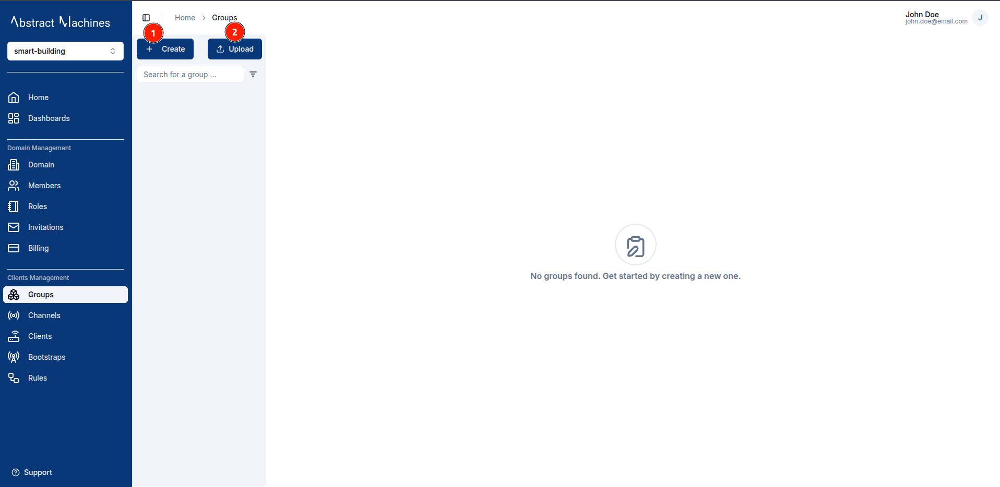
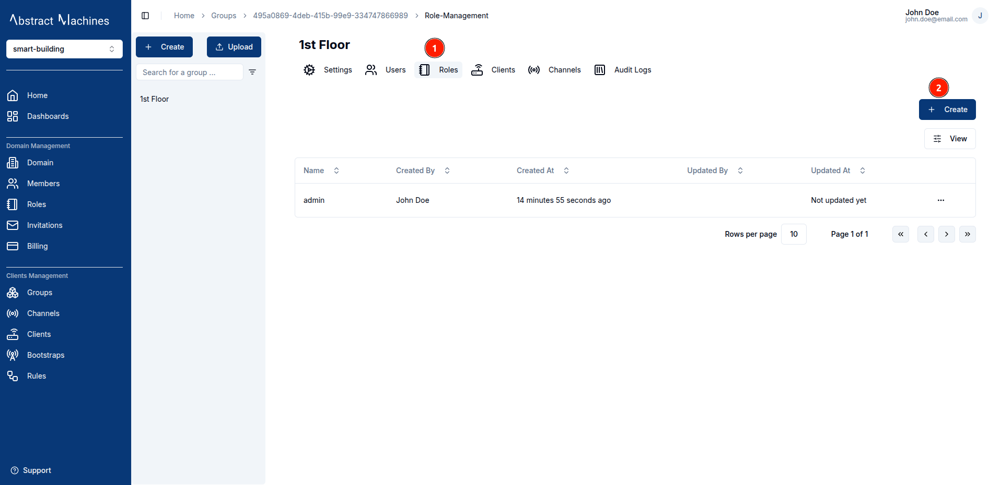
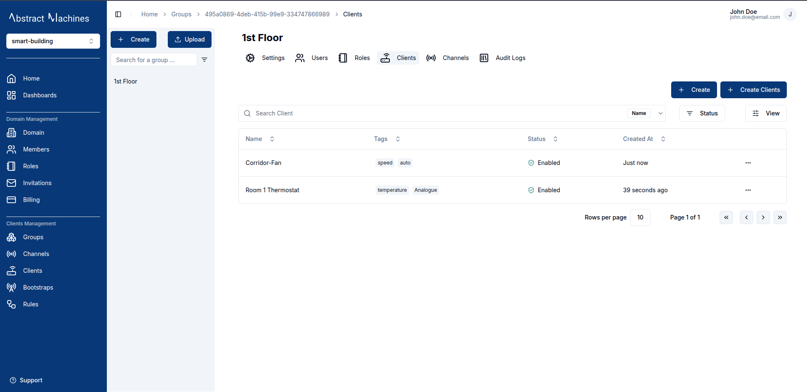

**Groups** in Magistrala are collections that organize **clients** and **channels** together.  
They make it easier to assign users with specific roles to a set of related channels and clients.

## Create a Group

To create a group, click on the `+ Create` button present on the top of the **Groups** sidebar. You can also create multiple groups by uploading a _.csv_ file with group **names** and any other fields you would like to add.

### Bulk Creation

Groups can be created in bulk using a `.csv` file with the following fields (in order):

1. **Name** (Required)  
2. **Metadata**  
3. **Description**  

A [sample groups CSV file](https://github.com/absmach/magistrala-ui/blob/main/samples/groups.csv) is available for reference.

### Group Information

When creating a group, you must provide a **name** and can optionally add a **description**, **metadata**, and a **parent group**.

If a **parent group** is selected, the new group becomes its child.  
This creates a hierarchy where role actions assigned in the parent group are automatically inherited by all child groups.

## View a Group

After creation, the group will appear in the **Groups sidebar**.

## Update a Group

While on the **View Group** page, you are allowed to update the group details such as the **name**, **description**, **metadata**, and **status**.
To update a field, click on the `pencil` icon on the far end of the field to edit. Once you have updated the value, click on the `check` icon to update the changes or the `cross` icon to cancel the change.

Groups can also be **enabled or disabled** by toggling the switch in the **Status** field.  

To permanently delete a group, click the **Delete Group** button.  
You will be asked to re-enter the group’s name to confirm before deletion is finalized.

## Share a Group

A group can also be shared to another domain member with specific **group roles** attached. Clicking on the `Share` button opens up a dialog that needs a Member as well as a Role.

Group Roles will be explained in the next section.

## Manage Parent Groups

To remove a child from the hierarchy it currently resides in, simply click on the `Remove Parent` button. This will remove it from the tier in the group sidebar and have it lose all the role actions and members it previously had access to.

In the case of a group without a parent, the button will instead prompt you to select a parent group from the current list of groups.

## Group Roles

### Create Group Roles

**Roles** allow you to group a specific set of actions and allocate them to users.
To create a role, navigate to the **Roles** section on the group navbar. Click on the `+ Create` button and provide a role name. The actions and members are optional fields.

#### Role Information

When creating the Group Role, the role name is compulsory. You can optionally provide the role actions by selecting from the available actions. You can also optionally provide the members by searching for a user with their **username**. These Users must be members of the same domain however.

The following is the list of available actions for a group:

- **Group Management**

  - read
  - update
  - membership
  - delete

- **Hierarchy Management**

  - set_child
  - set_parent

- **Role Management**

  - manage_role
  - add_role_users
  - remove_role_users
  - view_role_users

- **Client Management**

  - client_create
  - client_update
  - client_read
  - client_delete
  - client_set_parent_group
  - client_connect_to_channel
  - client_manage_role
  - client_add_role_users
  - client_remove_role_users
  - client_view_role_users

- **Channel Management**

  - channel_create
  - channel_update
  - channel_read
  - channel_delete
  - channel_set_parent_group
  - channel_connect_to_client
  - channel_publish
  - channel_subscribe
  - channel_manage_role
  - channel_add_role_users
  - channel_remove_role_users
  - channel_view_role_users

- **Subgroup Management**
  - subgroup_create
  - subgroup_channel_create
  - subgroup_client_create
  - subgroup_client_update
  - subgroup_client_read
  - subgroup_client_delete
  - subgroup_client_set_parent_group
  - subgroup_client_connect_to_channel
  - subgroup_read
  - subgroup_membership
  - subgroup_delete
  - subgroup_update
  - subgroup_set_child
  - subgroup_set_parent
  - subgroup_add_role_users
  - subgroup_manage_role
  - subgroup_remove_role_users
  - subgroup_view_role_users

### Update Group Roles

To update a **role name**, click on the `pencil` icon on the far right end of the field, update the value then click on the `check` icon to update the changes or the `cross` icon to cancel the changes.

To update the **actions** click on the `pencil` iconA dialog will appear where you can select additional actions.

To manage **role members**, open the Members table and click **Add Members**. A dialog will allow you to search and assign users.  

### Delete Group Roles

You can also delete actions and members by clicking on the `trash` icon. It pops up a dialog that allows you to select which action you want to remove. Optionally you can delete all of the actions by clicking on the `Delete All Actions` buttons.

To delete All the Members in the Role simply use the `Delete All Members` button and click on the confirmation.

The Members table also has individual `trash` icons on each row which facilitates deleting specific Role Members.

## Group Members

We can assign a user to a group by adding them as role members. This allows a user to be able to carry out the actions present in the role over the specific group.  
To add role members, one can add them when creating a role or in the specific role page. This has been discussed in the earlier **Roles** section.

We have the capacity to add users by assigning them to a group in the **Members** section of the group. This will allow you to assign a user to a group by adding them to a specific role.

To remove members, use the **trash** icon next to each user.  

## Group Clients

Groups support managing **clients** directly at the group level.  
From here, you can **create**, **update**, **enable**, **disable**, **delete**, **assign**, and **connect** clients.  
(See the [Clients](clients.md) section for a full overview of client functionality.)

To assign clients to a group, click on the `Assign Clients` button.
A dialog will open where you can select multiple clients to attach to the group.

## Group Channels

Groups also support managing **channels** directly at the group level.  
You can **create**, **update**, **enable**, **disable**, **delete**, **assign**, and **connect** channels.  
(See the [Channels](channels.md) section for more details.)

To assign channels to a group, click on the `Assign Channels` button. A dialog will open where you can select multiple channels to attach to the group.

## Audit Logs

Audit logs track all **group-related events**, including **creation**, **updates**, **disabling** and **role changes**.

Each log entry displays the **operation type**, a **timestamp**, and optional **details** for deeper inspection.

You can search logs by operation type using the search input above the log table.

The most recent operations—such as `group.view`, `group.create` and `group.assign`—are displayed at the top.

Clicking on the `Details` button at the end of each row opens a modal displaying structured details about the selected operation.

These details may include:

- `created_at`: Timestamp of group creation  
- `updated_at`: Timestamp of the last update  
- `id`: Unique group ID  
- `name`: Full group name, e.g., `"Harlem Block A"`  
- `parent`: UUID of the parent group, if applicable  
- `status`: Whether the group is `"enabled"` or `"disabled"`  
- `super_admin`: Indicates if the group is flagged as a super admin  
- `domain`: Associated domain UUID  
- `request_id`: Unique request UUID for tracing  
- `user_id`: UUID of the user who performed the action  
- `updated_by`: UUID of the user who last updated the group  
- `token_type`: The type of token used for the action (e.g., `"access token"`)

This enables users to **trace changes**, **audit hierarchy**, and **verify authorization events** efficiently.

