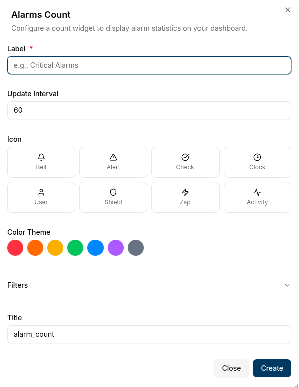
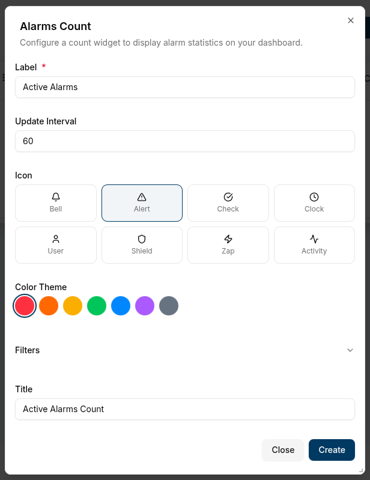
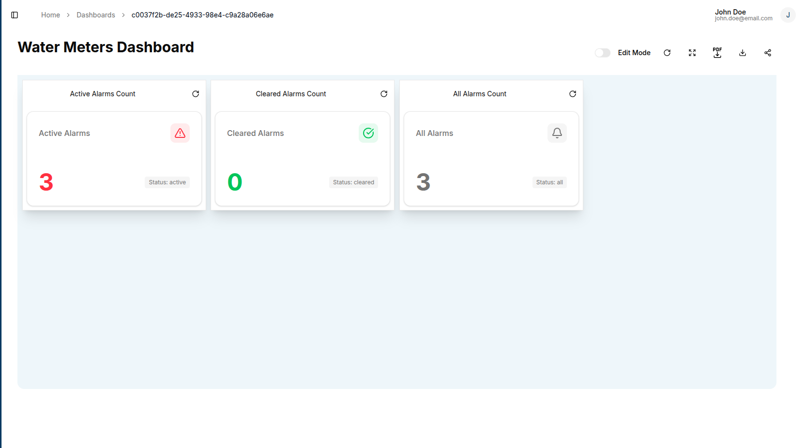
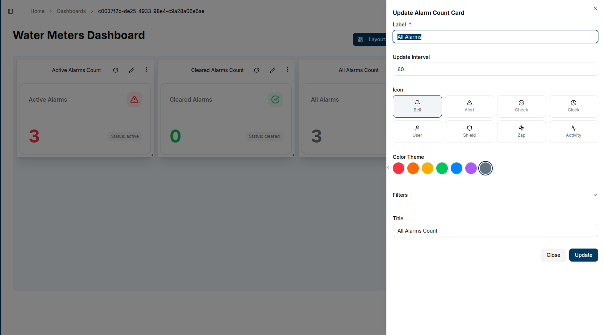

The **Alarm Count** widget displays the total number of alarms based on your filter criteria. It provides a quick overview of system alerts in a compact card format.

## Adding an Alarm Count Widget

1. Open your dashboard and switch to **Edit Mode**
2. Click **Add Widget**
3. Select **Alarm Count** from the widget options

## Configuration Options

### Basic Settings

- **Label**: Short descriptive text displayed on the card (e.g., "Critical Alarms")
- **Update Interval**: How often the widget refreshes data
- **Icon**: Visual icon displayed next to the label
- **Color Theme**: Theme color for the card content
- **Title**: Widget title shown at the top

### Filters

Use filters to narrow down which alarms to count. All filters are optional:

- **Channel**: Filter by specific communication channel
- **Client**: Filter by device or client ID
- **Alarm Status**:
  - Active: Currently triggered alarms
  - Cleared: Resolved alarms
  - All: Both active and cleared alarms
- **Subtopic**: Filter by message subtopic
- **Severity**: Filter by alarm severity level
- **Assignee**: Filter by person assigned to handle the alarm
- **Updated By**: Filter by who last modified the alarm
- **Assigned By**: Filter by who assigned the alarm
- **Acknowledged By**: Filter by who acknowledged the alarm
- **Resolved By**: Filter by who resolved the alarm
- **Created From**: Filter by alarm creation start date
- **Created To**: Filter by alarm creation end date

## Creating the Widget

1. Configure your desired settings and filters
2. Click **Create**
3. The alarm count card appears on your dashboard with the specified filters applied

## Editing the Widget

To modify an existing alarm count widget:

1. Click the **pencil icon** on the widget
2. Update any configuration options or filters
3. Click **Save** to apply changes

The widget automatically updates to reflect your new settings and displays the current alarm count based on your filter criteria.

## Conclusion

The Alarm Count widget provides essential monitoring capabilities for your IoT system. Use multiple widgets with different filters to track various alarm categories simultaneously, enabling proactive system management and quick identification of critical issues.
