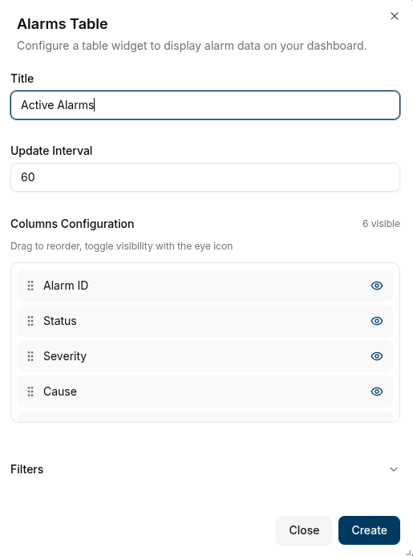
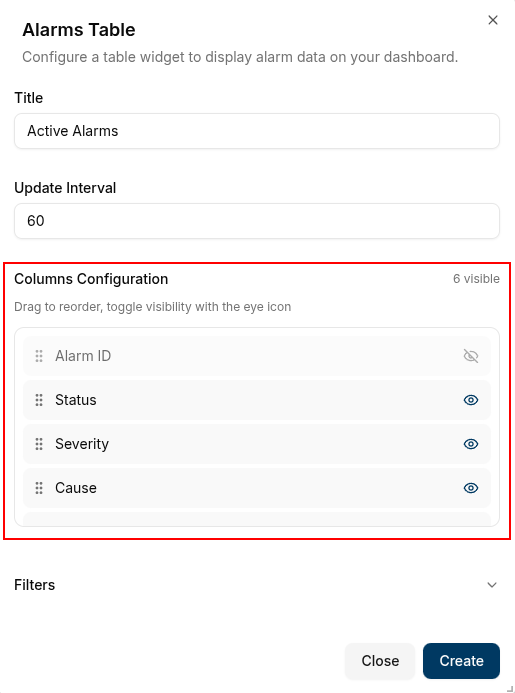
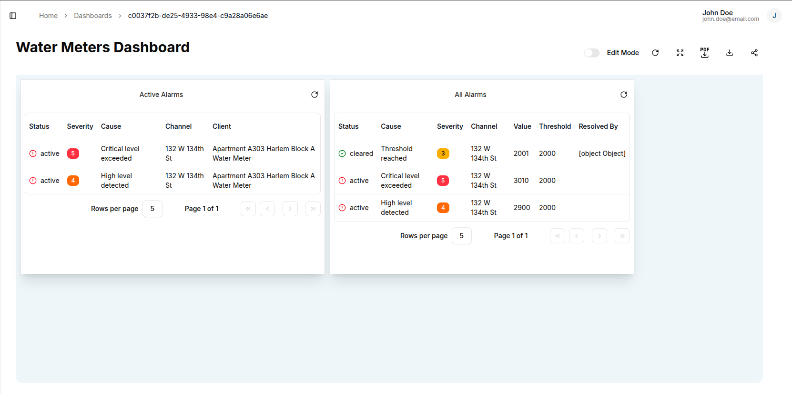
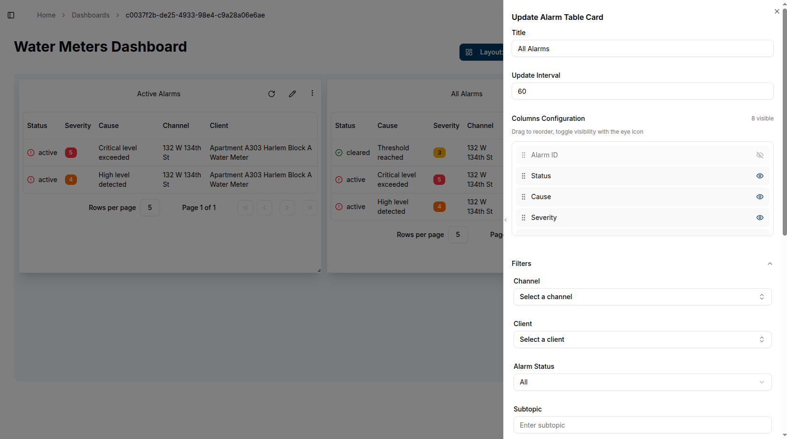

The **Alarm Table** widget displays detailed alarm information in a structured table format. It provides comprehensive visibility into system alerts with customizable columns and filtering options.

## Adding an Alarm Table Widget

1. Open your dashboard and switch to **Edit Mode**
2. Click **Add Widget**
3. Select **Alarm Table** from the widget options

## Configuration Options

### Basic Settings

- **Title**: Descriptive title appearing at the top of the widget
- **Update Interval**: How often the widget refreshes data

### Column Configuration

Control which columns are visible and their order:

**Available Columns:**

- Alarm ID
- Status
- Severity
- Cause
- Subtopic
- Channel
- Client
- Rule
- Value
- Threshold
- Assignee
- Assigned By
- Acknowledged By
- Resolved By
- Created At
- Updated At

**Column Management:**

- **Sort Order**: Click and drag columns up or down to reorder them
- **Visibility**: Click the eye icon to show/hide columns
  - Open eye: Column is visible
  - Crossed-out eye: Column is hidden

### Filters

Use filters to narrow down which alarms to display. All filters are optional:

- **Channel**: Filter by specific communication channel
- **Client**: Filter by device or client ID
- **Alarm Status**:
  - Active: Currently triggered alarms
  - Cleared: Resolved alarms
  - All: Both active and cleared alarms
- **Subtopic**: Filter by message subtopic
- **Severity**: Filter by alarm severity level
- **Assignee**: Filter by person assigned to handle the alarm
- **Updated By**: Filter by who last modified the alarm
- **Assigned By**: Filter by who assigned the alarm
- **Acknowledged By**: Filter by who acknowledged the alarm
- **Resolved By**: Filter by who resolved the alarm
- **Created From**: Filter by alarm creation start date
- **Created To**: Filter by alarm creation end date

## Creating the Widget

1. Configure your title and update interval
2. Set up column visibility and order
3. Apply desired filters
4. Click **Create**
5. The alarm table appears on your dashboard with the specified configuration

## Editing the Widget

To modify an existing alarm table widget:

1. Click the **pencil icon** on the widget
2. Update any configuration options, columns, or filters
3. Click **Save** to apply changes

The widget automatically updates to reflect your new settings and displays alarm data based on your configuration.

## Conclusion

The Alarm Table widget provides detailed alarm management capabilities for comprehensive system monitoring. Use column customization to focus on relevant information and apply filters to track specific alarm categories effectively.
