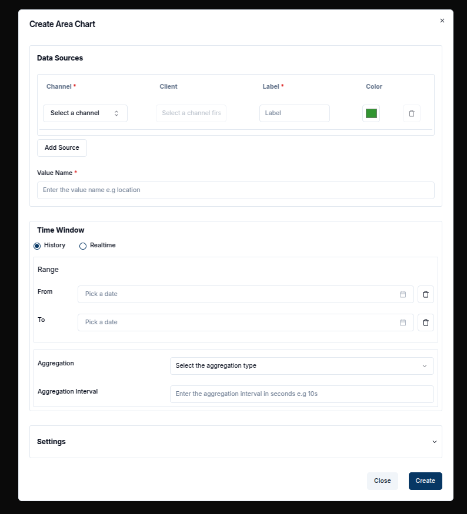
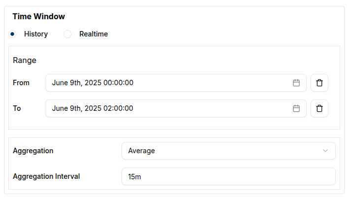

Creating an Area Chart follows a process similar to other timeseries charts, but it provides a visually distinct way to represent data trends over time.

### Create an Area Chart

To create an Area Chart, ensure your dashboard is in **Edit Mode**.
Click the `Add Widget` button, then select the **Area Chart** option from the widget list.
This will open the **Create Area Chart** dialog, where the settings and data sources can be configured.

#### Configuring the Area Chart

Start by setting up a single data source.

- **Value Name**: Enter the name of the value you wish to visualize, such as voltage or temperature.
- **Channel**: Select the channel that provides the data you want to plot.
- **Client**: Choose the entity or device connected to the channel.
- **Label**: Provide a meaningful label to differentiate each data source on the chart.
- **Area Color**: Pick a color for the filled area of the chart using the color picker.

Multiple data sources can be added by clicking the `Add Source` button.

Once the data sources are configured, you can define a **Time Window** by specifying the "From" and "To" dates, which will constrain the data shown to the specified time period.
In the **Settings** tab, you can adjust the **Update Interval** (how often the chart refreshes) and other chart appearance options.
After configuring everything, click the `Create` button to add the Area Chart to your dashboard.

### Edit the Area Chart

The Area Chart can be edited at any time by clicking the `pencil` icon in the top-right corner of the widget. This will open the edit sheet on the right, where data sources, the chart title and settings such as the time window can be modified.

1. **Adding Data Sources**: Click on the `Add Source` button to include additional data streams.
2. **Modifying Time Window**: Specify the "From" and "To" dates to adjust the time range for the chart.
3. **Aggregation**: Apply data aggregation to summarize the data points. For example, select sum, average, maximum, minimum or count to view aggregated values over defined intervals.

For example, the chart can be switched to live data.

Once the changes have been made, click the `Update` button to save and apply the new settings. The chart will automatically refresh with the updated data or appearance.

In many cases, data is aggregated over time intervals. For instance, setting the **Aggregation Interval** to 10 minutes (600 seconds) and selecting the **Average** aggregation type will display the mean values over each 10-minute period for a 2-hour time window.

The result will be an Area Chart that shows the average value in each time interval, providing an insightful view of the data trends.

#### **Conclusion**

Area Charts are a powerful way to visualize changes in data over time. They allow trends and patterns to be easily tracked with a clean, filled-in graphical representation.
This chart is especially useful for comparing cumulative values and emphasizing the overall volume of data.
