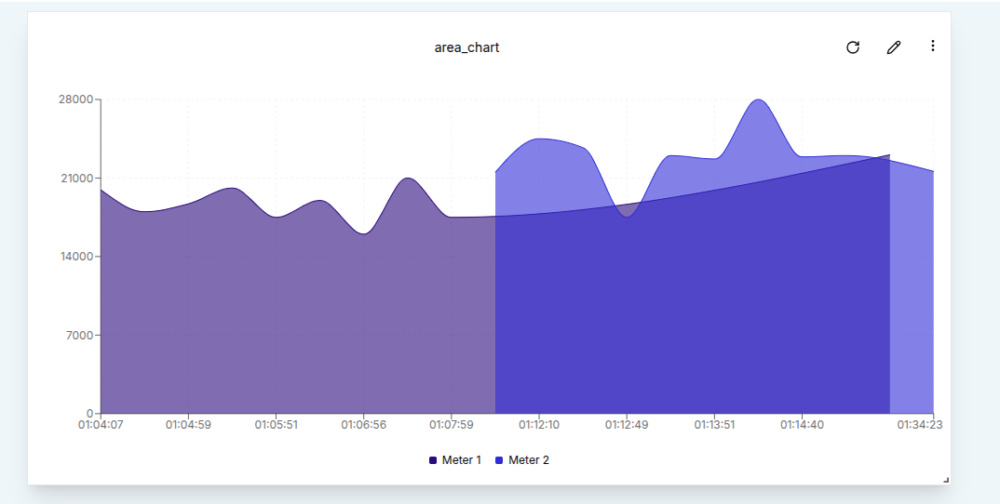
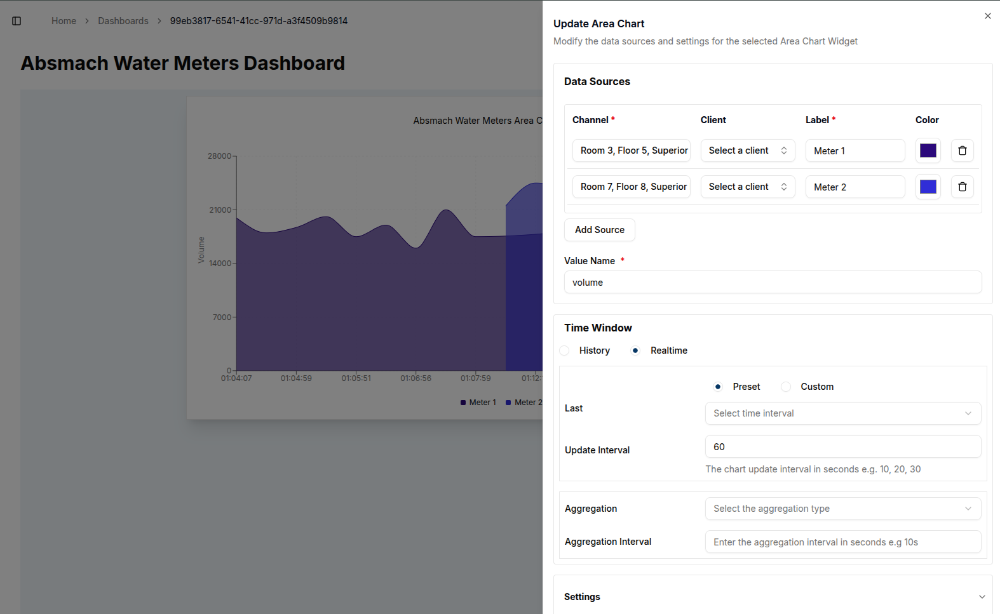

Area Charts provide a visually rich way to track data trends over time by shading the area beneath the line. Like other timeseries widgets, they support multiple data sources, time window configuration, and data aggregation to help users extract meaningful insights.

### Create an Area Chart

To create an Area Chart, a user must first ensure the dashboard is in **Edit Mode**.
Click the `Add Widget` button and select the **Area Chart** option from the widget list. This opens the **Create Area Chart** dialog, where data sources and chart settings can be configured.

#### Configuring the Area Chart

Start by setting up a single data source.

- **Value Name**: The specific metric to visualize, such as voltage or temperature.
- **Channel**: The channel providing the data to be plotted.
- **Client**:  The device or entity connected to the selected channel.
- **Label**:   A custom label to identify the data source on the chart.
- **Area Color**: The fill color for the area beneath the line.

To include more data streams, a user can click the `Add Source` button.

Once the data sources are defined,a Time Window can be applied by specifying the _From_ and _To_ dates. This restricts the displayed data to the selected time range.

In the **Settings** tab, a user can also adjust the **Data Points** (number of data point to be plotted) and modify other visual options.
After configuring all options, click the `Create` button to add the Area Chart to the dashboard.

### Edit the Area Chart

An Area Chart can be edited at any time by clicking the `pencil` icon in the top-right corner of the widget. This opens the settings sheet on the right, where chart properties such as data sources, the chart title, and the time window can be modified..

1. **Adding Data Sources**: Click on the `Add Source` button to include additional data streams.
2. **Modifying Time Window**:Adjust the From and To values to change the timeframe of the data.
3. **Aggregation**: Apply aggregation to group data points by interval. Options include **Sum**, **Average**, **Maximum**, **Minimum**, and **Count**.

For example, the chart can be switched to live data.

Once all changes are made, a user can click the `Update` button to apply the new settings. A confirmation message will appear, and the chart will refresh to reflect the updates.

In many use cases, data is aggregated over specific time intervals to make trends easier to interpret.
For instance, setting the **Aggregation Interval** to 15 minutes (900 seconds) and selecting the **Average** aggregation type will display the mean values over each 15-minute period for a 2-hour time window.

The result will be an Area Chart that shows the average value in each time interval, providing an insightful view of the data trends.

#### Conclusion

Area charts are a powerful way to visualize changes in data over time. They offer a clean, filled-in representation that highlights trends and patterns, while also emphasizing cumulative values.
With flexible settings for data sources, aggregation, time ranges, and styling, Area charts help users interpret both real-time and historical data with greater clarity.
