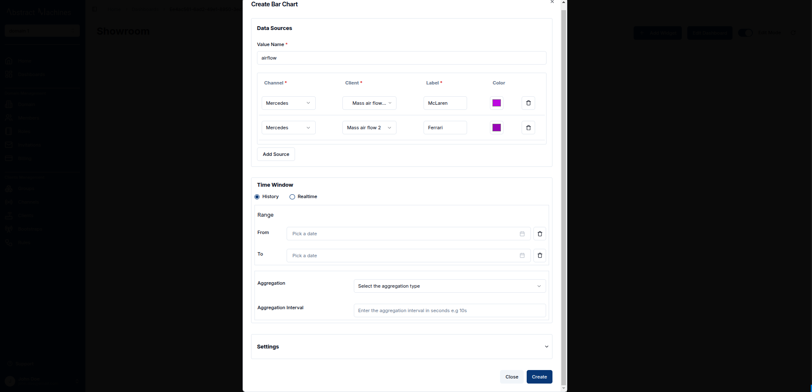
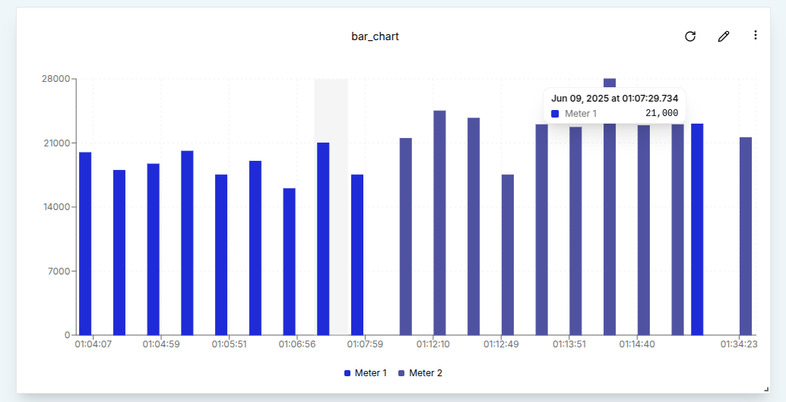
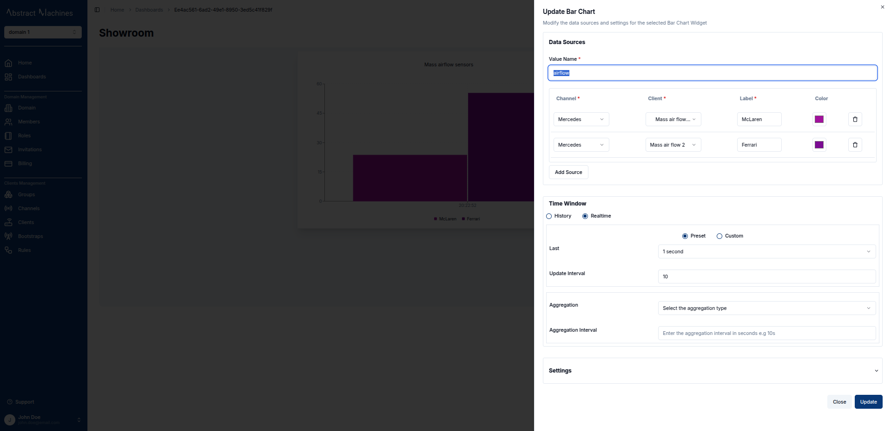
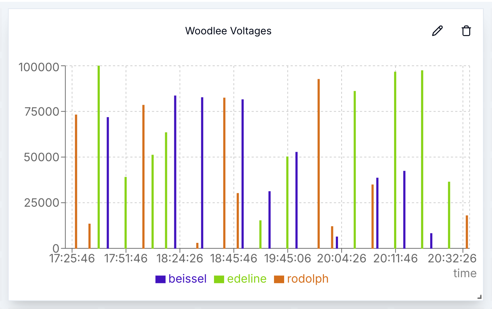

Similar to the Line Chart, the Bar Chart follows a comparable timeseries format in its dialog box.

### Create a Bar Chart

To create a Bar Chart, first ensure that the dashboard is in Edit Mode.
Click on the `Add Widget` button, which will open a dialog box displaying all available widgets.
Select the **Bar Chart** option from the list.

This will open the **Create Bar Chart** dialog, where the chart’s settings and data sources can be configured.

#### Configuring the Bar Chart

Just like with the line chart, the fields marked with an asterisk are required and must be filled in before clicking `Create` button.

Once the data sources are set, define a **Time Window** by specifying the "From" and "To" dates, which will limit the displayed data to the chosen time interval.
In the **Settings** tab, further customize the chart by adjusting its appearance, including the update interval and other relevant properties.
After configuring everything, click the `Create` button to save the Bar Chart widget.
The dialog will close, and the Bar Chart will be added to the dashboard.

### Edit the Bar Chart

An existing bar chart can be edited at any time by clicking the `pencil` icon in the top-right corner of the chart. This will open an edit sheet on the right, where data sources, labels, time window, and other settings can be modified.

1. **Add Data Sources**: You can add more data sources by clicking the `Add Source` button and providing additional channels, clients, and labels.
2. **Delete Data Sources**: Remove a data source by clicking the `trash` icon next to the specific source to be deleted.

In this section, the chart title, labels, and intervals can also be modified as needed.
Once all changes are made, click the `Update` button to save the modifications.

The **Time Window** settings can further filter the data shown in the chart by specifying a specific time range.
For example, selecting a time window from 17:30 to 19:30 will constrain the data to that two-hour period.
Additionally, **Aggregation** can be applied to the data points.

These settings group the data and allow for more meaningful summaries.
For instance, applying aggregation with an interval of 10 minutes and selecting "Minimum" will display the lowest value recorded for each 10-minute interval over a two-hour time window.

After applying these settings, the resulting chart will show aggregated values based on the specified criteria.

#### **Conclusion**

With the ability to add, edit, and delete data sources, along with fine-tuning time windows and aggregation, Bar Charts provide a versatile way to visualize data on the dashboard.
