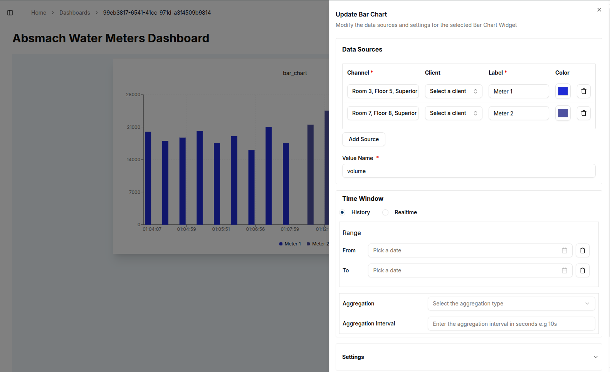
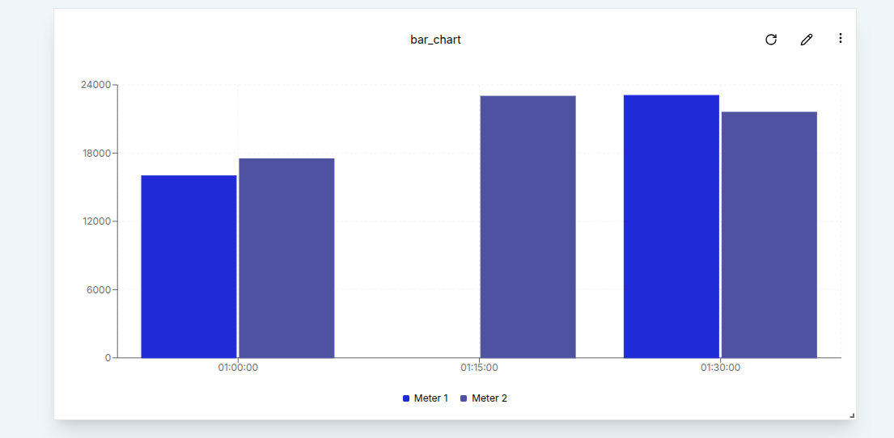

Bar Charts provide a clear, comparative view of data across categories or time intervals. Like other timeseries widgets, they support multiple data sources, time window configuration, and data aggregation to give users meaningful insights into their data.

### Create a Bar Chart

To create a Bar Chart, a user must first ensure the dashboard is in **Edit Mode**.
Click the `Add Widget` button and select **Bar Chart** from the list of available widgets. This opens the **Create Bar Chart** dialog, where the chart’s data sources, time window and settings can be configured.

#### Configuring the Bar Chart

Start by setting up a single data source.

- **Value Name**: The specific metric to visualize, such as voltage or temperature.
- **Channel**: The channel providing the data to be plotted.
- **Client**:  The device or entity connected to the selected channel.
- **Label**:   A custom label to identify the data source on the chart.
- **Bar color**: The fill color for bars.

To include more data streams, a user can click the `Add Source` button.

Just like with the line chart, the fields marked with an asterisk are required and must be filled in before clicking `Create` button.

A **Time Window** can be applied by setting the _From_ and _To_ dates. This constrains the chart to display data only within the specified range.
In the **Settings** tab, a user can further adjust properties such as the Data Points and other styling options.

After configuration, click the `Create` button to add the Bar Chart to the dashboard.

### Edit the Bar Chart

To edit an existing Bar Chart, a user can click the `pencil` icon in the top-right corner of the widget. This opens the settings sheet on the right, where chart properties such as data sources, time window, and title can be modified.

1. **Add Data Sources**: Click the Add Source button to include additional channels and labels.
2. **Removing Data Sources**:  Click the `trash` icon next to a source to delete it.
3. **Editing Chart Title**: Update chart title.
4. **Modifying Time Window**: Specify new From and To dates to change the time range of displayed data.
5. **Aggregation**: Apply aggregation by selecting a method (e.g., Minimum, Maximum, Average), set timewindow and interval (e.g., every 10 minutes).
In this section, the chart title, labels, and intervals can also be modified as needed.  

After applying changes, click the `Update` button. A confirmation message will appear, and the chart will refresh with the updated settings. For example, selecting a time window from 01:00 to 01:30 will constrain the data to that 30-minute period.

Additionally, **Aggregation** can be applied to the data points.
In the example below, an Aggregation Interval of **15 minutes** is used along with the **Minimum** aggregation method. This results in the chart displaying the lowest value recorded during each 15-minute segment over a two-hour period.

#### Conclusion

Bar Charts offer a clear, flexible way to visualize discrete values across time or categories. With support for multiple data sources, aggregation, and customizable styling, they are a powerful addition to any dashboard.
By allowing users to add, edit, or remove data streams and adjust time-based filters, Bar Charts provide valuable insights through a visual format that’s easy to interpret.
