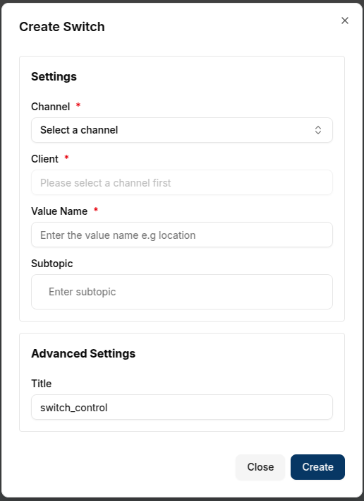

Control Cards are interactive widgets that allow a user to send commands directly to connected devices through a selected channel. These cards provide an intuitive interface for real-time device control within the dashboard.

There are two types of Control Cards:

- **Switch Cards** – for sending boolean values (ON/OFF)

- **Slider Cards** – for sending numeric values (e.g., volume, power)

---

## Switch Card

The **Switch Card** allows a user to send boolean values (**true** or **false**) to a connected client via a channel. This is useful for devices that support simple on/off behavior, such as relays, motors, or lights.

### Create a Switch Card

To create a Switch Card:

1. Ensure the dashboard is in **Edit Mode**.
2. Click the Add Widget button and select **Switch**.
3. The **Create Switch dialog** will appear.

#### Configure the Switch Card

Configuration Fields:

- **Channel (*Required*)** - The channel to which the message is sent.
- **Client (*Required*)** - The target device receiving the command.
- **Value Name (*Required*)** -The name of the value being controlled (e.g., **volume**).
- **Subtopic** -  Optional message subtopic.
- **Title** - Optional label for the widget on the dashboard.

Once all fields are complete, click `Create`. The Switch Card will be added to the dashboard

---

#### Use a Switch Card

After creation, the switch appears with its configured **title** and **value name**.

- The default state is **OFF**.
- A user can toggle the switch to **ON**, sending a true command to the client.

---

### Edit the Switch Card

Click the pencil icon on the widget to open the Update Switch dialog.

Editable fields include:

- **Channel** - Change the assigned communication channel.
- **Client** - Select a different connected device.
- **Value Name** - Modify the controlled value.
- **Subtopic** - Modify the subtopic value.
- **Title** - Update the displayed title.

After updating the settings, click `Update` to apply the changes.

---

#### Using the Switch Card (ON State)

After editing, the switch can be toggled to the **ON** (**true**) state, sending a command to the connected device.

---

#### Switch Conclusion

Switch Cards are ideal for simple device control:

- Toggle ON/OFF commands
- Real-time interaction with devices
- Configurable titles, value names, and channels

## Slider Control

The **Slider Card** allows a user to send numeric values to a connected device through a channel. It’s perfect for use cases such as adjusting **temperature**, **voltage**, or **fan speed**.

### Create a Slider Card

To create a Slider Card:

- Ensure the dashboard is in Edit Mode.
- Click the Add Widget button and select Slider.
- The Create Slider dialog will appear.

#### Configure the Slider Card

Configuration Fields:

- **Channel** (Required) – The channel for sending the message.
- **Client** (Required) – The target device receiving the value.
- **Value Name** (Required) – The metric being controlled (e.g., voltage).
- **Subtopic** – Optional subtopic for the message.
- **Unit** – The unit of measurement (e.g., L, °C, %, V).

Advanced Settings:

- **Title** – A custom title for the widget.
- **Minimum Value** – The lowest selectable value.
- **Maximum Value** – The highest selectable value.
- **Steps** – The value increment between slider positions.

Click `Create` once the configuration is complete.

---

#### Use the Slider Card

Once added, the slider appears with the configured **title** and **unit**.

A user can drag the handle to send a new numeric value.

The selected value is sent immediately to the target client.

---

### Edit the Slider Card

To edit a Slider Card, click the `pencil` icon on the widget.
This opens the **Update Slider** dialog.

#### Editable Slider Fields

- **Channel** - Change the assigned communication channel.
- **Client** - Select a different connected device.
- **Value Name** - Modify the value being controlled.
- **Subtopic** - Modify the subtopic for the message.
- **Title** - Update the displayed title.
- **Minimum & Maximum Values** - Adjust the slider range.
- **Steps** - Define the increment between values.

After making the necessary changes, click `Update` to save them.

---

#### Using the Slider with Updated Steps

After editing, the slider values can be adjusted in defined **steps** (e.g., increments of `1000`).

---

#### Conclusion

**Control Cards** enable direct, real-time control over IoT devices within a domain. Whether toggling a relay or adjusting a value, they provide a seamless, intuitive interface.

Key highlights:

- Switch Cards for binary **ON/OFF** control

- Slider Cards for precise numeric input

- Full support for custom labels, update logic, and device targeting
With Control Cards, managing connected devices from the dashboard becomes simple and efficient.
