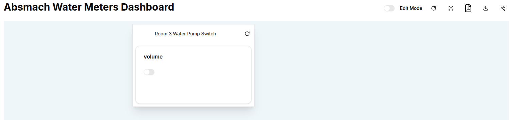
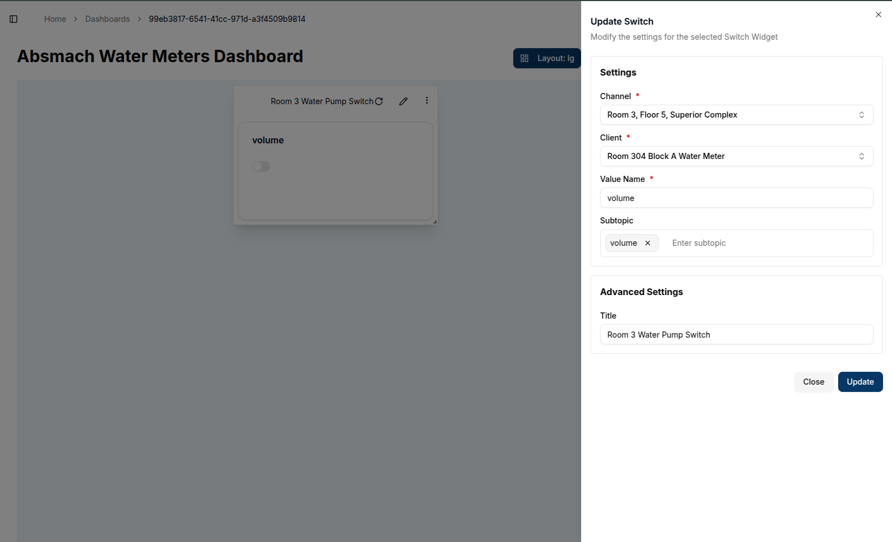

Control cards are interactive widgets that allow users to **send commands** to connected devices through a channel. These cards facilitate direct control of IoT devices from the dashboard.

There are two main types of **Control Cards**:

1. **Switch Cards** - Used for **boolean values** (ON/OFF).
2. **Slider Cards** - Used for **numeric values** (e.g. adjusting voltage or temperature).

---

## **Switch Card**

A **Switch Card** sends **boolean** values (`true` or `false`, equivalent to `ON` and `OFF`) to a connected **client** through a **channel**. It is useful for controlling devices like lights, motors, or sensors.

### Create a Switch Card

To create a **Switch Card**, follow these steps:

1. **Enable Edit Mode** on the dashboard.
2. Click on **"Add Widget"** and select **"Switch"** from the list.
3. A **Create Switch** dialog box will appear, as shown below.

#### Configure the Switch Card

The **Create Switch** dialog box contains the following settings:

- **Channel (*Required*)** - Select the channel that the switch will communicate through.
- **Client (*Required*)** - Choose the connected device that will receive the switch command.
- **Value Name (*Required*)** - Enter the name of the value being controlled (e.g., **airflow** or **voltage**).
- **Unit** - Must be set to **Boolean** (`true` or `false` values).
- **Advanced Settings**
  - **Title** - A custom name for the switch card on the dashboard.

Once the required fields are filled in, click `Create` to add the switch to the dashboard.

---

#### **Use a Switch Card**

Once created, the switch card appears on the dashboard with the configured **title** and **value name**.

- The **default state** of the switch is **OFF** (`false`).
- Clicking on the **toggle button** will change its state to **ON** (`true`), sending a message to the client.

---

### Edit the Switch Card

To edit a **Switch Card**, click the `pencil` icon in the top-right corner of the widget. This will open the Update Switch dialog.

#### **Editable Fields**

- **Channel** - Change the assigned communication channel.
- **Client** - Select a different connected device.
- **Value Name** - Modify the controlled value.
- **Title** - Update the displayed title.

After making the necessary changes, click `Update` to save them.

---

#### **Using the Switch Card (ON State)**

After editing, the switch can be toggled to the **ON** (`true`) state, sending a command to the connected device.

---

#### **Conclusion**

Switch Cards are essential for IoT control, allowing users to interact with devices directly from the dashboard. They offer an intuitive interface for toggling **boolean values** and sending real-time commands.

Key benefits of **Switch Cards** include:

- Simple **ON/OFF** functionality for **boolean-based control**.
- Real-time interaction with connected **IoT devices**.
- Customizable settings for **channels, clients, and value names**.

## **Slider Control**

A **Slider Card** sends **numeric values** to a connected **client** through a **channel**. It allows for adjustable input, making it useful for controlling settings like **temperature, voltage, or airflow**.

### Create a Slider Card

To create a **Slider Card**, follow these steps:

1. **Enable Edit Mode** on the dashboard.
2. Click on **"Add Widget"** and select **"Slider"** from the list.
3. A **Create Slider** dialog box will appear.

#### Configure the Slider Card

The **Create Slider** dialog contains the following settings:

- **Channel (*Required*)** - Select the channel that the slider will communicate through.
- **Client (*Required*)** - Choose the connected device that will receive the numeric value.
- **Value Name (*Required*)** - Enter the name of the value being controlled (e.g., `airflow`, `voltage`).
- **Unit** - Choose the appropriate unit (e.g., volts, percentage, degrees).
- **Advanced Settings**
  - **Title** - A custom name for the slider card.
  - **Minimum Value** - The lowest value that can be selected.
  - **Maximum Value** - The highest value that can be selected.
  - **Steps** - The increment between selectable values.

After filling in the required fields, click `Create` to add the slider to the dashboard.

---

#### **Use the Slider Card**

Once created, the slider card appears on the dashboard with the configured **title** and **value name**.

- The **default value** of the slider is at the minimum value.
- Dragging the **slider handle** changes the value, which is then sent to the client.

---

### Edit the Slider Card

To edit a Slider Card, click the **Pencil Icon** in the top-right corner of the widget. This will open the **Update Slider** dialog.

#### **Editable Slider Fields**

- **Channel** - Change the assigned communication channel.
- **Client** - Select a different connected device.
- **Value Name** - Modify the value being controlled.
- **Title** - Update the displayed title.
- **Minimum & Maximum Values** - Adjust the slider range.
- **Steps** - Define the increment between values.

After making the necessary changes, click `Update` to save them.

---

#### **Using the Slider with Updated Steps**

After editing, the slider values can be adjusted in defined **steps** (e.g., increments of `10`).

---

#### **Slider Conclusion**

Control Cards offer a user-friendly way to **interact with IoT devices** directly from the dashboard.

Key features of Control Cards include:

- **Switch Cards** for simple **ON/OFF control**.
- **Slider Cards** for **precise numeric adjustments**.
- **Customizable settings** for flexibility in device control.

With **Control Cards**, managing IoT devices becomes **intuitive and efficient**.
