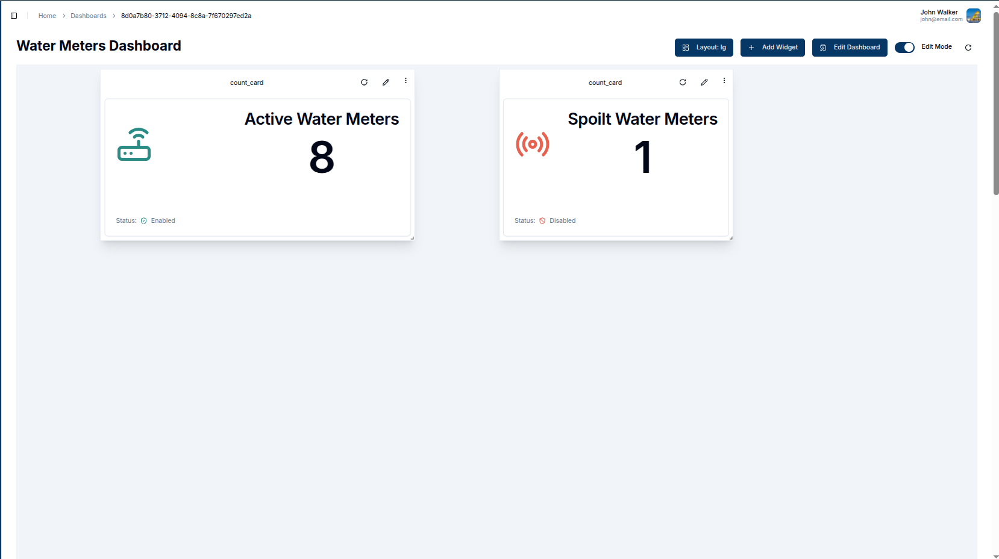
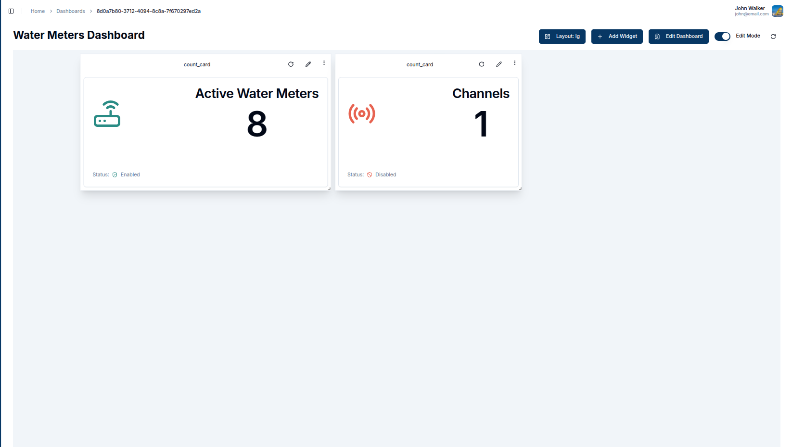
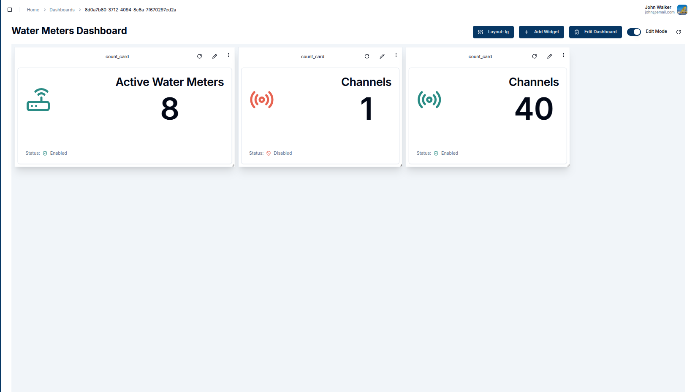

A **Count Card** provides a quick overview of the total number of entities such as devices, channels, members, or groups within a domain. It offers a snapshot of how many entities are available, based on the selected entity type and status.

### Create a Count Card

To create a Count Card, ensure your dashboard is in **Edit Mode**.
Click the `Add Widget` button and select **Count Card** from the list of available widgets. This will open the **Create Count Card** dialog, where the data source and appearance of the card can be configured.

#### Configuring the Count Card

1. **Entity Type**: Select the type of entity to count in the card. The available  options are:
   - **Client** (device)
   - **Channel**
   - **Member**
   - **Group**

2. **Entity Status**: Choose whether to count only enabled entities, disabled entities, or both.
3. **Tag**: Optionally, filter the entities by specifying a tag. Only entities with the selected tag will be counted.
4. **Update Interval**: Set how frequently the card should refresh to display the latest count. For example, an interval of `60` seconds will refresh the card every minute.

5. **Title**: Enter a title for the count card, which will appear at the top of the widget.

6. **Label**: Enter a label for the count card, e.g Water Meters.

Once all fields are completed, click the `Create` button to add the Count Card to the dashboard.

The card will immediately display the total count of entities based on the selected data source and filters. It will also display:

- **Status**: The status of the counted entities (enabled or disabled).
- **Tag**: The tag value, if a tag filter was applied.

   

### Edit the Count Card

The `pencil` icon in the top-right corner of the widget allows for editing. Clicking this icon will open a settings panel where the data source, entity status, tag, and other settings can be adjusted.

1. **Data Source**: Modify the **Entity Type**, **Status**, or **Tag** to change the entities being counted.
2. **Update Interval**: Adjust the frequency with which the card refreshes.
3. **Title**: Update the title to reflect any new data or focus.

  

Once the updates are made, click `Update` to save the changes. The count card will refresh with the new data and settings.

  

#### Customizing Count Cards

Count Cards are versatile and can be customized to meet specific needs. Customizable features include the title, status, tags, and icons displayed on the card. Below is an image that highlights these key features:

   

1. **Changing Icons**: Each entity type can have a unique icon, visually representing the type of entity being counted (e.g., a device icon for "Clients").
2. **Entity Status**: The status of the entities (Enabled/Disabled) is displayed.
3. **Deleting a Card**: To delete a count card, click the **Trash Icon**. A confirmation popup will appear.
4. **Popup**: Click `Delete` in the popup to confirm the deletion.
5. **Titles**: Titles of the count card can be customized for clarity.
6. **Labels**: Labels for the count card

#### **Conclusion**

With Count Cards, users can effectively monitor the total number of devices, channels, members, or groups in their domain. These cards are ideal for quickly assessing critical metrics at a glance.
