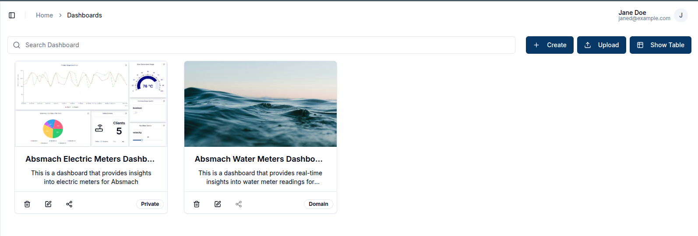
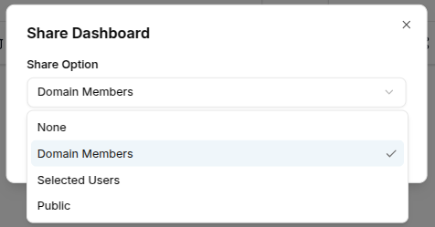
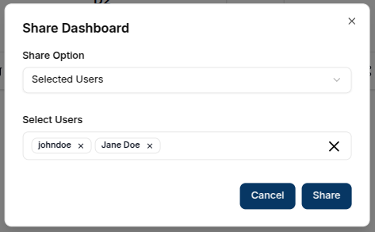
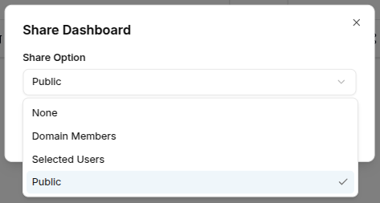
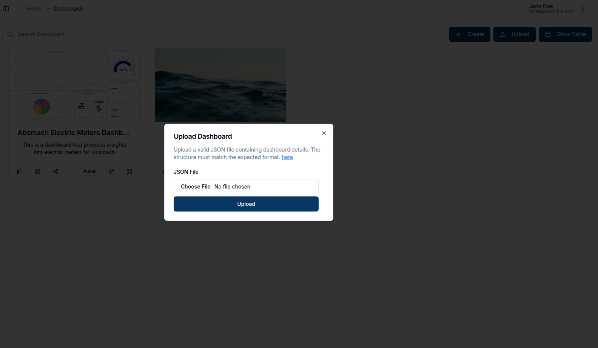

### Create a New Dashboard

After logging into a **Domain**, navigate to **Dashboards** tab and click on the `+ Create` button. A dialog box will prompt you to enter a dashboard name and optionally add a description, tags, a thumbnail, and a sharing option. Sharing options can be none, domain members, selected users or public.
> To learn more about the available share options, see the [**Update Dashboard Share State**](#update-dashboard-share-state) section below.
 

### View Dashboards

By default, dashboards are displayed as cards. To switch to table view, click the `Show Table` button at the top right. This displays the same dashboards in a table format.

To switch back to card view, click the `Show Cards` button.

### Edit Dashboard

To edit a dashboard, click the `Edit` icon on the dashboard card.  This opens a side panel from the right.

In the editing panel, a user can modify the dashboard's **name**, **description**, **tags** and **dashboard thumbnail** .  

### Update Dashboard Share State

To change a dashboard’s share settings, click the `Share` button on the dashboard card:

This opens a dialog with the available share options:

The available sharing options are:

- None - The dashboard is private and visible only to you

- Domain Members - The dashboard will be accessible to all domain members

- Selected Users - Only specific domain members can access the dashboard

- Public - Anyone with the link can access the dashboard

Public Dashboard Options:

On public dashboards:

- Click the `copy` button to copy the link and share it with others.

- Click the `fullscreen` icon to view the dashboard in full screen.

### Delete Dashboard

A user can delete a dashboard by clicking the `Trash` icon on the card or clicking **Delete** in the options on the dropdown menu in table view.
A confirmation prompt will appear to verify the action.

### Upload Dashboard

Magistrala allows dashboards to be uploaded in .JSON format.

By clicking the `Upload` button at the top of the dashboard table, a dialog box will open, allowing users to select and upload a _.JSON_ file containing the required fields for a complete dashboard.
> Make sure your file includes the dashboard **name**, **layout**, and **metadata**.  
 

The uploaded dashboard will then appear in the list with the uploaded data.

Sample templates to support real-life use cases can be found [here](https://github.com/absmach/magistrala-ui/tree/main/samples/dashboard-templates).

### Access a Dashboard

Dashboards can be accessed by clicking on the respective card or corresponding row in the table view.

### Customize a Dashboard

#### Edit a Dashboard

Toggling **Edit Mode** enables dashboard editing features. In this mode, users can **add**, **modify**, or **remove** charts and widgets, as well as update the dashboard's **name** and **description** using the `Edit Dashboard` button.

#### Choose a Layout

Layouts allow users to select a layout type that suits their needs, optimizing the dashboard for different screen sizes. Available options include layouts for **desktop**, **laptop**, **tablet**, **phone** or **small phone** — each adjusting the dashboard grid width for better responsiveness.

#### Add a Widget

To add widgets, users can click `Add Widget` at the top of the page, opening a dialog box with available charts and widgets for selection.

When edit mode switch is toggled off a user has access to:

### Full-Screen Mode

For an expanded view, clicking the `Full Screen` button allows the dashboard and its charts to occupy the entire screen.

### Download a Dashboard

#### Download a Dashboard as pdf

The `PDF icon` allows downloading the dashboard as a PDF file.

#### Download Dashboard as json

The `Download icon` enables downloading it as a JSON file.

### Share Dashboard

Allows the user to update the share state for the dashboard.

