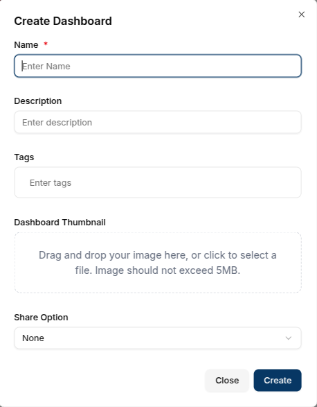
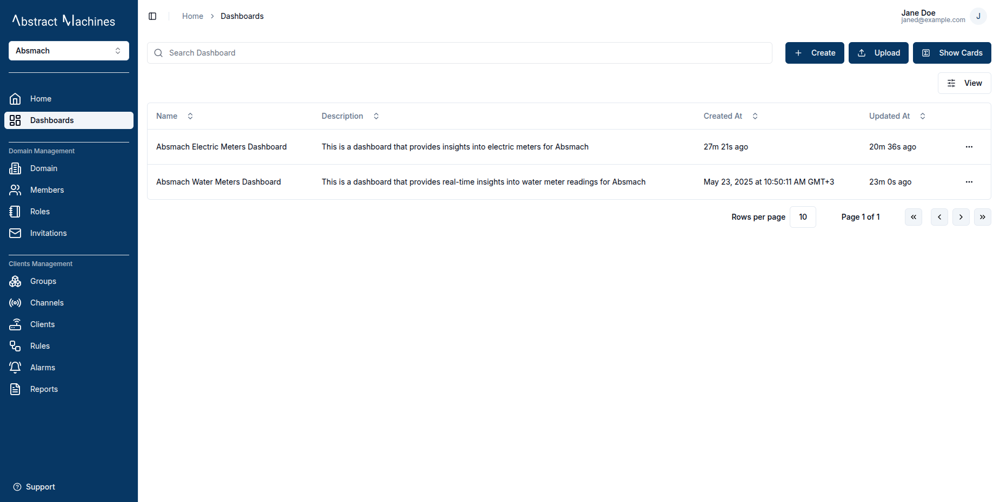
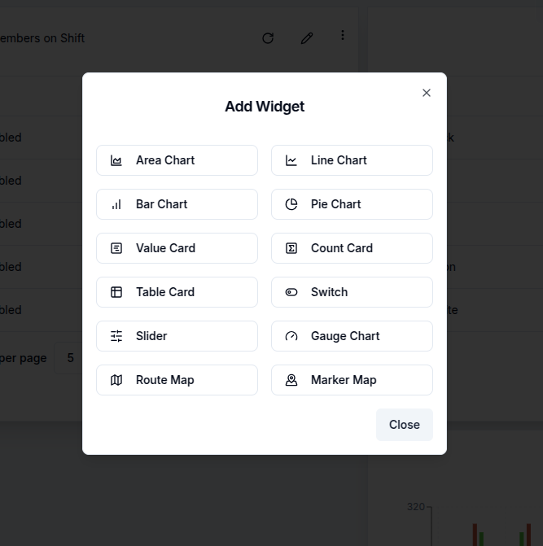

### Create a New Dashboard

After logging into a **Domain**, navigate to **Dashboards** tab and click on the `+ Create` button. A dialog box will prompt the user to enter a dashboard name, and optionally a description, tags and dashboard thumbnail.

### View Dashboards

Dashboards are initially displayed as cards. To switch to a table view, click the `Show Table` button at the top right. This displays the same dashboards in a table format.

To switch back to card view, click the `Show Cards` button.

### Edit Dashboard

To edit a dashboard, click the `Edit` icon on the dashboard card.  This opens a side panel from the right.

In the editing panel, a user can modify the dashboard's **name**, **description**, **tags** and **dashboard thumbnail** .  

### Delete Dashboard

A user can delete a dashboard by clicking the `trash` icon on the card or clicking **delete** in the options on the dropdown menu in table view.
A confirmation prompt will appear to verify the action.

### Upload Dashboard

Magistrala allows dashboards to be uploaded in .JSON format.

By clicking the `Upload` button at the top of the dashboard table, a dialog box will open, allowing users to select and upload a _.JSON_ file containing the required fields for a complete dashboard.
> Make sure your file includes the dashboard **name**, **layout**, and **metadata**.  

The uploaded dashboard will then appear in the list with the uploaded data.

Sample templates to support real-life use cases can be found [here](https://github.com/absmach/magistrala-ui/tree/main/samples/dashboard-templates).

### Access a Dashboard

Dashboards can be accessed by clicking on the respective card or corresponding row in the table view.

### Customize a Dashboard

#### Edit a Dashboard

Toggling **Edit Mode** enables dashboard editing features. In this mode, users can **add**, **modify**, or **remove** charts and widgets, as well as update the dashboard's **name** and **description** using the `Edit Dashboard` button.

#### Choose a Layout

Layouts allow a user to select the layout type suitable for your needs.
There are **desktop**, **laptop**, **tablet**, **phone** or **small phone** layouts. This adjust the width of the dashboard grid for better responsiveness.

#### Add a Widget

To add widgets, users can click `Add Widget` at the top of the page, opening a dialog box with available charts and widgets for selection.

When edit mode switch is toggled off a user has access to:

### Full-Screen Mode

For an expanded view, clicking the `Full Screen` button allows the dashboard and its charts to occupy the entire screen.

### Download a Dashboard

#### Download a Dashboard as pdf

The `PDF icon` allows downloading the dashboard as a PDF file.

#### Download Dashboard as json

The `Download icon` enables downloading it as a JSON file.

