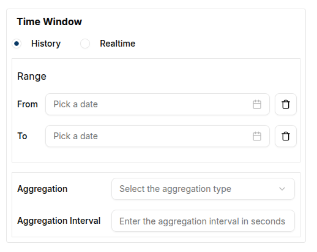
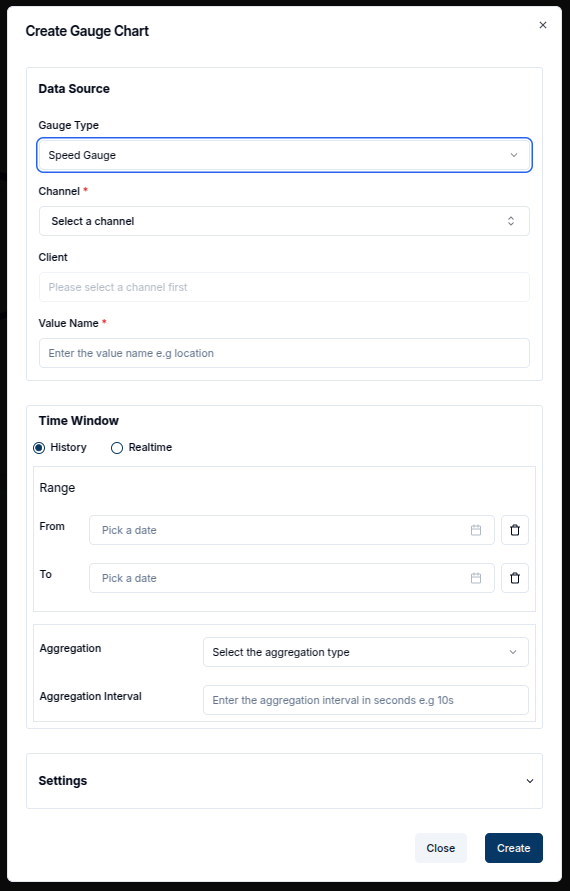

**Gauges** are essential widgets for visualizing the latest values from a connected **Client** or **Channel**. They offer a clear and intuitive way to monitor real-time metrics such as voltage, temperature, or speed.

Magistrala offers different types of gauges, including:

- **Simple Gauge**
- **Temperature Gauge**
- **Speed Gauge**

Each gauge can be configured to display values based on a specific data source. Below is an overview of how to create and configure each gauge type.

---

### Simple Gauge

The **Simple Gauge** widget displays the most recent value from a selected data source,  such as voltage or pressure. A user can configure the gauge to define value ranges, update intervals, units, and styling.

#### Create a Simple Gauge

To create a Simple Gauge:

1. Ensure the dashboard is in **Edit Mode**.
2. Click the `Add Widget` button and select **Simple Gauge** from the widget list. This will open the **Create Gauge Chart** dialog.

    

3. In the Create Gauge Chart dialog, configure the following:  

    - Data Source Configuration:

      - **Gauge Type**: Select Simple Gauge.

      - **Channel**: Choose the channel providing the data.

      - **Client**: Select the device associated with the channel.

      - **Value Name**: Specify the metric to display (e.g., volume).

     

    - Time Window Section:

      - **From / To**: Define the start and end of the time range.

      - **Aggregation Type**: Choose how to aggregate the values (e.g., Maximum, Average).

      - **Aggregation Interval**: Set the interval (e.g., 10s).

      

    - Settings Section:

      - **Minimum / Maximum Value**: Define the value range for the gauge.

      - **Update Interval**: Set how often the gauge should refresh (e.g., 600 seconds = 10 minutes).

      - **Title**: Add a meaningful title (e.g., "Absmach Temperature Sensor").

      - **Unit**: Choose from available units relevant to the data.

        

    Once configured, click `Create` to add the widget. The gauge will immediately begin displaying the latest value based on the applied settings.

   

### Temperature Gauge

The **Temperature Gauge** is tailored to display temperature data with unit options and a design optimized for temperature monitoring.

#### Create a Temperature Gauge

1. Enter **Edit Mode** and click **Add Widget**.
2. Select **Temperature Gauge** from the widget list.

   

3. Configure the following fields:
    - Data Source Configuration:

      - **Gauge Type**: Select Temperature Gauge.

      - **Channel**: Choose the source of temperature data.

      - **Client**: Select the associated device.

      - **Value Name**: Define the key used to retrieve temperature values (e.g., temperature).

    - Time Window Section:

      - **From /To**: Specify the desired time window.

      - **Aggregation Type**: Choose how values are aggregated.

      - **Aggregation Interval**: Define the aggregation interval (e.g., 10s).

    - Settings Section:

      - **Minimum /Maximum Value**: Set an appropriate temperature range (e.g., 0–200°C).

      - **Update Interval**: Define how frequently the data should refresh.

      - **Title**: Provide a title for the gauge (e.g., "Absmach Temperature Sensor").

    
  
  Click `Create` to add the widget to the dashboard. The gauge will immediately start reflecting the latest temperature readings.  

  

---

### Speed Gauge

The **Speed Gauge** is ideal for tracking real-time speed or velocity values from connected devices. It functions similarly to other gauges but is styled and labeled for speed data.

#### Create a Speed Gauge

1. Enable **Edit Mode** on the dashboard.
2. Click `Add Widget` and select **Speed Gauge** from the widget options.
   
3. Configure the following fields:
    - Data Source Configuration:

      - **Gauge Type**: Select Speed Gauge.

      - **Channel**: Choose the data source.

      - **Client**: Select the relevant device.

      - **Value Name**: Enter the key for the speed value (e.g., speedValue).

    - Time Window Section:

      - **From/ To**: Set the time range to fetch data.

      - **Aggregation Type**: Choose a method (e.g., Maximum).

      - **Aggregation Interval**: Enter a value (e.g., 10s).

    - Settings Section:
      - **Minimum/ Maximum Value**: Define the value range (e.g., 0–1000 km/h).

      - **Update Interval**: Set the refresh rate (e.g., 60 seconds).

      - **Title**: Enter a descriptive name (e.g., "Absmach Machine Speed Gauge").

      - **Unit**: Choose the appropriate speed unit from the list.

   

  Click `Create` to finalize the widget. The gauge will start displaying the latest speed data.

   

---

### Edit the Gauge

A user can edit any existing gauge widget by clicking the `pencil` icon on the top-right corner of the widget. This opens the settings sheet, where configuration changes can be made to the **data source**, **labels**, **time window**, or **visual properties**.

  

#### Conclusion

**Gauges** provide a real-time snapshot of key metrics in an easy-to-understand visual format. Whether tracking voltage, temperature, or speed, gauge widgets offer the flexibility and precision needed for monitoring connected devices.

Each gauge can be tailored through settings like value ranges, units, update frequency, and labels. As monitoring needs evolve, gauges can be updated at any time to reflect the most relevant data.
