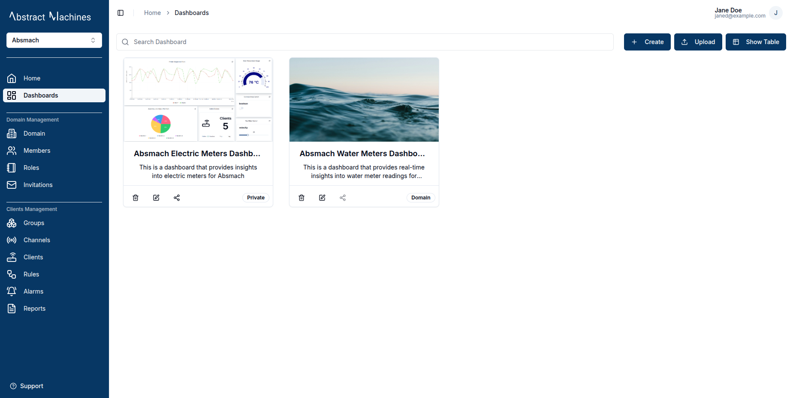

Dashboards are a powerful feature in Magistrala, and this section will cover how to create, customize and manage them effectively. Users can create and customize dashboards with various widgets, such as charts and control devices, adapting the interface to their specific needs. This flexibility makes it easier than ever to inspect IoT devices and data.

Each dashboard can be populated with multiple widgets, which are not limited to a single dataSource. Data can be displayed from devices and entities such as clients, providing a comprehensive view of system performance.

