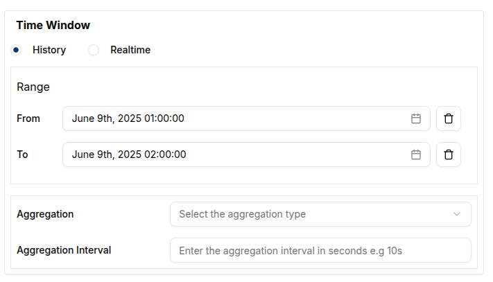

### Create a Line Chart

To create a Line Chart, first ensure that the dashboard is in **Edit Mode**.
Click on the `Add Widget` button, which will open a dialog box displaying all the available widgets.
Select the **Line Chart** option from the list.

This will open the **Create Line Chart** dialog, where the chart's settings and data sources can be configured.

#### Configuring the Line Chart

Start by setting up a single data source.

- **Value Name**: Enter the name of the value used to fetch the messages.
- **Channel**: Choose the channel connected to the device that should be tracked.
- **Client**: Select the client connected to the specified channel.
- **Label**: Provide a label to track each data source clearly on the chart.
- **Line Color**:  Use the color picker to choose a color for the line.

Once the data sources are configured, define a **Time Window** by specifying the "From" and "To" dates to restrict the data to a specific time interval.

In the **Settings** tab, the **Line Width** can also be adjusted to set the thickness of the lines based on visual preferences.

Once satisfied with the settings, click the `Create` button to save the Line Chart widget. This will close the dialog and add the new Line Chart to the dashboard.

### Edit the Line Chart

The Line Chart can be edited at any time by clicking the `pencil` icon on the widget. This will open a settings sheet on the right, where the chart’s data sources, labels, intervals, and title can be modified.

At this point, the labels, intervals, and chart title can also be edited.
Clicking the `Update` button will save the changes and adjust the chart according to the new settings. A confirmation message (toast notification) will appear to confirm that the update has been applied.

The data can be further manipulated using the **Time Window** settings. For example, the data can be restricted to a specific interval, such as one hour, as shown in the following settings:

This adjustment will ensure the chart displays data within the defined time frame, ensuring that the final data point is at or before the specified _To_ date.

Additionally, **Aggregation** can be applied to the data points. Aggregation requires a "From" value, a "To" value, and an interval. These settings help structure the query to the database for aggregated data.

In the example above, the chart is set to show the **Maximum** value over 10-minute intervals within a 100-minute time window.

The resulting chart will look like this:

#### **Conclusion**

Line Charts are an effective tool for visualizing trends and changes in data over time. They provide a clear, precise representation of data points, making it easy to track fluctuations, compare multiple data sources, and identify patterns. With customizable settings like data aggregation, time windows, and line styling, line charts offer flexibility for detailed data analysis, helping users make informed decisions based on real-time or historical data insights.
