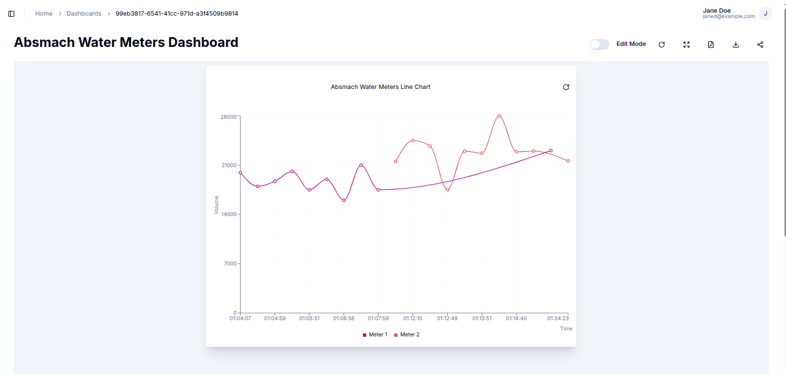
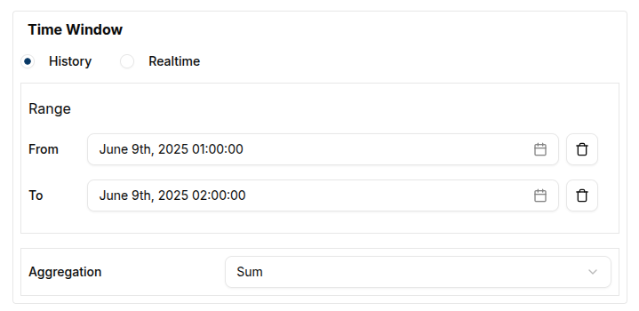

### Create a Line Chart

To create a Line Chart, the dashboard must first be switched to **Edit Mode**.
Clicking on the `Add Widget` button opens a dialog box displaying all the available widgets.
From this list, the **Line Chart** option should be selected.

This action opens the **Create Line Chart** dialog, where settings and data sources can be configured.

#### Configuring the Line Chart

The configuration begins with setting up a single data source.

- **Value Name**: The name of the value used to fetch the messages.
- **Channel**: The channel connected to the device being tracked.
- **Client**: The client associated with the selected channel.
- **Label**: A clear label for identifying each data source on the chart.
- **Line Color**:  A chosen color for the line using the color picker.

With the data sources defined, the next step is  optionally specify a **Time Window**. This is done by selecting the "From" and "To" dates, restricting the data to a specific time range.

Alternatively, under the **Settings** tab, the **Line Width** can also be adjusted. This changes the thickness of the chart lines to suit visual preferences.

Once the configuration is complete, clicking the `Create` button saves the Line Chart widget. The dialog closes, and the new chart appears on the dashboard.

### Edit the Line Chart

To edit a Line Chart, a user can click the `pencil` icon on the widget. This opens a settings sheet on the right, where chart properties such as **data sources**, **labels**, **intervals**, and the **title** can be updated.

The chart’s data can be refined by adjusting the **Time Window** for example, narrowing the range to a single hour using specific _From_ and _To_ values. This ensures the chart displays only data within the selected timeframe.

For deeper analysis, a user can enable **Aggregation** within the same settings panel. By setting a **From** date, **To** date, and an **interval** (e.g., 15 minutes), the data is grouped accordingly. This configures the query to return aggregated results.

In the example below, the chart displays the **Maximum** values aggregated over 15-minute intervals within a 2-hour window:

After making changes, a user can click the `Update` button at the bottom of the settings sheet. A confirmation message (toast notification) will appear to indicate that the update was successful.

#### Conclusion

Line Charts are a powerful tool for visualizing trends and changes in data over time. They offer a clear and precise view of data points, enabling users to track fluctuations, compare multiple data sources, and identify patterns with ease. With customizable settings such as data aggregation, time windows, and line styling, Line Charts provide the flexibility needed for detailed analysis, helping users make informed decisions based on both real-time and historical insights.
