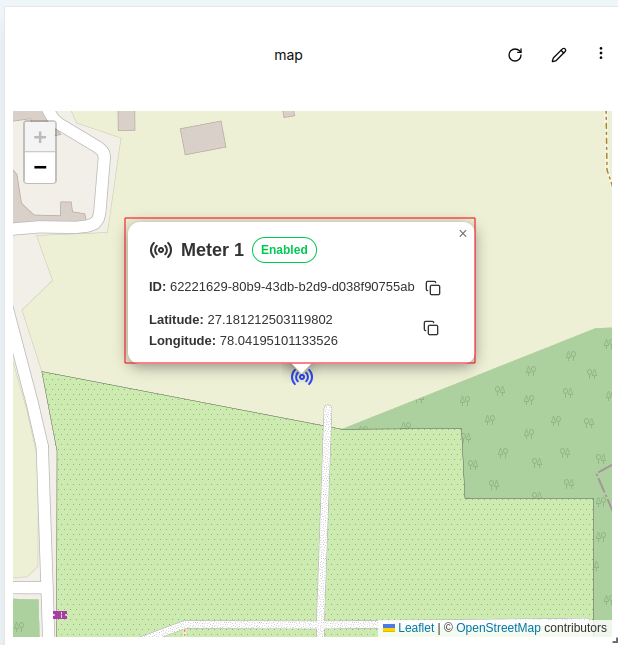
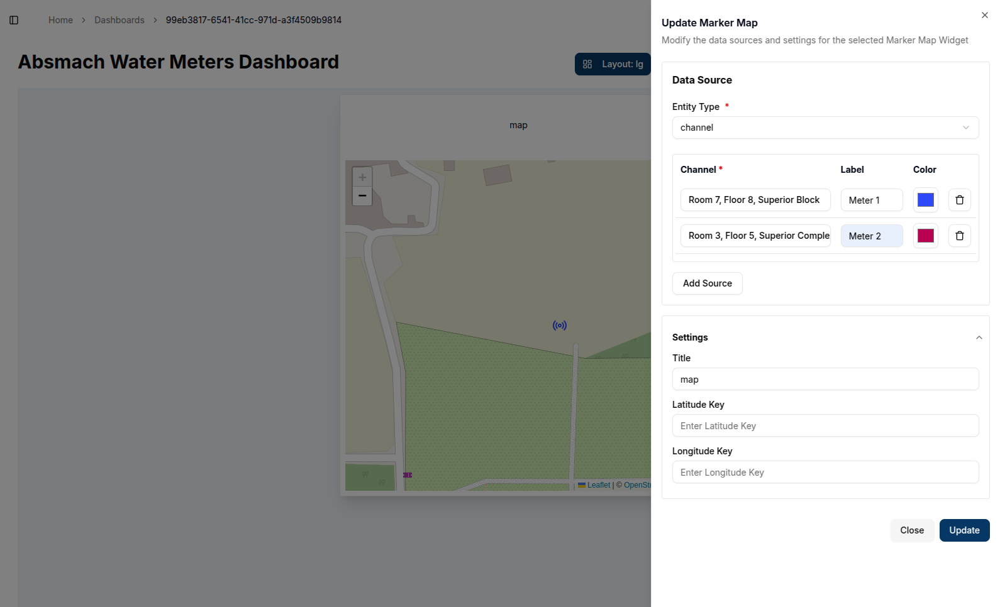
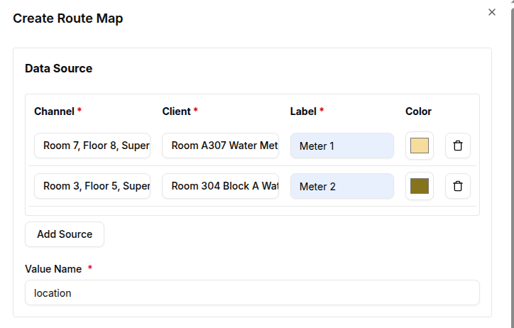
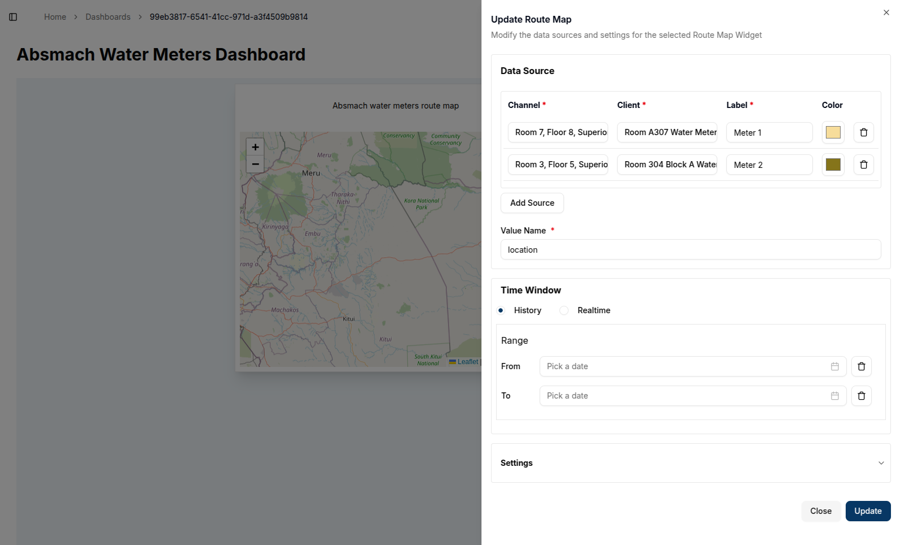
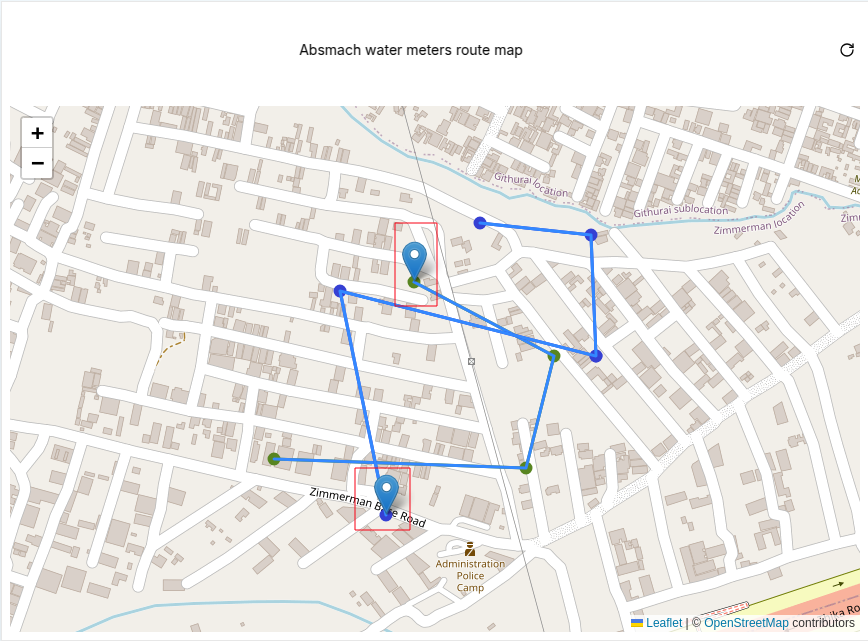

## **Marker Map**

**Marker Maps** are used to visualize the locations of entities, such as devices or channels, on a map. This makes them particularly useful for tracking the geographical locations of various IoT assets in a visual interface.

Marker Maps work by retrieving latitude and longitude data from the metadata of the entities. A typical metadata entry for an entity’s location might look like this:

```json
{
  "location": {
    "latitude": 27.181212503119802,
    "longitude": 78.04195101133526
  }
}
```

These coordinates are then used to place a marker on the map. Users can add multiple data sources, such as different devices or channels, to visualize them on the same map.

### Create a Marker Map

To create a Marker Map, ensure that the dashboard is in **Edit Mode**. Then, click the `Add Widget` button and select **Marker Map** from the list of available widgets.

This will open the **Create Marker Map** dialog, where users can configure the data sources and appearance of the map.


#### Configure the Marker Map

1. **Entity Type**: Choose the type of entity whose location data will be visualized. The available options include:
   - **Client** (device)
   - **Channel**
   - **Group**

     
2. **Channel**: Select the specific entity whose location data will be displayed. For this example, a channel with pre-configured metadata will be plotted.  3. **Label**: Provide a label for the marker, which will help identify it on the map.  
3. **Color**: Choose a color for the marker to distinguish it from others.  
4. **Add Source**: Multiple data sources (entities) can be added to the map by clicking `Add Source`.  
5. **Delete Source**: A data source can be removed by clicking the `trash` icon next to it.

   

**Settings Section**  
7. **Title**: Set a title for the map (e.g., "Marker Map"). This title will appear at the top of the map.  
8. **Latitude Key**: Specify the metadata key that contains the latitude value. By default, it is set to `latitude`, but it can be modified if a different key is used.  
9. **Longitude Key**: Similarly, set the metadata key for the longitude. The default is `longitude`.  

  

Once all the required fields are completed, click the `Create` button to add the Marker Map to the dashboard. The map will automatically center on the specified locations based on the metadata.


Each marker on the map has an interactive popup that provides more information about the entity. Clicking on a marker will open a popup with the entity details, as shown below:

- **Entity Name**: This is the name of the device or channel or group with a small icon dependent on the entity type.
- **Status**: This shows the state of the entity which can be **enabled/disabled**
- **Entity ID**: This is the unique identifier for the entity. It can be copied to the clipboard by clicking on the copy icon next to it.
- **Latitude and Longitude**: The exact coordinates of the entity’s location, which can also be copied to the clipboard.

   

### Edit the Marker Map

To edit a Marker Map, click the `pencil` icon at the top-right corner of the map widget. This will open the **Update Marker Map** dialog,  where users can adjust the data sources, labels, colors, and other settings.

1. **Add or Delete Data Sources**: Add additional entities to the map or remove existing ones by clicking the `Add Source` or `trash` icon, respectively.
2. **Modify Settings**: Update the **Latitude Key**, **Longitude Key**, and **Title** to better reflect the data being displayed.

   

Once changes have been made, click `Update` to apply the modifications. The updated map will display the new locations or modified settings.

   

#### Conclusion

Marker Maps offer an intuitive way to visualize the physical locations of IoT devices or channels on a dashboard. The flexibility to add multiple data sources, customize markers, and retrieve position data from metadata or messages ensures that this widget is adaptable to various use cases. By integrating real-time location data, Marker Maps enable users to track and monitor their assets effectively.

## **Route Map**

**Route Maps** display the path or movement of a device or entity based on the location messages sent over time. Unlike Marker Maps, which rely on metadata, Route Maps depend on message data from a connected channel-client pair. These messages contain latitude and longitude values, which are used to trace the route on the map. This feature is particularly useful for tracking the movement of devices over time.

### How Route Maps Work

Route Maps visualize location data by retrieving it from messages sent through a channel. The process for sending messages is covered in [getting-started](../../dev-guide/getting-started.md).
To use Route Maps, navigate to the messages tab of a channel that has connected clients. For Route Maps, it is crucial to use `location` as the value name, and the value type must be string. The message should contain the location data in the following format (as a string):

`{"latitude":-1.206367, "longitude":36.905012}`

  

These location values are used to plot the device's movement on the map. The latest message will indicate the current location, while previous messages will form the route path.

### Create a Route Map

To create a Route Map, ensure that the dashboard is in **Edit Mode**. Click the  `Add Widget` button and select Route Map from the list of available widgets.

This will open the **Create Route Map** dialog, where users can configure the data sources and appearance of the map.

  

#### Configure the Route Map

1. **Value Name**: Enter the name of the value that will contain the location data. This name should match the key in the message where the location information is stored.
2. **Channel**: Select the channel that will provide the location messages.
3. **Client**: Choose the connected device (client) associated with the selected channel.
4. **Label**: Provide a label for the route, which will help identify it on the map.
5. **Color**: Choose a color to represent the route line on the map.
6. **Add Source**: You can add multiple data sources (clients or channels) by clicking **Add Source**.
7. **Remove Source**: To remove a data source, click the `Trash Icon` next to the specific entry.

  

#### Settings Section

1. **Time Window**: In the advanced settings, you can define a time range (`From Date` and `To Date`). This setting will limit the messages displayed on the map to a specific time interval. The route will display all the messages sent within this window, with the pointer indicating the last message before the `To Date` timestamp.  
2. **Update Interval**: Set how frequently the map should refresh to display new messages.  
3. **Title**: Set a title for the map (e.g., "Device Route"). This title will appear at the top of the map.  
4. **Latitude Key**: Specify the key in the message that contains the latitude value. By default, this is set to `latitude`, but you can modify it if your message uses a different key.  
5. **Longitude Key**: Specify the key in the message that contains the longitude value. The default is `longitude`, but this can be changed as needed.  
6. **Route Line Width**: Adjust the thickness of the route line on the map. This allows users to highlight routes or distinguish between different paths visually.

   

Once all required fields are completed, click the `Create` button to add the Route Map to the dashboard.

#### Created Route Map

After creating the Route Map, the path will be displayed based on the messages that were sent, with the latest message showing the current location. The map will automatically focus on the area covered by the route.

- **Single Message Route**: If only one message has been sent, the map will show a single marker for the location.
  
   

- **Multiple Messages Route**: As more messages are received, the route will appear longer, showing the movement or changes in location over time.

### Edit the Route Map

To edit the Route Map, click the `pencil` icon at the top-right corner of the map widget. This will open the Update Route Map dialog, where users can adjust the data sources, time window, and other settings.

1. **Add or Delete Data Sources**: Add additional channels or clients to the map, or remove existing ones by clicking `Add Source` or the `trash` icon, respectively.
2. **Modify Settings**: Update the **Latitude Key**, **Longitude Key**, and **Title**. You can also adjust the **Update Interval** or change the **Route Line Width** to better reflect the data being displayed.

Changes to the map can be made by updating the data or settings and clicking Update to apply them.

  

The updated route map will refresh with the new data or settings.

  

Multiple data sources can also be added, as shown below:

  

#### Route Map Popups

Each point on the map representing a message has an interactive popup with more details about the entity. The popup includes:

- **Label**: The label assigned to the route.
- **Current Location**: Displays the current location based on the latest message.
- **Latitude and Longitude**: The exact coordinates of the location, which can be copied to the clipboard.
- **View Client Details**: A link to the specific entity's details page.

  

#### Route Map Conclusion

Route Maps provide a dynamic way to visualize the movement or changes in location of devices over time. By retrieving location data from messages, these maps enable real-time tracking and historical path analysis. With customizable settings such as update intervals and time windows, Route Maps offer flexibility in monitoring IoT devices' geographical movements. Users can track multiple devices.
