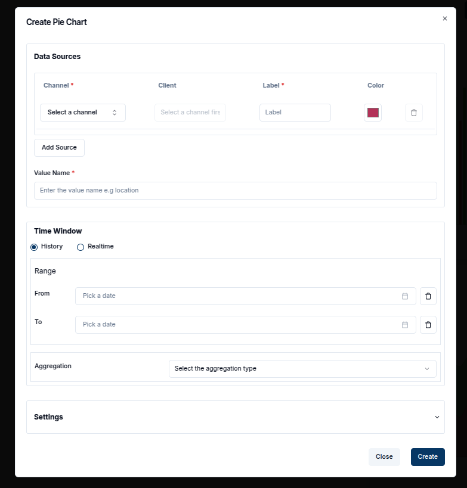
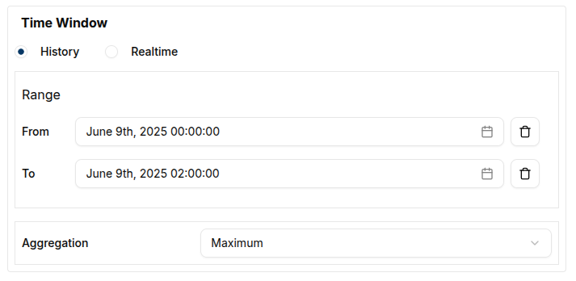

**Pie Charts** provide a simple yet effective way to compare different data points by visualizing them as proportions of a whole. Unlike other timeseries charts, pie charts only display the latest value from each data source, making them ideal for showing the most recent data from multiple sources in a comparative manner.

### Create a Pie Chart

To create a Pie Chart, ensure that your dashboard is in **Edit Mode**.
Click the `Add Widget` button, and from the list of available widgets, select **Pie Chart**.

This will open the **Create Pie Chart** dialog, where the data sources and settings for the chart can be configured.

Once the required fields for value name and data sources are filled, a unique title can be added, and the refresh interval can be adjusted.

#### Configuring the Pie Chart

These are the required fields to configure the Pie Chart;

1. **Value Name**: Enter the name of the value to be displayed (e.g., voltage, temperature).
2. **Channel**: Select the channel that provides the data. To add multiple channels, click `Add Source`.
3. **Client**: Choose the entity or device connected to the respective channels.
4. **Label**: Provide a label for each data source, which helps distinguish the different segments of the pie chart.
5. **Color**: Choose a color for each data source slice in the pie chart.

Once the data sources are configured, a Time Window can be defined by specifying the "From" and "To" dates to use historical data.
The Pie Chart will display the latest message received within this time window, focusing on the most recent message during the specified period.
In the Settings tab, the Update Interval can be adjusted to determine how often the chart refreshes with new data.

Once all settings are complete, click the `Create` button to add the Pie Chart widget to the dashboard.

### Edit the Pie Chart

To edit a Pie Chart, click the `pencil` icon in the top-right corner of the widget.
This will open the edit sheet on the right, where adjustments can be made to the data sources, labels, colors, time window, and other settings.

1. **Adding More Data Sources**: Additional data sources can be added to compare more metrics.
2. **Modifying Time Window**: Adjust the "From" and "To" dates to define the desired time period for the latest values.
3. **Delete a Data Source**: Click the `trash` icon to delete any data source.

Once the necessary changes are made, click `Update` to apply the modifications.
The chart will refresh to display the updated data and settings.
This is an edited chart showing live data.

Pie Charts support Aggregation, which allows displaying a summary value (such as **maximum**, **minimum**, **sum**, **count**, or **average**) from the data in each time window.
Unlike other timeseries charts, there is no need to specify an interval—the time window itself defines the aggregation range, and the chart will only display the aggregated value for each data source.

For example, setting the aggregation to **Maximum** will display the highest value of each data source within the specified time window, helping users understand the overall distribution of data across different sources.

#### Customize Pie Charts

- **Multiple Data Sources**: To get the most out of Pie Charts, it is recommended to add multiple data sources. This allows for easy comparison of how different data points relate to each other.
- **Color Customization**: Each slice in the pie chart represents a different data source, and the color picker allows for easy differentiation between them.

#### **Conclusion**

With the ability to lock onto the latest message within a time window and aggregate data over specific periods, Pie Charts are a powerful tool for comparing real-time or recent data from multiple devices or channels in a visually appealing format.
