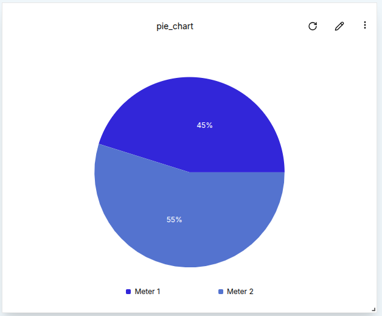

**Pie Charts** offer a simple and effective way to visualize the relative proportions of different data sources. Unlike timeseries charts that show trends over time, Pie Charts focus on the latest values from each source—making them ideal for comparative snapshots across multiple devices or metrics.

### Create a Pie Chart

To create a Pie Chart, a user must first ensure the dashboard is in **Edit Mode**.
Click the `Add Widget` button and select **Pie Chart** from the list of available widgets. This opens the **Create Pie Chart** dialog, where data sources and settings can be configured.

#### Configuring the Pie Chart

A user must provide at least one data source. The following fields are required:

1. **Value Name**:  The metric to be visualized (e.g., voltage, temperature).
2. **Channel**: The data channel that provides the metric. To add multiple channels, click `Add Source`.
3. **Client**: The device or entity connected to the selected channel.
4. **Label**:  A custom label that identifies the data source on the chart.
5. **Color**: Choose a color for each data source slice in the pie chart.

A **Time Window** can be defined by setting the _From_ and _To_ dates.
The Pie Chart will retrieve the most recent message within this period for each source.

In the **Settings** tab, a user can adjust the Data Points to control how many data points are displayed.

Once all configurations are complete, click the `Create` button to add the Pie Chart to the dashboard.

### Edit the Pie Chart

An existing Pie Chart can be edited by clicking the `pencil` icon on the top-right corner of the widget.
This opens the settings sheet on the right, where data sources, labels, colors, time window, and other settings can be updated.

1. **Add Data Sources**: Click `Add Source` to compare additional values.

2. **Modify Time Window**: Adjust the From and To fields to change the period of analysis.

3. **Remove Sources**: Click the trash icon beside a source to delete it.

After applying changes, click the `Update` button. The chart will refresh to reflect the new configuration.
This is an edited chart showing live data.

Pie Charts also support Aggregation, which summarizes data from the selected time window.
Unlike other charts, Pie Charts aggregate over the entire time window without requiring an interval.
Aggregation types include:
    - Maximum
    - Minimum
    - Sum
    - Average
    - Count

For example, setting the aggregation to **Maximum** will display the highest recorded value for each data source within the specified time window, helping users visualize distribution peaks across data points.

#### Customize Pie Charts

- **Multiple Sources**: Pie Charts are most effective when comparing multiple data sources side by side.

- **Color Coding**: Assign unique colors to each source for clear visual separation.

#### Conclusion

Pie Charts provide a focused way to compare real-time or recent values from multiple data sources. With support for time window filtering, aggregation, and multi-source inputs, they help users visualize proportions and distribution at a glance.

This widget is especially useful when the goal is to compare the most recent state of several devices or metrics in a visually digestible format.
