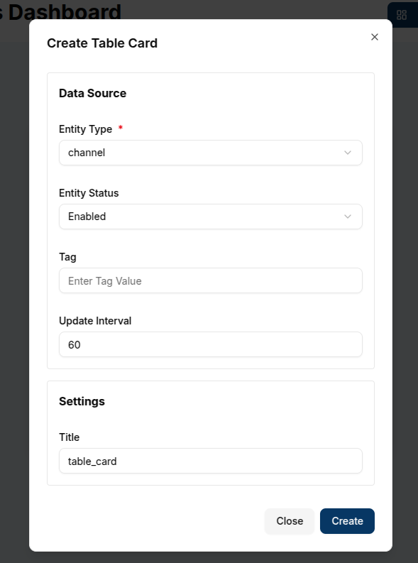
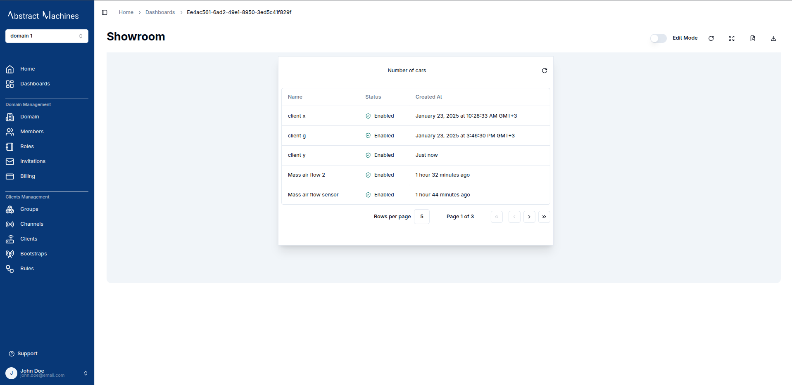
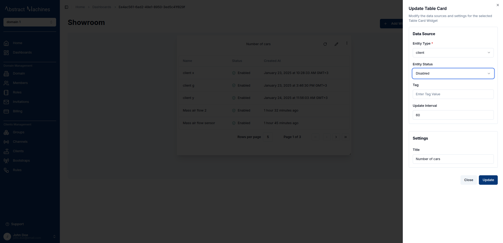
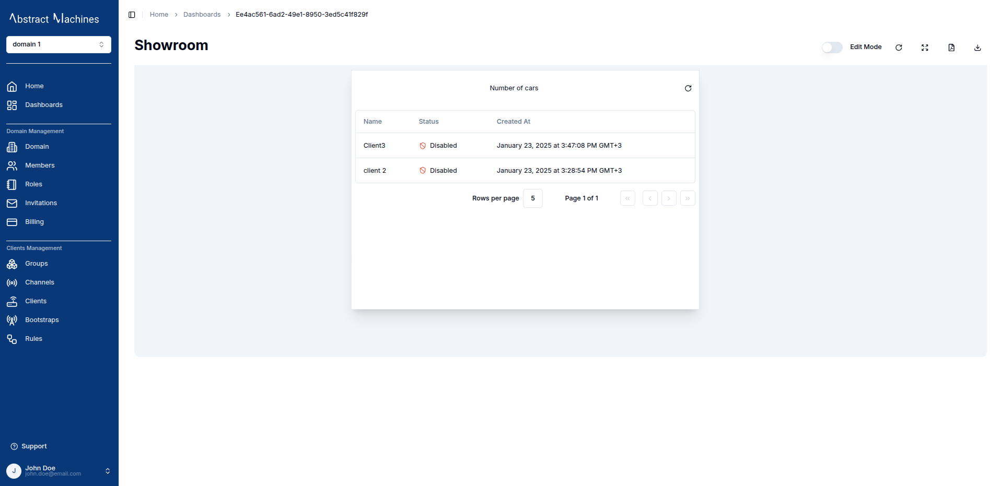

A **Table Card** displays a list of entities (such as devices, members, or groups) within a domain, showing both enabled and disabled entities. It also includes pagination to help manage large lists effectively.

### Create a Table Card

To create a Table Card, ensure the dashboard is in **Edit Mode**.
Click the `Add Widget` button and select **Table Card** from the list of available widgets. This will open the **Create Table Card** dialog, where the data source and appearance of the card can be configured.

#### Configuring the Table Card

1. **Entity Type**: Select the type of entity to display in the table. The available options are:
   - **Client** (device)
   - **Channel**
   - **Member** (the users assigned to the currently logged in domain)
   - **Group**

2. **Entity Status**: Choose whether to display only enabled entities, disabled entities or both.
3. **Tag**: Optionally, filter the displayed entities by specifying a tag. Only entities with the selected tag will appear in the table.
4. **Update Interval**: Set the refresh interval for how often the table should update with the latest data. For example, an interval of `60` seconds will refresh the table every minute.
5. **Title**: Enter a title for the table card, which will appear at the top of the widget.

   

Once all necessary fields are completed, click the `Create` button to add the Table Card to the dashboard.

The table card will immediately display the list of entities based on the selected data source and filters. It will include columns such as:

- **Name**: The name of the entity (e.g., device name).
- **Status**: The status of the entity (enabled or disabled).
- **Created At**: The timestamp of when the entity was created.

   

The card also includes pagination at the bottom, allowing navigation through multiple pages of entities.

### Edit the Table Card

To edit a Table Card, click the `pencil` icon in the top-right corner of the widget. This will open a settings sheet on the right, where the data source, entity status, tag, and other settings can be adjusted.

1. **Data Source**: Modify the **Entity Type**, **Status**, or **Tag** to change the entities displayed in the table.
2. **Update Interval**: Adjust the refresh interval for the table.
3. **Title**: Update the title of the table card to reflect any new data or focus.

   

Once the updates are made, click `Update` to save the changes. The table card will refresh with the new data and settings.

   

#### Customizing Table Cards

- **Entity Types**: Table Cards are versatile and can display various entities (Clients, Channels, Members, Groups). Each selection offers relevant insights into the domain's structure and activity.

- **Tags**: By applying tags, the list can be filtered to show specific groups of entities, which is especially useful for managing large numbers of devices or users.

- **Pagination**: For larger datasets, the pagination feature helps manage the display of rows per page, improving performance and making navigation easier.

#### **Conclusion**

With Table Cards, users can efficiently monitor and manage lists of entities within a domain. These cards are ideal for reviewing the status of devices, members, or groups in an organized and customizable format.
