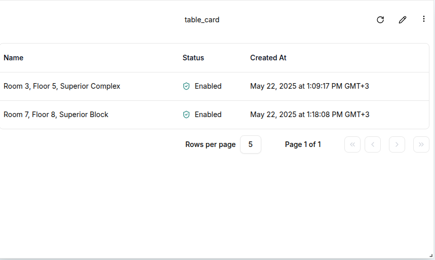
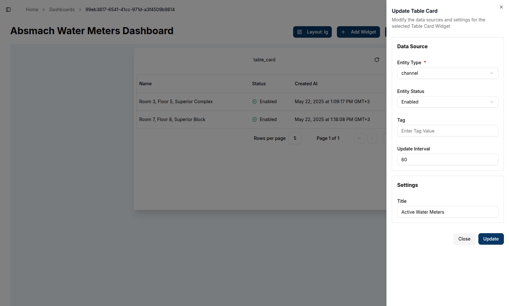
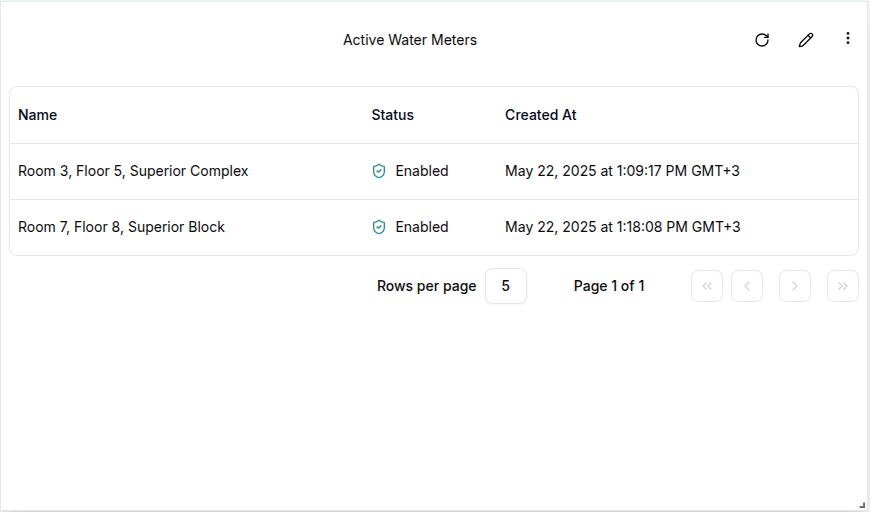

**Table Cards** are powerful widgets for displaying lists of entities—such as clients (devices), members, groups, or channels—within a domain. They present key information like entity names, statuses, and creation dates, and include built-in pagination for easy navigation through large datasets.

### Create a Table Card

To create a Table Card, ensure the dashboard is in **Edit Mode**.
Click the `Add Widget` button and select **Table Card** from the list of available widgets. This will open the **Create Table Card** dialog, where the data source and appearance of the card can be configured.

#### Configuring the Table Card

1. **Entity Type**: Select the type of entity to display in the table. The available options are:
   - **Client** (device)
   - **Channel**
   - **Member** (the users assigned to the currently logged in domain)
   - **Group**

2. **Entity Status**: Select whether to display:
   - Only enabled entities
   - Only disabled entities
   - Both
3. **Tag**(Optional): Apply a tag to filter entities by label. Only tagged entities will appear in the table.
4. **Update Interval**: Define how frequently the table refreshes with new data (e.g., every 60 seconds).
5. **Title**: Set a descriptive title that will appear at the top of the widget.

   

Once all required fields are filled out, click the `Create` button. The Table Card will appear on the dashboard and begin displaying the relevant entities based on the selected filters.

   The resulting table includes key columns such as:
      - **Name**: The name of the entity (e.g., client or user name)  
      - **Status**: Whether the entity is enabled or disabled
      - **Created At**: The timestamp of when the entity was created

Pagination is available at the bottom of the widget, making it easy to navigate through multiple pages of entries.

   

### Edit the Table Card

To update the configuration of a Table Card, click the `pencil` icon in the top-right corner of the widget. This will open the settings sheet, where any of the original fields can be modified:

1. **Data Source**: Update the **Entity Type**, **Status**, or **Tag** to display a different set of records.
2. **Update Interval**: Change how often the widget refreshes its data.
3. **Title**: Rename the widget to reflect new data or purpose.

   

Once changes are made, click the `Update` button. The widget will refresh to reflect the updated settings.

   

#### Customizing Table Cards

- **Entity Types**: Table Cards can display a variety of entity types, giving users a centralized view of different components within their domain.

- **Tags**: Applying tags enables users to filter large datasets based on custom labels—useful for grouping devices or team members by location, role, or purpose.

- **Pagination**: Pagination ensures smooth navigation across extensive lists, preventing overload and keeping the interface responsive.

#### Conclusion

Table Cards provide a versatile and organized way for users to monitor entities within a domain. Whether tracking the status of connected devices, managing members, or reviewing groups, this widget offers a customizable and performant table view, complete with refresh intervals and filtering tools for improved usability.
