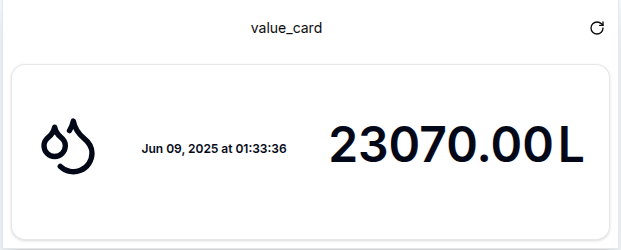
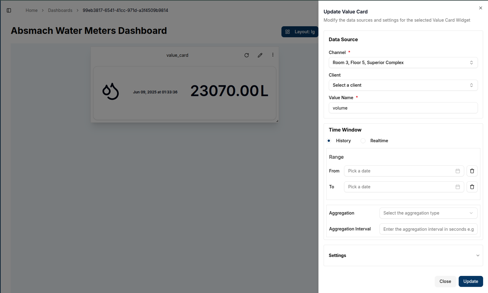
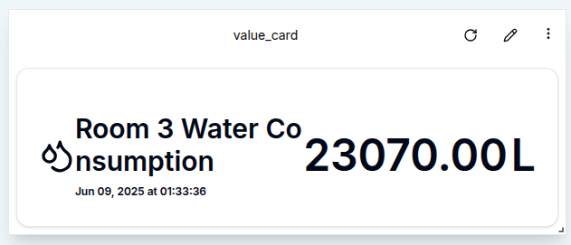

A **Value Card** provides a snapshot of real-time data by displaying the latest value from a message received via a connected channel.

### Create a Value Card

To create a Value Card, ensure the dashboard is in **Edit Mode**.
Click the `Add Widget` button and select **Value Card** from the list of available widgets. This will open the **Create Value Card** dialog, where the data source and appearance of the card can be configured.

#### Configuring the Value Card

1. **Channel**: Select the channel from which the card will pull data.
2. **Client**: Choose the connected device (client) associated with the channel.
3. **Value Name**: Enter the value name to display on the card (e.g., volume).
4. **Title**: Provide a title for the Value Card, which will be displayed at the top of the widget.
5. **Unit**: Provide a unit for the data to be displayed.
6. **Label**: Provide a label for the data to be displayed.

7. **Icon**: Select an icon to visually represent the data displayed. A range of icons is available to match the context of the value.

After all fields are configured, click the `Create` button to add the Value Card to the dashboard.
The card will immediately display the latest value from the channel, along with the associated unit and selected icon.

### Edit the Value Card

To edit a Value Card, click the `Pencil` in the top-right corner of the widget. This will open a settings sheet on the right, where the data source, title, icon, and other settings can be adjusted.

1. **Data Source**: Modify the channel, client, or value name if needed.
2. **Title**: Change the title of the value card to reflect the new information.
3. **Unit**: Update the unit if the data type changes (e.g., from liters to cubic meter).s
4. **Icon**: Select a new icon that matches the updated data context.
5. **Label**: Update the label to one that matches the updated data context.

Once the desired updates are complete, click **Update** to save the changes.
The card will refresh to show the updated data and icon.

#### Customizing Value Cards

- **Icons**: Selecting an appropriate icon is essential for visually representing the type of data displayed. For example, an "activity" icon might indicate voltage, while a "thermometer" icon could represent temperature.
- **Display**:  Value Cards show the current value, associated unit, and last update time, making them ideal for quickly interpreting the latest state of connected devices or systems.

#### Conclusion

Value Cards are a practical tool for displaying real-time metrics from connected channels. By focusing on the most recent value, they provide a concise and immediate overview of key parameters. With customizable titles, icons, units, and refresh intervals, Value Cards offer a flexible solution for monitoring critical data at a glance.
