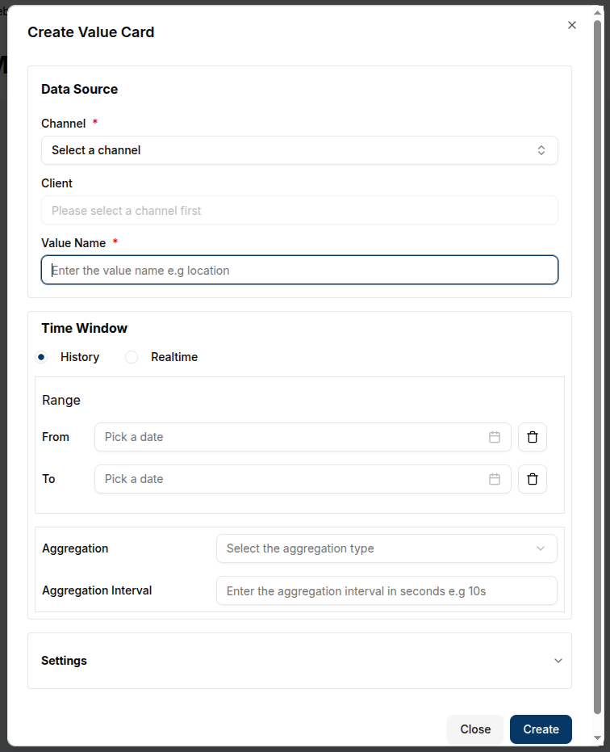

A **Value Card** provides a snapshot of real-time data by displaying the latest value from a message received via a connected channel. Unlike timeseries charts, value cards **do not** require a time interval, as they only show the most recent message from the selected data source.

### Create a Value Card

To create a Value Card, ensure the dashboard is in **Edit Mode**.
Click the `Add Widget` button, then select **Value Card** from the list of available widgets. This will open the **Create Value Card** dialog, where the data source and appearance of the card can be configured.

#### Configuring the Value Card

1. **Channel**: Select the channel from which the card will pull data.
2. **Client**: Choose the connected device (client) associated with the channel.
3. **Value Name**: Enter the value name to display on the card (e.g., demovoltage).
4. **Update Interval**: Set the interval for how often the card should refresh to show the latest message.
5. **Title**: Provide a title for the Value Card, which will be displayed at the top of the widget.
6. **Unit**: Provide a title for the Value Card, which will be displayed at the top of the widget.

7. **Icon**: Select an icon to visually represent the data displayed. A range of icons is available to match the context of the value.

Once all the necessary fields are completed, click the `Create` button to add the Value Card to the dashboard.
The card will immediately display the latest value from the channel, along with the associated unit and icon.

### Edit the Value Card

To edit a Value Card, click the **Pencil Icon** in the top-right corner of the widget. This will open a settings sheet on the right, where the data source, title, icon, and other settings can be adjusted.

1. **Data Source**: Modify the channel, client, or value name if needed.
2. **Update Interval**: Adjust the refresh interval for the latest data.
3. **Title**: Change the title of the value card to reflect the new information.
4. **Unit**: Update the unit if the data type changes (e.g., from volts to amps).
5. **Icon**: Select a new icon that matches the updated data context.

Once the updates are made, click **Update** to save the changes.
The card will refresh to show the updated data and icon.

#### Customizing Value Cards

- **Icons**: Selecting an appropriate icon is essential for visually representing the type of data displayed. For example, an "activity" icon might represent voltage, while a "thermometer" icon is suitable for temperature data.
- **Display**: The Value Card shows the value, unit, and the last update time, allowing users to quickly understand the current status of the connected device or channel.

#### **Conclusion**

With Value Cards, users can effectively monitor the latest value of specific metrics, making them ideal for real-time overviews of critical data from connected devices.
