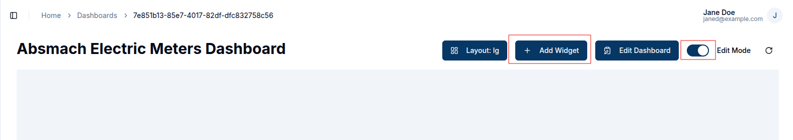
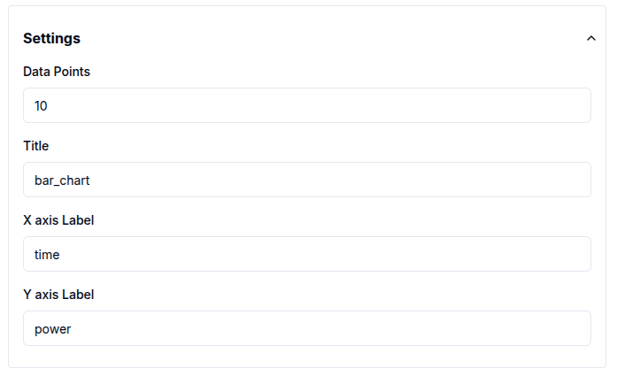
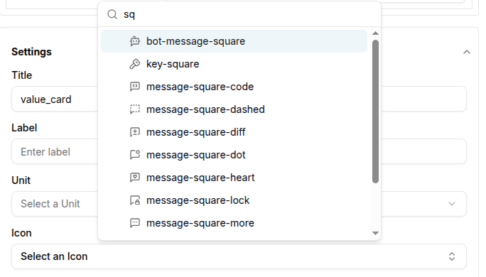
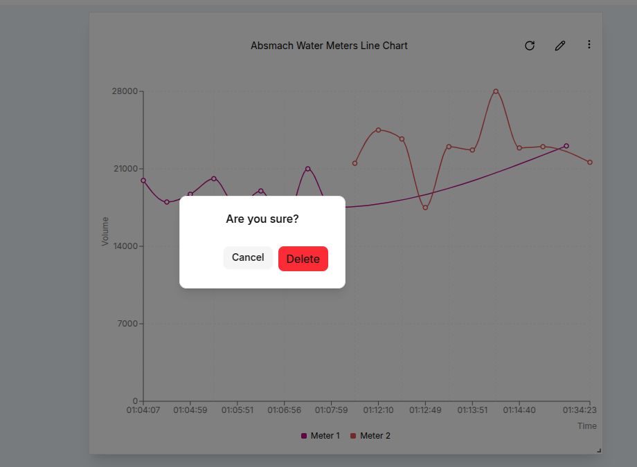

#### Introduction to Widgets

Widgets are interactive components designed to display data visually. They enable real-time monitoring and historical data analysis, providing valuable insights through customizable dashboards. Widgets can be tailored to meet specific requirements, making them essential tools for data-driven decision-making.

Magistrala offers a variety of widgets, including charts, data cards, gauges, maps, and control elements:

- **Timeseries Charts**:
  - Line Chart
  - Bar Chart
  - Area Chart
  - Pie Chart
- **Data Cards**:
  - Value Card
  - Count Card
  - Table Card
- **Control Elements**:
  - Switch
  - Slider
- **Gauges**:
  - Gauge Chart
- **Maps**:
  - Route Map
  - Marker Map

Each of these widgets can be customized and configured to display data in the most meaningful way for your use case.

To use widgets effectively, particularly timeseries charts, you need to have connected entities that are actively sending data.
A guide on how to connect and send messages is provided in [Quick Start Guide][users-quick-start].
Widgets rely on messages sent from devices in the following **SeNML** format:

```json
{
  "publisher": "866783d4-b8f9-477a-9ff5-637891c25a3e",
  "protocol": "coap",
  "name": "demovoltage",
  "unit": "V",
  "time": "2024-07-30 20:33:39",
  "value": 6679038674907747000
}
```

### Add a new widget

To add a new widget to your dashboard, start by opening the desired dashboard. Click on `Add Widget` to open the widget selection dialog box. Choose the widget type that best suits your needs, whether it's a **chart**, **card**, **gauge**, **map**, or **control**. Customize the widget's appearance, configure data sources, and adjust display options to fit your preferences. Once you've completed the setup, click `Save` to add the widget to your dashboard.

Charts are ideal for time-series data and comparisons, while cards prominently showcase key metrics. Gauges help visualize performance against predefined thresholds, and maps provide a spatial context for your data. Controls enhance dashboard interactivity, allowing users to filter and manipulate data views dynamically.

Dashboards are built using **Widgets** that visualize data and facilitate control over other devices. These widgets can host a variety of charts and controls.
To ensure that timeseries charts function correctly, you need to have connected channels and clients that actively send messages.



### Widget Chart Features

There are some standard features of the charts that ensure better visualisation and customisation of their performance and appearance.

These features include:

- Time Window
- Chart Appearance Settings
- Icons
- Filters
- Data Aggregation

#### 1. Time Window

The time window represents the interval used to fetch time-series data for charts. It is especially useful for time-series charts like Area, Line, Bar, Pie charts, Route Maps and Value Cards.


The selected "from" and "to" times are included in the query sent to the database. Users can choose between **Realtime** and **History** modes:

- **History**: Displays data within a specific time range set using the calendar.

- **Realtime**: Shows data as it is updated in real-time.

The date-time calendar also includes time slots. Clicking the first box allows you to enter the time using a 24-hour clock format. When live data is selected, a red blinking button appears on the widget.

Here is an example of a time-series Area chart using live data:


If no time window is set, **history** is set as default.

#### 2. Chart Appearance Settings

Chart Appearance Settings allow you to adjust how your charts look, including titles, axis labels, and refresh rates. Each chart type has unique settings accessible through the dialog that opens when you click on a specific chart.

To further customize a chart's title, click the `pencil` icon on the widget after creation. This opens a panel displaying current settings. While titles default to the chart name, they can be edited to fit your preferences.

For **time-series charts**, settings are generally consistent except for pie charts which require multiple data sources and do not use axes.  

Users can only modify the **title** and **update interval**.
The update interval determines how often the API requests new data from the database, with a default of **60 seconds**. Additionally, a user can modify the **x and y-axis** labels as needed.



**Gauge charts** offer additional options, such as setting **minimum** and **maximum** values to control the scale. These default to *0* and *100*. Users can also select a unit from a provided list, including:

1. Kilometer (km)
2. Meter (m)
3. Centimeter (cm)
4. Millimeter (mm)
5. Micrometer (µm)
6. Nanometer (nm)
7. Inch (in)
8. Foot (ft)
9. Yard (yd)
10. Mile (mi)
11. Degrees Celsius (°C)
12. Kelvin (K)
13. Fahrenheit (°F)
14. Meters per Second (m/s)
15. Kilometers per Hour (km/h)
16. Miles per Hour (mph)
17. Feet per Second (ft/s)
18. Mach (Mach)
19. Knots (kn)
20. RPM (rpm)
21. Pascal (Pa)
22. Hectopascal (hPa)
23. Kilopascal (kPa)
24. Megapascal (MPa)
25. Bar (bar)
26. Counts per Second (cps)
27. pH Level (pH)
28. Volts (V)
29. Millivolts (mV)
30. Percent (%)
31. Gram (g)
32. Kilogram (kg)
33. Milligram (mg)
34. Liter (L)
35. Milliliter (mL)
36. Newton (N)
37. Joule (J)
38. Watt (W)
39. Kilowatt (kW)
40. Horsepower (hp)
41. Ampere (A)
42. Milliampere (mA)
43. Coulomb (C)
44. Ohm (Ω)

Here is an example of a chart with the unit set to *km* :


For **control sliders**, similar to gauge charts, you'll need to define minimum and maximum values to set the scale. The step value, which determines the increment or decrement per move, defaults to *10*.


For maps, the **Latitude Key** and **Longitude Key** tags are essential for retrieving geospatial data. These tags define the latitude and longitude attributes required to pinpoint entity positions. By default, these are set to *latitude* and *longitude*.

**Route maps** allow you to adjust the **line width**, making it easy to modify the thickness of route lines.


**Value cards** provide options to configure the **update interval**, **unit**, and **title**, allowing for quick adjustments to how data is displayed.


#### 3. Icons

The icons section provides a variety of icons that can enhance the value card's visualization.
Simply type the name of the desired icon and it will appear on the card



#### 4. Filters

Filters play a crucial role in refining the data displayed in widgets. Each map contains specific fields that help refine the displayed data.. Time windows serve as a fundamental filter, defining the period of data retrieval.

Data sources act as filters, particularly concerning client IDs and channel IDs. Most charts currently support multiple data sources simultaneously. When a channel is selected, the associated client must be connected to that channel to enable data retrieval from the backend.

The **ValueName** parameter functions as an additional filter by restricting requests to specific data columns. Typically, valuenames correspond to message topics, as illustrated below:

```json
{
  "channel": "aecf0902-816d-4e38-a5b3-a1ad9a7cf9e8",
  "publisher": "2766ae94-9a08-4418-82ce-3b91cf2ccd3e",
  "protocol": "http",
  "name": "voltage",
  "unit": "V",
  "time": 1276020076.001,
  "value": 120.1
}
```

The status of an entity also acts as a key filter, especially in charts like the entity table and count card. This filter limits displayed entities based on their status: enabled, disabled, or all statuses.


#### 5. Data Aggregation

Data aggregation is a powerful feature that enables the summarization of data over specific time periods. This is particularly useful for time-series charts where you want to visualize trends or patterns over a defined period. Magistrala currently supports the following aggregation methods:

- **Maximum**: Retrieves the highest value within the specified time window.
- **Minimum**: Retrieves the lowest value within the specified time window.
- **Average**: Calculates the mean value over the selected interval.
- **Sum**: Computes the total sum of values for the given time window.
- **Count**: Counts the number of entries in the specified interval.

For aggregation to work effectively, a **Time Window** needs to be set. The time window consists of a "From Date" and a "To Date," defining the range of time over which the aggregation will be performed.

For aggregation to work correctly:

- In History mode, users must select both a From Date and a To Date, along with the Aggregation Interval.

- In Realtime mode, users must select a From Date, specify the Last duration, and set the Aggregation Interval.

The **Aggregation Interval** indicates the frequency at which the data points are aggregated (e.g., every 10 seconds).


For example, to view the average temperature readings of a sensor every 10 minutes over the past 24 hours:

- Set the From Date to 24 hours ago.

- Set the To Date to the current time (or use Last = 24 hours in Realtime mode).

- Set the Aggregation Interval to 10 minutes.

This setup provides a clear visual representation of temperature trends.

By using data aggregation, users gain deeper insights into your data, making it easier to monitor and analyze the performance and behavior of your IoT devices.

### Edit the Widgets

Once you've created a widget, you can easily modify it to suit changing requirements. While in **Edit Mode**, click the `pencil` icon located at the top right corner of the widget you want to edit. This action opens a settings panel from the right side of the screen, as shown below:


In this panel, you'll find all the previously configured settings and data sources. You can:

- Change the **Value Name** to target a different data metric.
- Select a different **Channel** and **Client** to pull data from another source.
- Modify the **Label** and **Color** for better visualization.
- Add additional data sources by clicking on the `Add Source` button, allowing the widget to visualize multiple data streams simultaneously.
- Adjust the **Time Window** and other **Settings** such as chart appearance, filters and aggregation intervals as needed.


After making your changes, click the `Update` button to apply them. The widget will automatically refresh to display the new configuration, providing a real-time view of the updated data.

For example, if you want to add two more data sources to an existing bar chart, click the `Add Source` button and select the desired channels and clients. You can also update the chart title to reflect these new sources, making your dashboard more informative.

This flexibility allows you to keep your dashboard stays up-to-date with the latest data allowing you to make adjustments on the fly to meet your monitoring and management needs.

### Add Dummy Data

From the widget menu, you can select `Dummy Data` to populate the chart with sample data. This feature provides a quick and easy way to create dummy charts, helping you understand the data structure needed for your visualizations.


### Delete a Widget

To delete a widget, click the `Delete` button in the widget menu on the widget card. Confirm the deletion when prompted to permanently remove the widget.




[users-quick-start]: ../users-quick-start.md
