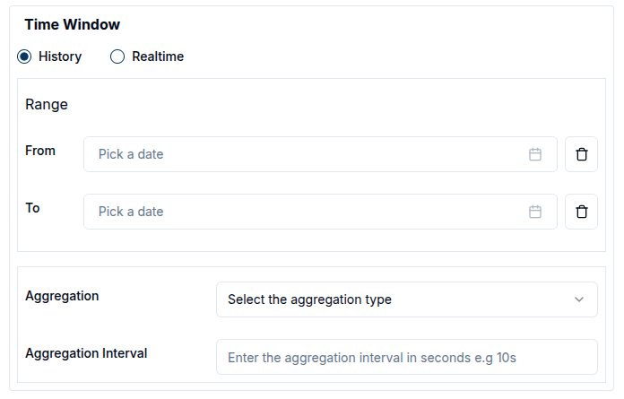
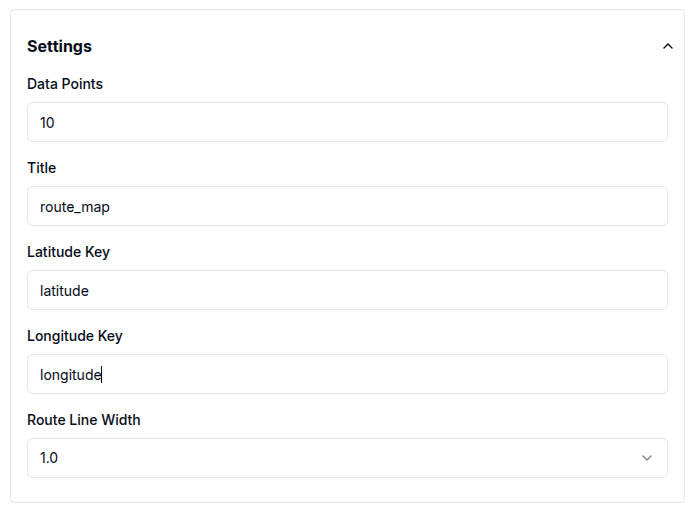
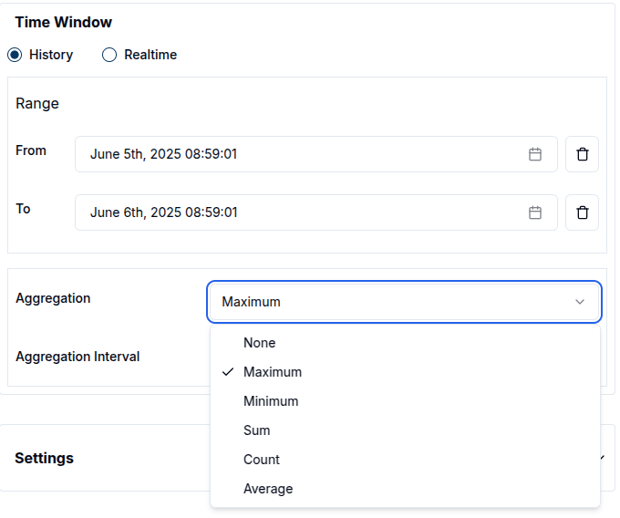

### Introduction to Widgets

Widgets are interactive components designed to display data visually. They enable real-time monitoring and historical data analysis, providing valuable insights through customizable dashboards. Widgets can be tailored to meet specific requirements, making them essential tools for data-driven decision-making.

Magistrala offers a variety of widgets, including charts, data cards, gauges, maps, and control elements:

- **Timeseries Charts**:
  - Line Chart
  - Bar Chart
  - Area Chart
  - Pie Chart
- **Data Cards**:
  - Value Card
  - Count Card
  - Table Card
- **Control Elements**:
  - Switch
  - Slider
- **Gauges**:
  - Gauge Chart
- **Maps**:
  - Route Map
  - Marker Map
  - Polygon Map
- **Alarms**:
  - Alarm Table
  - Alarm Count

Each of these widgets can be customized and configured to display data in the most meaningful way for the intended use case.

Effective use of widgets, particularly timeseries charts, requires connected entities actively sending data.
A guide on how to connect and send messages is provided in [Quick Start Guide][users-quick-start].
Widgets rely on messages sent from devices in the following **SeNML** format:

```json
{
  "publisher": "866783d4-b8f9-477a-9ff5-637891c25a3e",
  "protocol": "coap",
  "name": "demovoltage",
  "unit": "V",
  "time": "2024-07-30 20:33:39",
  "value": 6679038674907747000
}
```

### Add a new widget

> ⚠️Before adding widgets, devices must be connected and sending data. Refer to the [Quick Start Guide][users-quick-start]] for setup instructions.

Adding a new widget begins by opening the desired dashboard and switching it into **Edit Mode**.


Once in edit mode, click on `Add Widget` to open the widget selection dialog box. From there, the user chooses the widget type that best suits the needs, whether it's a **chart**, **card**, **gauge**, **map**, or **control**.


After choosing a widget type, it's possible to configure its data source, customize its appearance, and adjust relevant display settings as will be explained in following sections. Once configuration is complete, selecting `Save` will add the widget to the dashboard.

Each widget type serves a distinct purpose. **Charts** are are well-suited for visualizing time-series data and comparisons. **Cards** are used to highlight key metrics prominently. **Gauges** display performance in relation to thresholds, while **maps** add geographic context. **Controls** enhance interactivity by enabling filters and data manipulation directly within the dashboard. **Alarms** provide critical system monitoring by displaying alert information and alarm counts for proactive issue management. For step-by-step instructions on configuring a specific chart, select the appropriate chart from the sidebar.

Dashboards consist of these modular **widgets**, which are designed to display data or interact with connected devices. For time-series charts and similar data-driven components to function correctly, connected channels and clients must be transmitting data consistently.

### Widget Chart Features

There are some standard features of the charts that ensure better visualisation and customisation of their performance and appearance.

These features include:

- Time Window
- Chart Appearance Settings
- Icons
- Filters
- Data Aggregation

#### 1. Time Window

The **time window** defines the interval over which data is fetched for visualizations. It is particularly relevant for widgets like Area, Line, Bar, Pie, Gauge charts, Route maps and Value cards.

Users can choose between two modes: **Realtime** and **History**.



- **History** mode displays data from a specific time range, which the user defines using the calendar. Both from and to timestamps must be set, and only the data sent within this range will be retrieved from the database. The calendar includes time selectors, allowing users to specify the exact time in a 24-hour format.


To clear the selected date range, click the `trash` icon.


- **Realtime** mode continuously updates the data shown on the widget. Users can choose from predefined intervals (e.g. 24 hours) or define a custom interval (e.g. 1 day 5 hours), in which case the widget will display data between now and the specified duration in the past.


When live data is selected, a red blinking button appears on the widget.

Here is an example of a time-series line chart using live data:


If no time window is set, **History** mode is set as default.

#### 2. Chart Appearance Settings

Chart Appearance Settings allow users to control how charts are displayed, including titles, axis labels, units, and refresh intervals. Each chart type has unique settings, which can be accessed through the configuration dialog that appears when a chart is clicked.

To customize a chart's appearance after creation, click the `pencil` icon on the widget.


This opens a panel with editable settings. By default, the title uses the chart’s name but can be updated to better reflect the chart’s purpose


Users can now create **custom units** in addition to the predefined list. To add one, click **Add Custom Unit**.


Then provide a **Unit Name** (e.g., Kilowatt-hours) and a **Unit Symbol** (e.g., kWh).


This flexibility makes it possible to represent domain-specific or less common metrics directly in charts.

##### Time Series Charts

For **time-series** charts, appearance settings are mostly consistent across chart types except for pie charts, which use multiple data sources and do not have axes.

Users can only modify the **title**, **data points** and **axis labels**.

- **Data points**: Define how many data points appear on the chart. This is especially useful for continuous data visualization.

- **X and Y axis labels**: Can be customized to reflect the data context.


##### Gauge Charts

**Gauge charts** offer additional configuration options:

- Set **minimum** and **maximum** - (default: 0 to 100) to control the scale.
- Choose a unit from the selector, which now supports both predefined units and custom units:
  - Length: Kilometer (km), Meter (m), Millimeter (mm), Inch (in)

  - Temperature: Degrees Celsius (°C), Kelvin (K), Fahrenheit (°F)

  - Speed: Meters per Second (m/s), Kilometers per Hour (km/h), Miles per Hour (mph), Feet per Second(ft/s), Mach, Knots(kn)

  - Pressure: Pascal (Pa), Kilopascal (kPa), Megapascal(MPa), Bar, Hectopascals(hPa)

  - Electrical: Volt (V), Millivolt (mV), Ampere (A), Ohm (Ω), Watt (W), Kilowatt (kW)

  - Others: Percent (%), Liter (L), RPM (rpm), pH, Newton (N), Joule (J), Horsepower (hp), etc.

Here is an example of a gauge chart with the unit set to _kWh_ :


##### Control Widgets

In **Control widgets**, sliders require minimum and maximum values. The step value defines the increment or decrement for each movement and defaults to 10.


##### Card Widgets

For **card widgets**, users can configure the title. Additionally, **count cards** allow customization of a label, which provides additional context.


##### Map Widgets

For **map widgets**, the following tags are required to visualize geospatial data:

- Latitude Key

- Longitude Key

These default to **latitude** and **longitude**, respectively.

**Route maps** allow users to adjust the **line width**, controlling the visual thickness of route paths.



##### Value Cards

**Value cards** offer settings for **update interval**, **unit**, **label**, **title** and **icons**, allowing for quick adjustments to how data is displayed.


#### 3. Icons

Icons help visually enhance map charts and value cards by adding context to the displayed data.
To add an icon, start typing its name in the icon field, a list of matching options will appear for selection.


#### 4. Filters

Filters play a crucial role in refining the data displayed in widgets. Each map contains specific fields that help refine the displayed data. Time windows serve as a fundamental filter, defining the period of data retrieval.

Data sources act as filters, particularly concerning client IDs and channel IDs. Most charts currently support multiple data sources simultaneously.

- Filter by value name

The **ValueName** parameter functions as an additional filter by restricting requests to specific data columns. Typically, valuenames correspond to message topics, as illustrated below:

```json
{
  "channel": "aecf0902-816d-4e38-a5b3-a1ad9a7cf9e8",
  "publisher": "2766ae94-9a08-4418-82ce-3b91cf2ccd3e",
  "protocol": "http",
  "name": "voltage",
  "unit": "V",
  "time": 1276020076.001,
  "value": 120.1
}
```

- Filter by status

The status of an entity also acts as a key filter, particularly in table and count card widgets. This filter limits displayed entities based on their status: enabled, disabled, or all.


- Filter by tag

Tag filtering applies to all entities except **groups**. To filter by tag, enter the tag value, and only entities matching that value will be shown.


> Filter by status and tag only apply to the cards (table and count cards).
> <br/>

Here is an example of a count card displaying enabled entities with the tag `Floor 1`


#### 5. Data Aggregation

Data aggregation is a powerful feature that enables the summarization of data over specific time periods. This capability is especially useful for charts where visualizing trends or patterns over defined intervals is required. Magistrala currently supports the following aggregation methods:

- **Maximum**: Retrieves the highest value within the specified time window.
- **Minimum**: Retrieves the lowest value within the specified time window.
- **Average**: Calculates the mean value over the selected interval.
- **Sum**: Computes the total sum of values for the given time window.
- **Count**: Counts the number of entries in the specified interval.



To use aggregation effectively, a **Time Window** must be defined. This determines the period over which data will be aggregated and varies based on the data mode:

- In **History mode**, users must select both a **From Date** and a **To Date**, along with the **Aggregation Interval**.

- In **Realtime mode**, users must select a **From Date**, specify the **Last** duration, and set the **Aggregation Interval**.

The **Aggregation Interval** indicates the frequency at which the data points are aggregated (e.g., every 10 seconds).


For example, to view the average temperature readings of a sensor every 10 minutes over the past 24 hours:

- Set the From Date to 24 hours ago.

- Set the To Date to the current time (or use Last = 24 hours in Realtime mode).

- Set the Aggregation Interval to 10 minutes.

This setup provides a clear visual representation of temperature trends.

By using data aggregation, users gain deeper insights into their data, making it easier to monitor and analyze the performance and behavior of IoT devices.

### Edit the Widgets

Once a widget has been created, it can be easily modify it to suit changing requirements. While in **Edit Mode**, the `pencil` icon at the top right corner of the widget can be clicked to open a settings panel from the right side of the screen.

<!--  -->

Within this panel, all previously configured settings and data sources are accessible. Users can:

- Change the **Value Name** to target a different data metric.
- Select a different **Channel** and **Client** to pull data from another source.
- Modify the **Label** and **Color** for better visualization.
- Add additional data sources by clicking on the `Add Source` button, allowing the widget to visualize multiple data streams simultaneously.
- Adjust the **Time Window** and other **Settings** such as chart appearance, filters and aggregation intervals as needed.


After making the changes, click the `Update` button to apply them. The widget will automatically refresh to display the new configuration, providing a real-time view of the updated data.


For example, to add two or more data sources to an existing bar chart, click the `Add Source` button and choose the desired channels and clients. The chart title can also be updated to reflect the new sources, making the dashboard more informative.


This flexibility allows users to keep their dashboards up-to-date with the latest data, enabling adjustments on the fly to meet monitoring and management needs.

### Enable Dummy Data

From the widget menu, users can select `Enable Dummy Data` to populate the chart with sample data. This feature provides a quick and effective way to generate mock visualizations, helping users understand the expected data structure and test widget configurations.


To remove the sample data, simply select `Disable Dummy Data`.


### Delete a Widget

To delete a widget, click the `Delete` button in the widget menu on the widget card, then confirm the deletion when prompted to permanently remove it.


[users-quick-start]: ../users-quick-start.md
