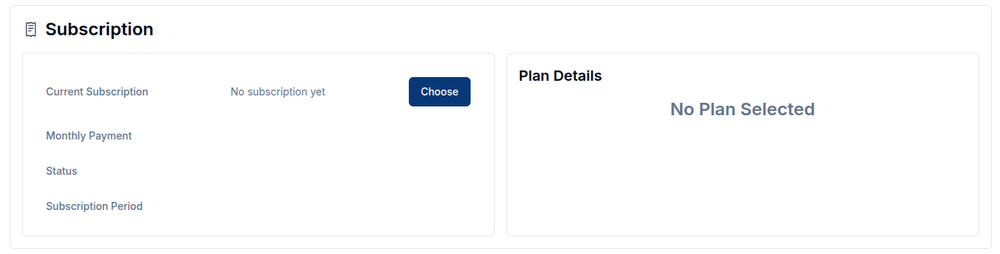
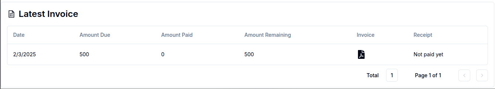

> Please note that this service is only available to **Magistrala Cloud** users.

The **Billing** service allows users to view and subscribe to billing plans, manage payment methods and billing information and download generated invoices and receipts.  
Magistrala uses a trusted **third-party payment processor (Paddle)** to handle sensitive payment information.  
This ensures that Magistrala never stores or has access to your card credentials.

Navigate to the **Billing** tab in the side navigation bar.  
This tab is only visible to **admin members** of a domain.

## Overview

The Billing page is divided into several sections, each handling a key part of the billing process.

In a newly created domain without any data on billing, all the sections will be empty. The domain will also automatically be subscribed to the **Free** plan.

## Add Billing Information

This section includes the user's contact details such as addresses, emails, and the name of the user to whom the subscription will be charged.

To fill this section, click on `Add` to trigger a dialogbox.
On the form, you are required to fill in the Name, Email, Phone, Country and City of the billed customer.
State and Province or Addresses are optional but help in the creation of invoices.
After filling in the required data, click `Add` and the information will be fed into the system.

## Subscribe to a Billing Plan

The subscription section handles the domain's subscription plan and shows the status of the subscription.

To update a billing plan from the current `Free` plan or any other, click `Update`, which will display a list of available subscription plans.

The subscription status can be either **active**, where the user has already been charged, or **pending**, where the process is not yet finished and the subscription is inactive.

The **plan details** generally show the user the limits of their subscribed plan. This ensures they are aware of their restrictions at all times. These limits define what can be accessed in terms of domains, users, groups, and devices.

## Add a Payment Method

Click on the `Add` button to gain access to the page where you will fill in your card information.
A succesful update will lead you back to the Magistrala billing page with an active payment method.

<!-- You can add as many payment cards as needed.
Each card will be verified to prevent any fraudulent cards from being accepted. Ensure that the card has sufficient funds to cover the subscription cost.
You can also edit payment methods, set a default card and delete any payment method.  

 -->

<!-- To set a payment method as default simply select `Set as default` in the dropdown. Once payment method has been set as default, a badge showing default appears. To delete a payment method simply select `Delete` on the dropdown and the payment method will be deleted. -->

## Generate an Invoice

Once the plan is selected, the **Latest Invoice** section automatically displays the most recent invoice generated by the payment processor.  
The table includes **Date**, **Amount**, **Currency**, **Invoice Number**, **Invoice ID**, and the associated **Transaction ID**.  
Invoices can be **viewed** online or **downloaded** as a PDF.

  

<!-- ## Generate a Receipt

Once payment is received, there will be an receipt generated that a user can download by clicking on the receipt icon.

   -->

## Transactions and Subscription History

The **Billing** page now provides a clear overview of subscription activity and financial records through three key sections:

### Transactions

This section lists all payment transactions related to your domain.  
Each entry includes the **Transaction ID**, **Status** (e.g: billed, completed, paid), **Amount**, **Currency** and **Created At** timestamp.  
Transactions help track all billing events, including successful charges and pending payments.

### Subscription Status History

This section displays a log of subscription state changes for the domain.  
It shows the **Date**, **Status** (active, cancelled, etc.), the **Plan ID** and when the change occurred.  
This history helps admins track subscription lifecycle events over time.

