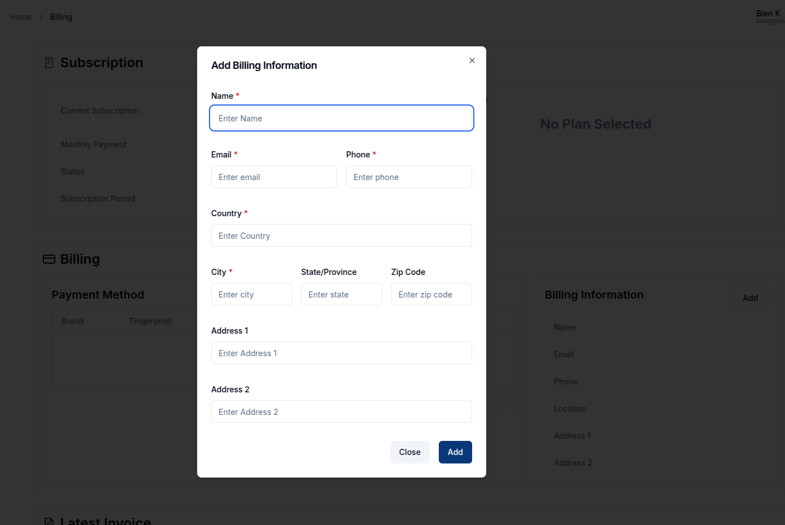

> Please note that this service is only available to **Magistrala Cloud** users.

The **Billing** service allows users to view and subscribe to billing plans, billing information and download generated invoices.
Magistrala uses a trusted **third-party payment processor** to handle sensitive payment information.  
This ensures that Magistrala never stores or has access to your card credentials.

Navigate to the **Billing** tab in the side navigation bar.  
This tab is only visible to **admin members** of a domain.

## Overview

The Billing page is divided into several sections, each handling a key part of the billing process.

In a newly created domain without any data on billing, all the sections will be empty. The domain will also automatically be subscribed to the **Free** plan.

## Add Billing Information

This section includes the user’s contact details, such as name, address, and email, as well as company information, including company name, company number, and tax ID, of the user to whom the subscription will be charged.

To fill this section, click on `Add` to trigger a dialogbox.
On the form, you are required to fill in the Name, Email, Country, City, Region and Postal code of the billed customer.
You may also provide optional company details, including Company Name, Company Number, and Tax ID.
After filling in the required data, click `Add` and the information will be fed into the system.

## Subscribe to a Billing Plan

The **Subscription** section allows you to manage your domain’s billing plan and view its current status.

To upgrade from the default `Free` plan (or switch from any existing plan), click **Update**. This will open a list of available subscription options.

> **Note:** The **Update** button is only active if there are paid plans available in addition to the Free plan.

Once you select a plan and confirm, you’ll be redirected to the payment page where you can enter your card details. After completing payment, you’ll be automatically redirected back to Magistrala with your updated subscription.

### Subscription Status

- **Active** – Your subscription is active and payments are up to date.  
- **Waiting for Payment** – The plan has been selected but the payment process is not yet completed.  
- **Canceled** – The subscription has been terminated.

The **plan details** generally show the user the limits of their subscribed plan. This ensures they are aware of their restrictions at all times. These limits define what can be accessed in terms of domains, users, groups and clients.

## Generate an Invoice

Once the plan is selected, the **Latest Invoice** section automatically displays the most recent invoice generated by the payment processor.  
The table includes **Date**, **Amount**, **Currency**, **Status** and the associated **Transaction ID**.
Invoices can be **viewed** online or **downloaded** as a PDF.

  

## Transactions and Subscription History

The **Billing** page now provides a clear overview of subscription activity and financial records through three key sections:

### Transactions

This section lists all payment transactions related to your domain.  
Each entry includes the **Transaction ID**, **Status** (e.g: billed, completed, paid), **Amount**, **Currency** and **Created At** timestamp.  
Transactions help track all billing events, including successful charges and pending payments.

### Subscription Status History

This section displays a log of subscription state changes for the domain.  
It shows the **Date**, **Status** (active, cancelled, etc.), the **Plan ID** and when the change occurred.  
This history helps admins track subscription lifecycle events over time.

