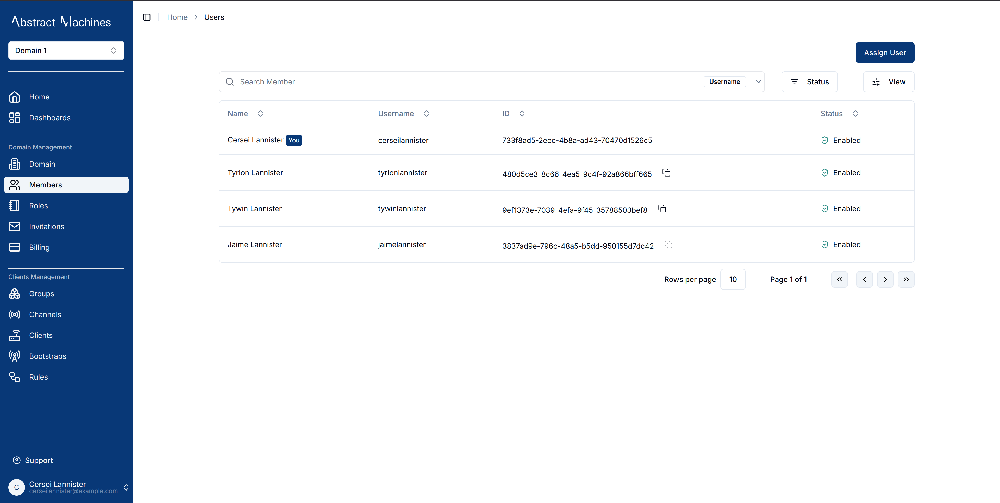

## Domain Information

Navigate to the **Domain** section in the side navigation under **Domain Management** to find out more about the domain.

Here, a user can edit the Domain **Name**, **Tags**, **Metadata**, **Status** and **Logo** as well as copy the Domain ID and **Route**.

- **Name** – A descriptive label for the domain.  
- **Route** – A user-friendly identifier for the domain, used instead of the full UUID when referencing or subscribing.  
  > **Note:** The Route is set only during creation and **cannot** be changed later. Choose something short, unique, and descriptive.  
- **ID** – The globally unique identifier (UUID) for the domain.  
- **Tags** – Optional keywords for better organization and searchability.  
- **Logo** – An image (up to 5MB) that represents the domain.  
- **Metadata** – A JSON object for storing additional structured information about the domain.  

The Domain status can be disabled by clicking the `Disable` button or enabled by the `Enable` button. Disabling the domain will revoke access for users who aren't domain admins.

## Domain Roles

From the Roles section, you can create new roles with custom actions.  

By default, an **Admin** role with complete control over the domain is always present and granted to the Domain creator.

Here's a comprehensive list of domain role actions:

- **Domain Management**

  - update
  - enable
  - disable
  - read
  - delete

- **Role Management**

  - manage_role
  - add_role_users
  - remove_role_users
  - view_role_users

- **Client Management**

  - client_create
  - client_update
  - client_read
  - client_delete
  - client_set_parent_group
  - client_connect_to_channel
  - client_manage_role
  - client_add_role_users
  - client_remove_role_users
  - client_view_role_users

- **Channel Management**

  - channel_create
  - channel_update
  - channel_read
  - channel_delete
  - channel_set_parent_group
  - channel_connect_to_client
  - channel_publish
  - channel_subscribe
  - channel_manage_role
  - channel_add_role_users
  - channel_remove_role_users
  - channel_view_role_users

- **Group Management**

  - group_create
  - group_update
  - group_read
  - group_delete
  - group_membership
  - group_set_child
  - group_set_parent
  - group_manage_role
  - group_add_role_users
  - group_remove_role_users
  - group_view_role_users

To create a new role, click on the `+ Create` button, provide a descriptive name for the role, and optionally add users and actions

Once created, domain roles can be edited in their respective pages.
Users can edit the domain role name, role actions and role members.

These fields can be updated directly on the page or via the dropdown menu options.

## Domain Members

A domain admin or a member with the right permissions can assign users to a domain.
Members must be assigned specific roles.
Domain members have permissions over different entities depending on the role assigned to them. For example, members without read permissions aren't able to view specific entities within the domain.

### Assign Users

To assign a user to a domain, click the `Assign User` button, and then select a user along with their respective roles.
Alternatively, the user can be added while creating the domain role.

### Unassign Users

To unassign a user, click on the **trash** icon present on their row and click **Unassign** on the popup to confirm the action.

