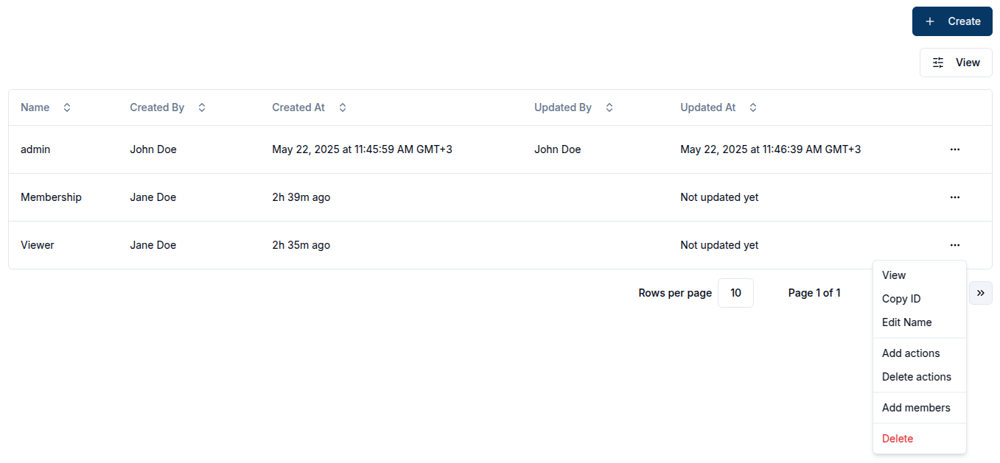

## Domain Information

Navigate to the `Domain` section in the side navigation under **Domain Management** to find out more about the domain.

Here a user can edit the Domain Name, Alias, Tags and Metadata as well as copy the Domain ID.

The Domain status can be disabled by clicking the `Disable` button or enabled by the `Enable` button. Disabling the domain will revoke the access for users who are not domain admins.

## Domain Roles

From the roles section of the domain, the user can create new roles with varying role actions.

By default, an admin role with complete control over the domain is always present and granted to the Domain creator.

This is a domain role actions comprehensive list:

- **Domain Management**

  - update
  - enable
  - disable
  - read
  - delete

- **Role Management**

  - manage_role
  - add_role_users
  - remove_role_users
  - view_role_users

- **Client Management**

  - client_create
  - client_update
  - client_read
  - client_delete
  - client_set_parent_group
  - client_connect_to_channel
  - client_manage_role
  - client_add_role_users
  - client_remove_role_users
  - client_view_role_users

- **Channel Management**

  - channel_create
  - channel_update
  - channel_read
  - channel_delete
  - channel_set_parent_group
  - channel_connect_to_client
  - channel_publish
  - channel_subscribe
  - channel_manage_role
  - channel_add_role_users
  - channel_remove_role_users
  - channel_view_role_users

- **Group Management**

  - group_create
  - group_update
  - group_read
  - group_delete
  - group_membership
  - group_set_child
  - group_set_parent
  - group_manage_role
  - group_add_role_users
  - group_remove_role_users
  - group_view_role_users

To create a new role, click on the `+ Create` button, provide a descriptive name for the role, and optionally add users and actions

Once created, domain roles can be edited in their respective pages.
A user can edit the domain role name, role actions and role members.

These fields can be updated directly on the page or via the dropdown menu options.

## Domain Members

An admin or a member with the right permissions can assign users to a domain. Members must be assigned with specific roles.

> This feature is currently under development :hammer:
