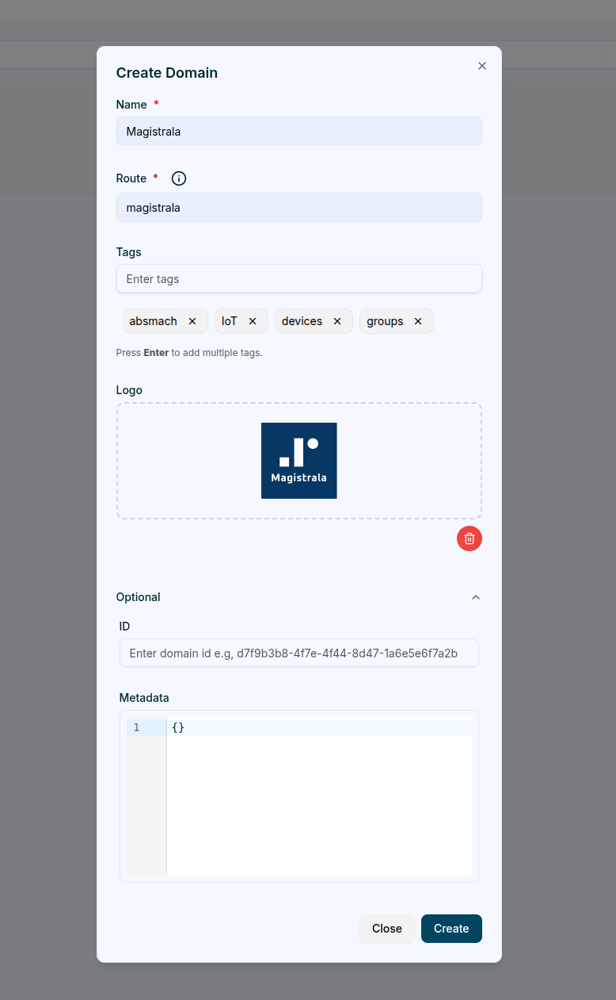
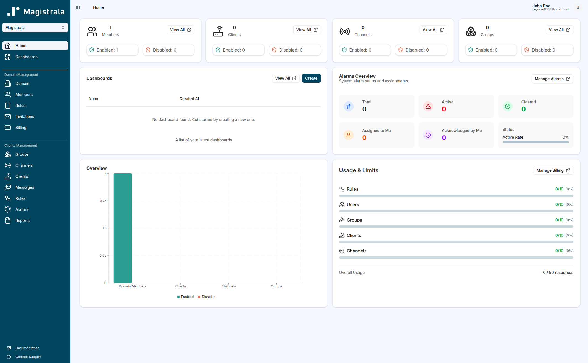
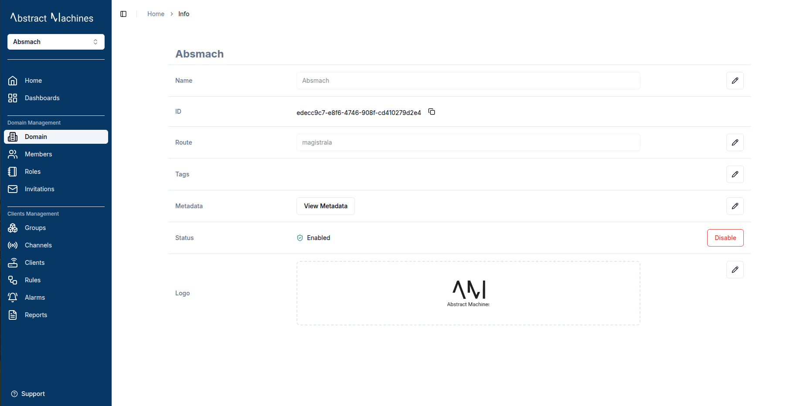
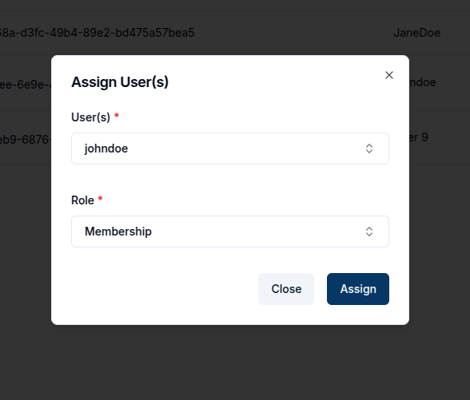
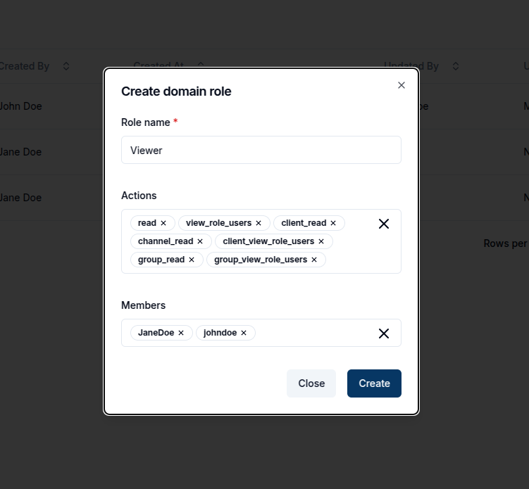
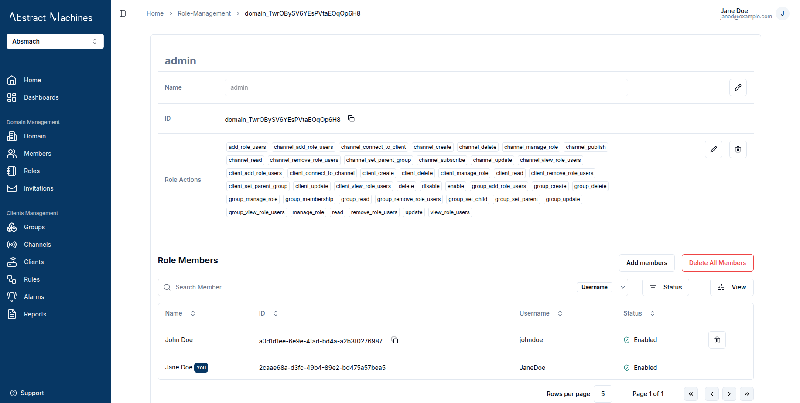

## Creating a Domain

After logging in, the user is redirected to the **Domains** page.  
If no domains exist, an empty state appears prompting the creation of a new one.

Clicking the **+ Create** button opens the **Create Domain** dialog.

The dialog presents fields for entering domain details.  
The primary fields are **Name** and **Route**, which are required.  
Additional optional fields include **Metadata**, **ID**, **Tags**, and **Logo**.

- The **Route** field acts as a short, human-readable identifier and **cannot be changed later**.  
- **Metadata** must be provided as a valid JSON object (for example: `{ "region": "EU" }`, not a string).  
- The **ID** value is automatically generated if omitted.  
- **Tags** can be used to categorize domains for improved organization and searchability.  
- **Logo** supports image uploads up to **5 MB** in size.

Once a domain is successfully created, it appears on the **Domains** page as a card displaying its name, route, status and associated tags.

Selecting a domain card initiates a session within that domain.  
This action redirects the user into the domain workspace, where domain-specific entities such as clients, channels and groups can be managed.

## Domain Homepage

Upon entering a domain, the system redirects to the **Domain Homepage**.  
This page provides an overview of all activities, entities, and limits within the selected domain.

At the top of the page, a series of summary cards displays the current state of the domain’s entities:

- **Members** – Shows the total number of users assigned to the domain, along with their enabled or disabled status.  
  The domain creator is automatically assigned the **Admin** role and appears as the first active member.  
- **Clients** – Displays the number of clients within the domain and their operational status.  
- **Channels** – Lists the channels available for message publishing and subscription.  
- **Groups** – Indicates the total number of groups configured in the domain.  

Each card also includes a quick-access **View All** button for navigating directly to the detailed management page of that entity.

### Dashboards

The **Dashboards** section on the **Home** page provides a quick summary of your existing dashboards within the current domain.  
It lists the **Name** and **Created At** columns, along with buttons to **View All** dashboards or **Create** a new one.  
If no dashboards exist yet, a message appears prompting you to *“Get started by creating a new one.”*  

This section helps you quickly access or create dashboards without navigating away from the Home page.

### Alarms Overview

The **Alarms Overview** section summarizes active and historical alarms within the domain.  
It highlights alarms that are currently active, assigned or acknowledged, helping administrators quickly identify and manage system events that require attention.

### Overview Chart

Below the summary cards, a **bar graph** presents a visual comparison of domain entities such as members, clients, channels, and groups.  
This graph mirrors the numeric information shown in the cards but offers a more immediate and visually intuitive representation of domain activity.

### Usage and Limits

The **Usage & Limits** section displays resource utilization across various entity types, including rules, users, groups, clients, and channels.  
It provides insight into the current usage relative to the domain’s maximum allocation, ensuring that administrators can monitor and manage capacity efficiently.  
The **Manage Billing** option links directly to the billing section for plan adjustments or usage expansion.

The **Domain Homepage** thus serves as a central dashboard for domain-level monitoring, configuration, and resource management, providing both high-level insights and quick access to detailed sections.

## Domain Information

Navigate to the **Domain** section in the side navigation under **Domain Management** to find out more about the domain.

Here, a user can edit the Domain **Name**, **Tags**, **Metadata**, **Status** and **Logo** as well as copy the Domain ID and **Route**.

- **Name** – A descriptive label for the domain.  
- **Route** – A user-friendly identifier for the domain, used instead of the full UUID when referencing or subscribing.  
  > **Note:** The Route is set only during creation and **cannot** be changed later. Choose something short, unique, and descriptive.  
- **ID** – The globally unique identifier (UUID) for the domain.  
- **Tags** – Optional keywords for better organization and searchability.  
- **Logo** – An image (up to 5MB) that represents the domain.  
- **Metadata** – A JSON object for storing additional structured information about the domain.  

The Domain status can be disabled by clicking the `Disable` button or enabled by the `Enable` button. Disabling the domain will revoke access for users who aren't domain admins.

## Domain Members

A **Domain Admin** (or any member with the appropriate permission) can add users to a domain and assign them a **role**.  
Every member must have a role; roles determine what they can do across **Clients**, **Channels**, **Groups**, **Dashboards**, and other resources.

> **Important:** The **read** permission is the most basic permission required for domain access.  
> Without **read**, a user **cannot view the domain at all** after signing in — **not just** specific entities.  
> Assign **read** to any user who needs to log in and see the domain.

Members’ effective permissions over entities depend on the role they’re assigned.  
Users with additional permissions (e.g., **Write**, **Manage**) can perform actions as allowed by that role.

### Assign Users

To assign a user to a domain, click the **`Assign User`** button.  
Search for the user by their **username**, then select their name and choose one or more **roles** to assign.  

Alternatively, a user can also be added while creating the domain role.

### Unassign Users

To unassign a user, click on the **trash** icon present on their row and click **Unassign** on the popup to confirm the action.

## Domain Roles

From the Roles section, you can create new roles with custom actions.  

By default, an **Admin** role with complete control over the domain is always present and granted to the Domain creator.

Here's a comprehensive list of domain role actions:

- **Domain Management**

  - update
  - enable
  - disable
  - read
  - delete

- **Role Management**

  - manage_role
  - add_role_users
  - remove_role_users
  - view_role_users

- **Client Management**

  - client_create
  - client_update
  - client_read
  - client_delete
  - client_set_parent_group
  - client_connect_to_channel
  - client_manage_role
  - client_add_role_users
  - client_remove_role_users
  - client_view_role_users

- **Channel Management**

  - channel_create
  - channel_update
  - channel_read
  - channel_delete
  - channel_set_parent_group
  - channel_connect_to_client
  - channel_publish
  - channel_subscribe
  - channel_manage_role
  - channel_add_role_users
  - channel_remove_role_users
  - channel_view_role_users

- **Group Management**

  - group_create
  - group_update
  - group_read
  - group_delete
  - group_membership
  - group_set_child
  - group_set_parent
  - group_manage_role
  - group_add_role_users
  - group_remove_role_users
  - group_view_role_users

To create a new role, click on the `+ Create` button, provide a descriptive name for the role, and optionally add users and actions

Once created, domain roles can be edited in their respective pages.
Users can edit the domain role name, role actions and role members.

These fields can be updated directly on the page or via the dropdown menu options.

