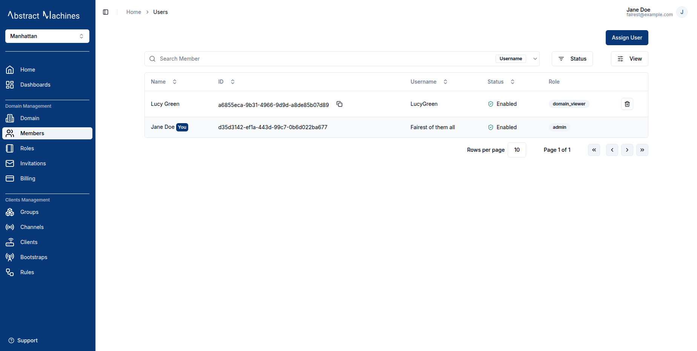

## Overview

Domain administrators can invite users to their domain with a specific role. Each role grants the invitee a predefined set of actions they can perform within the domain.  
The **Invitations** tab displays a list of all invitations sent by the user, including their **status**, **role**, and **timestamps** for confirmation or rejection.

The **Status** column shows the current state of each invitation:

| Status | Description |
| ------- | ------------ |
| **Pending** | Invitation sent, awaiting recipient's response. |
| **Accepted** | Invitation accepted — the user has joined the domain. |
| **Rejected** | Invitation declined by the recipient. |

## Send Invitation

To invite users to a domain, the administrator can click the **`Send Invitation`** button and select multiple users along with their assigned role.

Once sent, the recipients will be notified the next time they log in and can **accept** or **decline** the invitation.

## Accept or Decline an Invitation

After logging in, the recipient will see a pop-up notification on the **Domains** page displaying all pending invitations.  

The user has the option to **accept** or **decline** the invitation directly from this pop-up. A maximum of five invitations will be displayed at a time, refreshing each time an invitation is accepted or declined.  

If there are more than five pending invitations, the user can click `View All` to navigate to the **Invitations Table**, where all pending invitations are listed.  

Once the Invitation is accepted, the user will be able to log into the domain. Their details will be added to the **Members Table** within the domain, reflecting the assigned role.

## Resend and Delete Invitations

The **Invitations Table** also includes management options depending on the invitation’s status:

| **Action** | **Availability**                        | **Description**                                                                    |
|------------|-----------------------------------------|------------------------------------------------------------------------------------|
| **Resend** | Available for **Rejected** invitations | Allows the administrator to resend an invitation to users who previously declined. |
| **Delete** | Available only for **Pending** invitations | Removes a pending invitation that has not yet been accepted or rejected.           |

This ensures only relevant invitations remain editable, while accepted and rejected ones are preserved for tracking and auditing purposes.
