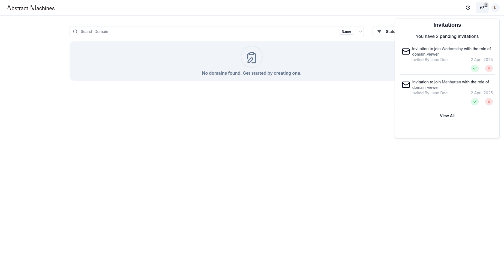
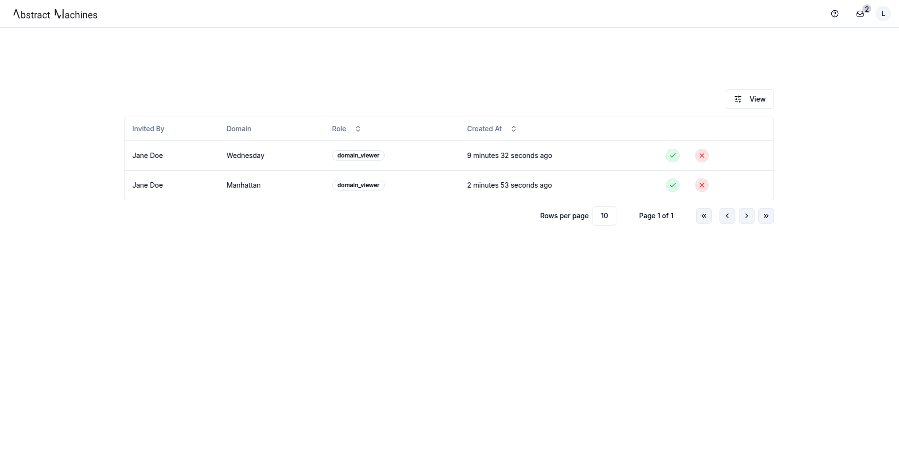

## Overview
Domain administrators can invite users to their domain with a specific role. Each role grants the invitee a predefined set of actions they can perform within the domain.  
The **Invitations** tab displays a list of invitations sent by the user to other users.

## Send Invitation
To invite users to a domain, the administrator can click the `Send Invitation` button and select multiple users along with their assigned role.

Once an invitation is sent, the recipient will receive a notification after logging in and can either accept or decline it.

## Accept or Decline an Invitation
After logging in, the recipient will see a pop-up notification on the **Domains** page displaying all pending invitations.  

The user has the option to **accept** or **decline** the invitation directly from this pop-up. A maximum of five invitations will be displayed at a time, refreshing each time an invitation is accepted or declined.  

If there are more than five pending invitations, the user can click `View All` to navigate to the **Invitations Table**, where all outstanding invitations are listed.  

Once the Invitation is accepted, the user will be able to log into the domain. Their details will be added to the **Members Table** within the domain, reflecting the assigned role. 

