Once a channel is created and client is connected to it, it can start to publish messages on the channel. The following section will provide an example of message publishing for each of the supported protocols. Magistrala currently supports secure versions of the MQTT, HTTP, WS and COAP protocols. To use TLS and DTLS for TCP and UDP requests respectively, we will require a Certificate Authority(CA) certificate. The CA certificate used to sign Magistrala server certificates and keys is provided by a well known and Trusted CA, [Let's Encrypt][let's encrypt]. To use this you can download the pem encoded[ca certificate][let's encrypt ca crt]. It is possible to use your default CA chain on your personal computer which will include Let's Encrypt's certificate. If using an embedded device you will be required to download the certificate.

## CLI tools

To send messages from your workstation you can use protocol specific CLI tools to send and receive messages from Magistrala. We provide examples for sending messages using the following CLI tools:

1. For HTTPS an example is provided using [curl][curl]
2. For MQTTS an example is provided using [mosquitto tools][mosquitto-tools]
3. For WSS an example is provided using [wscat][wscat]
4. For COAPS and example is provided using [coap-cli][coap-cli]

## Send message

To start sending messages:

1. Go to the **Channels** page

   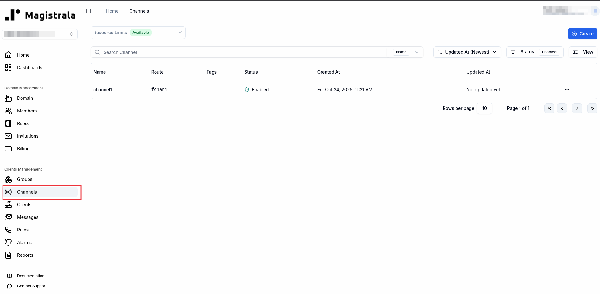

2. Click on the **channel** you would like to send messages to

   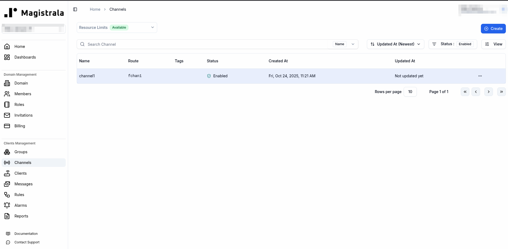

   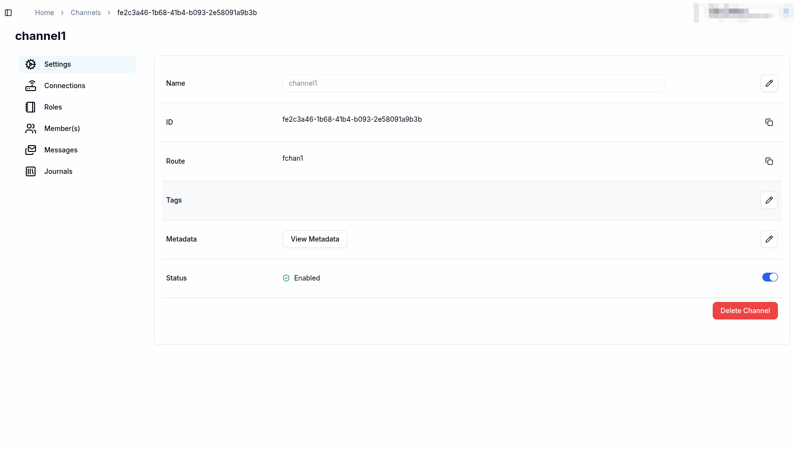

3. Click on the **messages** tab on the View channel page

   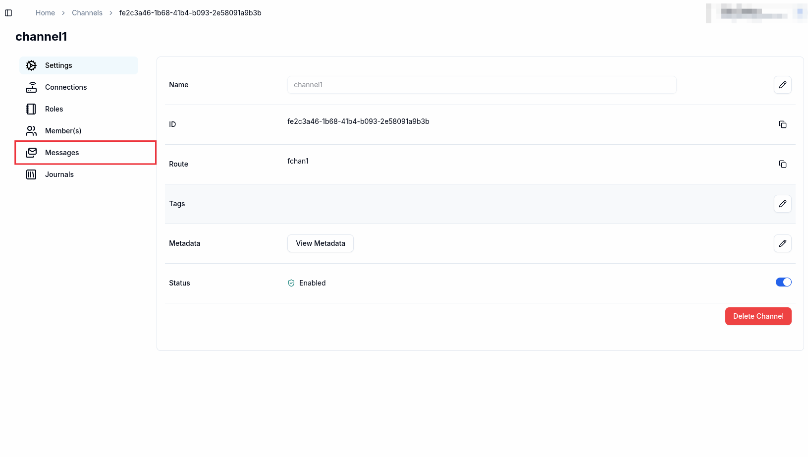

   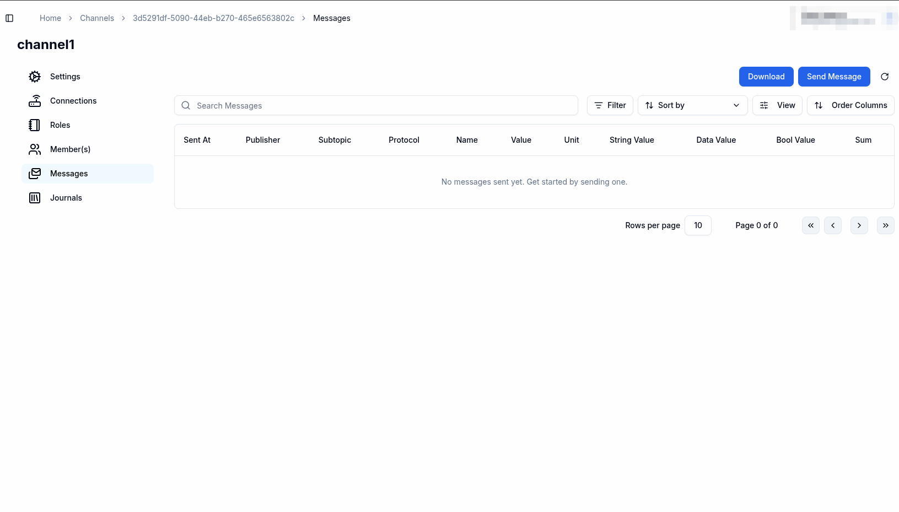

4. Click on the **Send message** button on the top right hand side of the page

   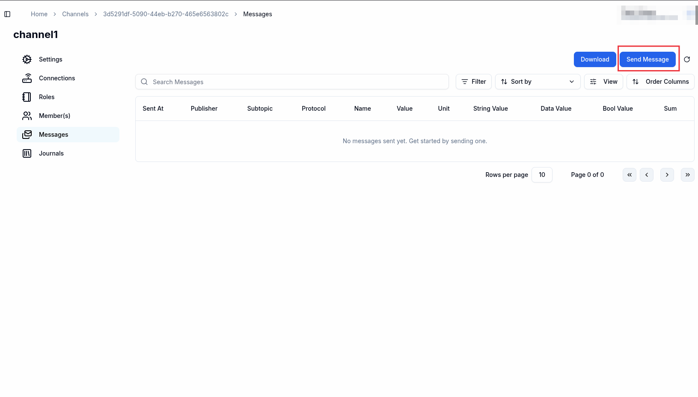

5. Fill in the details of your message:

   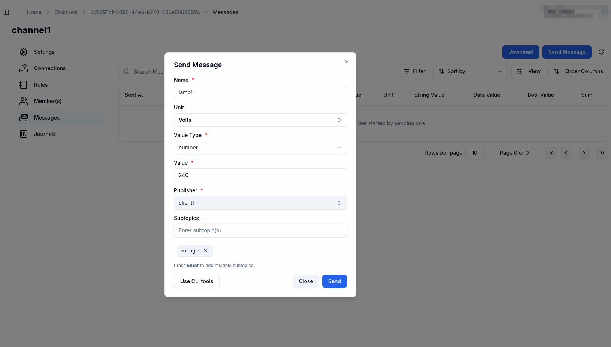

   At this point you can choose to click the **Send** button, this will send the message using the **HTTP** protocol and your **UserID** as the publisher of the message.
   If you wish to use the cli tools you can click on the **Use CLI Tools** button

6. Using CLI tools

   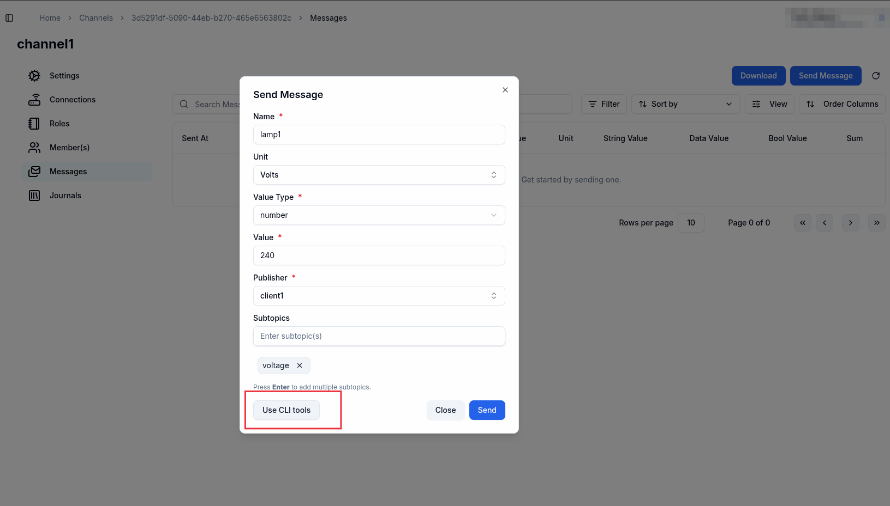

   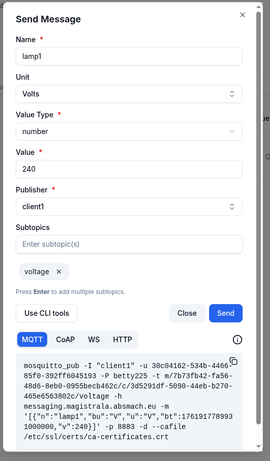

   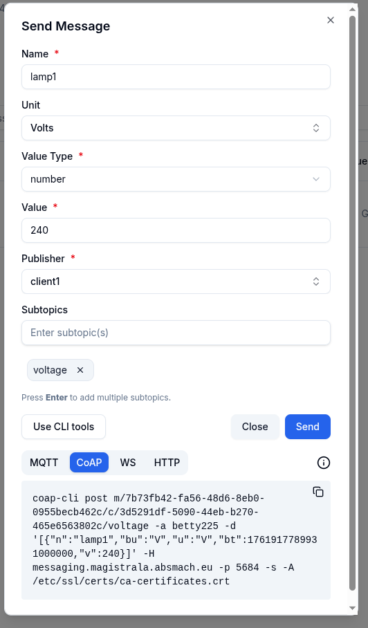

   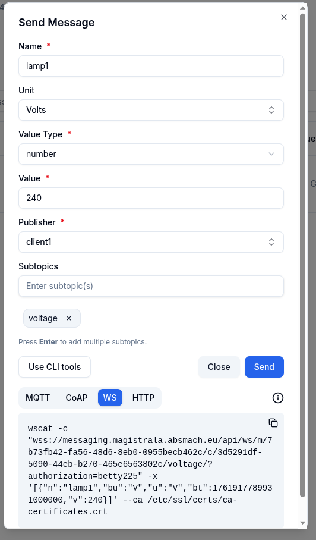

   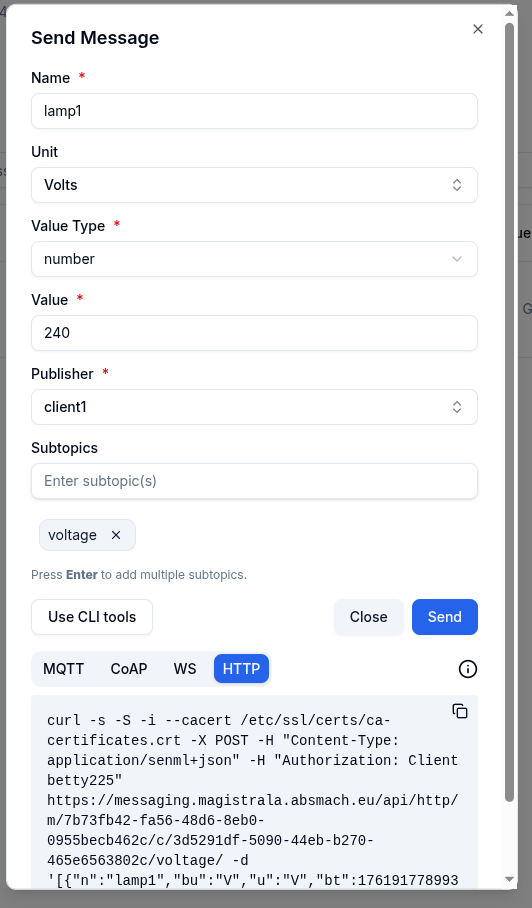

You can copy these commands to your terminal and execute them. The messages sent will be associated with the client using the desired protocol.

## HTTP

To publish message over channel with a client, the command should be in the format:

```bash
curl -s -S -i --cacert /etc/ssl/certs/ca-certificates.crt -X POST -H "Content-Type: application/senml+json" -H "Authorization: Client <client_secret>" https://messaging.magistrala.absmach.eu/http/m/<domain_id>/c/<channel_id> -d '[{"bn":"some-base-name:","bt":1.276020076001e+09, "bu":"A","bver":5, "n":"voltage","u":"V","v":120.1}, {"n":"current","t":-5,"v":1.2}, {"n":"current","t":-4,"v":1.3}]'
```

Note that if you're going to use SenML message format, you should always send messages as an array.

For more information about the HTTP messaging service API, please check out the [API documentation][http-api].

## MQTT

To send and receive messages over MQTT you could use [Mosquitto tools][mosquitto], or [Paho][paho] if you want to use MQTT over WebSocket.

To publish message over channel, client should call following command:

```bash
mosquitto_pub -I <client_name> -u <client_id> -P <client_secret> -t m/<domain_id>/c/<channel_id> -h messaging.magistrala.absmach.eu -m '[{"bn":"some-base-name:","bt":1.276020076001e+09, "bu":"A","bver":5, "n":"voltage","u":"V","v":120.1}, {"n":"current","t":-5,"v":1.2}, {"n":"current","t":-4,"v":1.3}]'
```

To subscribe to channel, client should call following command:

```bash
mosquitto_sub -I <client_name> -u <client_id> -P <client_secret> -t m/<domain_id>/c/<channel_id> -h messaging.magistrala.absmach.eu
```

If you want to use standard topic such as `m/<domain_id>/c/<channel_id>` with SenML content type (JSON or CBOR), you should use following topic `m/<domain_id>/c/<channel_id>`.

If you are using TLS to secure MQTT connection, add `--cafile docker/ssl/certs/ca.crt`
to every command.

## CoAP

CoAP adapter implements CoAP protocol with DTLS using underlying UDP and according to [RFC 7252][rfc7252]. To send and receive messages over CoAP, you can use [CoAP CLI][coap-cli]. To set the add-on, please follow the installation instructions provided at [CoAP CLI][coap-cli].

Examples:

To subscribe to a topic:

```bash
coap-cli get m/<domain_id>c/<channel_id>/subtopic -auth <client_secret> -o -h messaging.magistrala.absmach.eu -p 5684 -s
```

To send a message to a channel with a topic:

```bash
coap-cli post m/<domain_id>c/<channel_id>/subtopic -auth <client_secret> -d "hello world" -h messaging.magistrala.absmach.eu -p 5684 -s
```

To send a message, use `POST` request. To subscribe, send `GET` request with Observe option (flag `o`) set to false.

## WebSocket

To publish and receive messages over channel using web socket, you should first send handshake request to `/m/<domain_id>/c/<channel_id>` path. Don't forget to send `Authorization` header with client authorization token. In order to pass message content type to WS adapter you can use `Content-Type` header.

To connect and subscribe to a channel using WS the client shoudl use the command:

```bash
wscat -c "wss://messaging.magistrala.absmach.eu/api/ws/m/<domain_id>/c/<channel_id>/<subtopic>/?authorization=<client_secret"
```

To send a message to a channel with a topic, use:

```bash
wscat -c "wss://messaging.magistrala.absmach.eu/api/ws/m/<domain_id>/c/<channel_id>/<subtopic>/?authorization=<client_secret" -x '[{"n":"voltage","bu":"V","u":"V","bt":1761838262251000000,"v":350}]'
```

## MQTT-over-WS

Magistrala also supports [MQTT-over-WS][mqtt-over-websockets], along with pure WS protocol. this bring numerous benefits for IoT applications that are derived from the properties of MQTT - like QoS and PUB/SUB features.

There are 2 reccomended Javascript libraries for implementing browser support for Magistrala MQTT-over-WS connectivity:

1. [Eclipse Paho JavaScript Client][paho-js]
2. [MQTT.js][mqttjs]

As WS is an extension of HTTP protocol, Magistrala exposes it on port `8008`, so it's usage is practically transparent.
Additionally, please notice that since same port as for HTTP is used (`8008`), and extension URL `/mqtt` should be used -
i.e. connection URL should be `ws://<host_addr>/mqtt`.

For quick testing you can use [HiveMQ UI tool][websocket-client].

Here is an example of a browser application connecting to Magistrala server and sending and receiving messages over WebSocket using MQTT.js library:

```javascript
<script src="https://unpkg.com/mqtt/dist/mqtt.min.js"></script>
<script>
    // Initialize a mqtt variable globally
    console.log(mqtt)

    // connection option
    const options = {
        clean: true, // retain session
        connectTimeout: 4000, // Timeout period
        // Authentication information
        clientId: '14d6c682-fb5a-4d28-b670-ee565ab5866c',
        username: '14d6c682-fb5a-4d28-b670-ee565ab5866c',
        password: 'ec82f341-d4b5-4c77-ae05-34877a62428f',
    }

    var channelId = '08676a76-101d-439c-b62e-d4bb3b014337'
    var domainId = '6a45444c-4c89-46f9-a284-9e731674726a'
    var topic = 'm/' + domainId + '/c/' + channelId

    // Connect string, and specify the connection method by the protocol
    // ws Unencrypted WebSocket connection
    // wss Encrypted WebSocket connection
    const connectUrl = 'ws://messaging.magistrala.absmach.eu/mqtt'
    const client = mqtt.connect(connectUrl, options)

    client.on('reconnect', (error) => {
        console.log('reconnecting:', error)
    })

    client.on('error', (error) => {
        console.log('Connection failed:', error)
    })

    client.on('connect', function () {
        console.log('client connected:' + options.clientId)
        client.subscribe(topic, { qos: 0 })
        client.publish(topic, 'WS connection demo!', { qos: 0, retain: false })
    })

    client.on('message', function (topic, message, packet) {
        console.log('Received Message:= ' + message.toString() + '\nOn topic:= ' + topic)
    })

    client.on('close', function () {
        console.log(options.clientId + ' disconnected')
    })
</script>
```

**N.B.** Eclipse Paho lib adds sub-URL `/mqtt` automaticlly, so procedure for connecting to the server can be someclient like this:

```javascript
var loc = { hostname: "messaging.magistrala.absmach.eu", port: 8008 };
// Create a client instance
client = new Paho.MQTT.Client(loc.hostname, Number(loc.port), "clientId");
// Connect the client
client.connect({ onSuccess: onConnect });
```

## Subtopics

In order to use subtopics and give more meaning to your pub/sub channel, you can simply add any suffix to base `/m/<domain_id>/c/<channel_id>` topic.

Example subtopic publish/subscribe for bedroom temperature would be `m/<domain_id>/c/<channel_id>/bedroom/temperature`.

Subtopics are generic and multilevel. You can use almost any suffix with any depth.

Topics with subtopics are propagated to Message broker in the following format `channels.<channel_id>.<optional_subtopic>`.

Our example topic `m/<domain_id>/c/<channel_id>/bedroom/temperature` will be translated to appropriate Message Broker topic `channels.<channel_id>.bedroom.temperature`.

You can use multilevel subtopics, that have multiple parts. These parts are separated by `.` or `/` separators.
When you use combination of these two, have in mind that behind the scene, `/` separator will be replaced with `.`.
Every empty part of subtopic will be removed. What this means is that subtopic `a///b` is equivalent to `a/b`.
When you want to subscribe, you can use the default Message Broker, NATS, wildcards `*` and `>`. Every subtopic part can have `*` or `>` as it's value, but if there is any other character beside these wildcards, subtopic will be invalid. What this means is that subtopics such as `a.b*c.d` will be invalid, while `a.b.*.c.d` will be valid.

Authorization is done on channel level, so you only have to have access to channel in order to have access to
it's subtopics.

**Note:** When using MQTT, it's recommended that you use standard MQTT wildcards `+` and `#`.

[http-api]: https://docs.api.supermq.abstractmachines.fr/?urls.primaryName=api%2Fhttp.yaml
[mosquitto]: https://mosquitto.org
[paho]: https://www.eclipse.org/paho/
[rfc7252]: https://tools.ietf.org/html/rfc7252
[coap-cli]: https://github.com/absmach/coap-cli
[mqtt-over-websockets]: https://www.hivemq.com/blog/mqtt-essentials-special-mqtt-over-websockets/#:~:text=In%20MQTT%20over%20WebSockets%2C%20the,(WebSockets%20also%20leverage%20TCP).
[paho-js]: https://www.eclipse.org/paho/index.php?page=clients/js/index.php
[mqttjs]: https://github.com/mqttjs/MQTT.js
[websocket-client]: http://www.hivemq.com/demos/websocket-client/
[let's encrypt]: https://letsencrypt.org/
[let's encrypt ca crt]: https://letsencrypt.org/certs/gen-y/root-x2-by-x1.pem
[curl]: https://curl.se/
[mosquitto-tools]: https://mosquitto.org/download/
[wscat]: https://github.com/websockets/wscat
