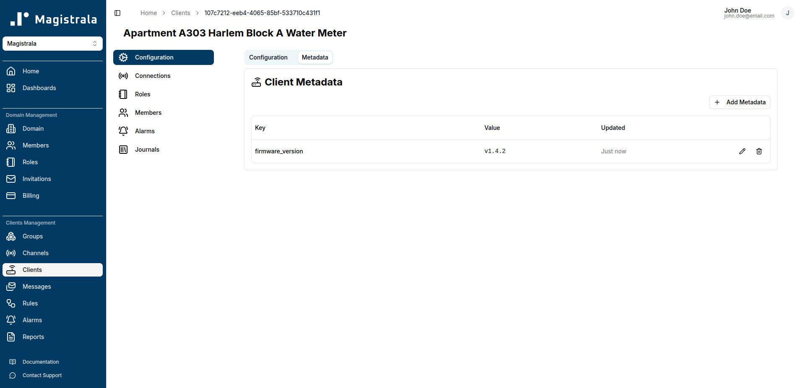
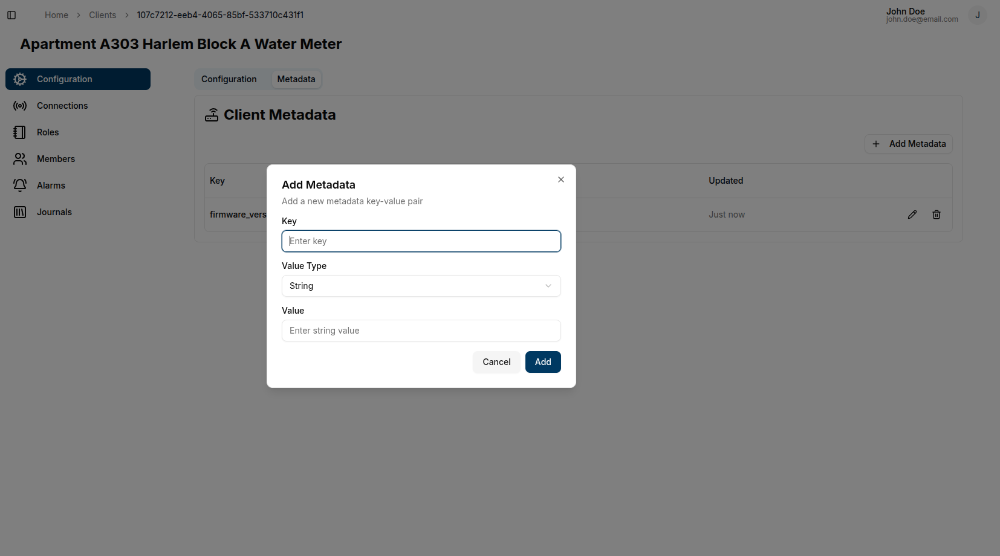
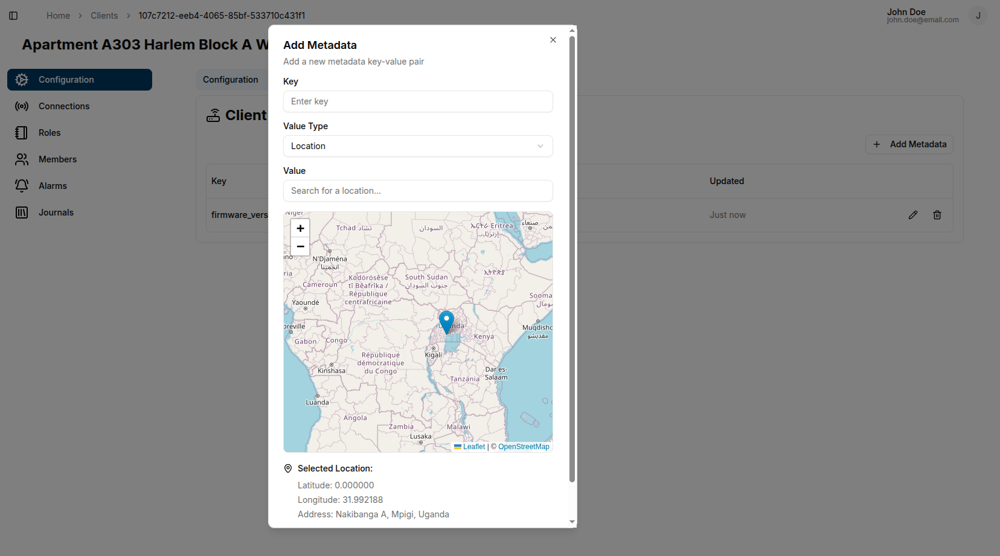
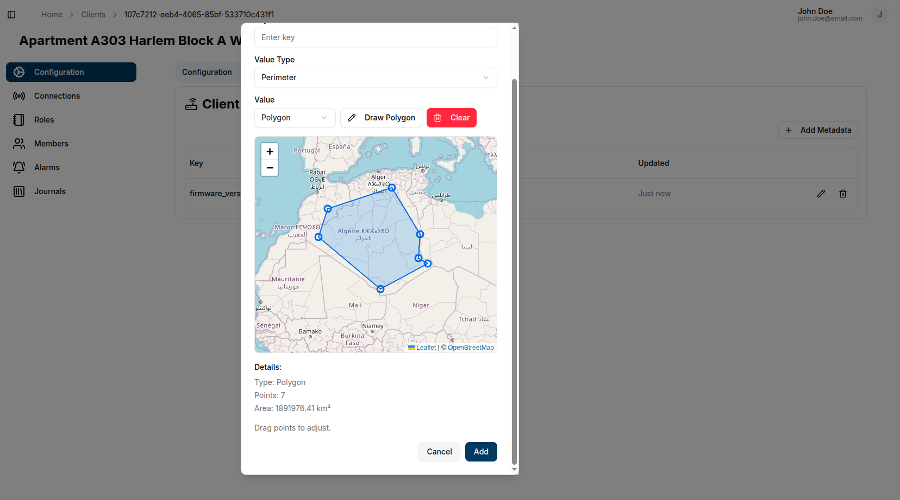
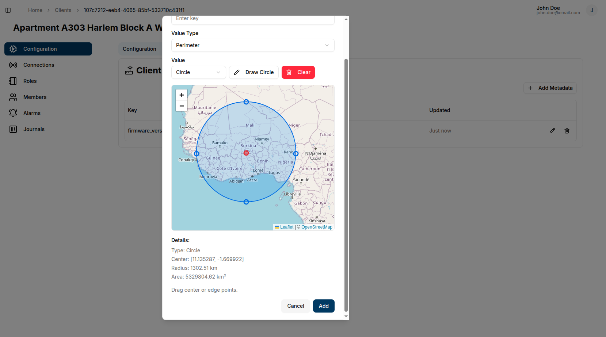
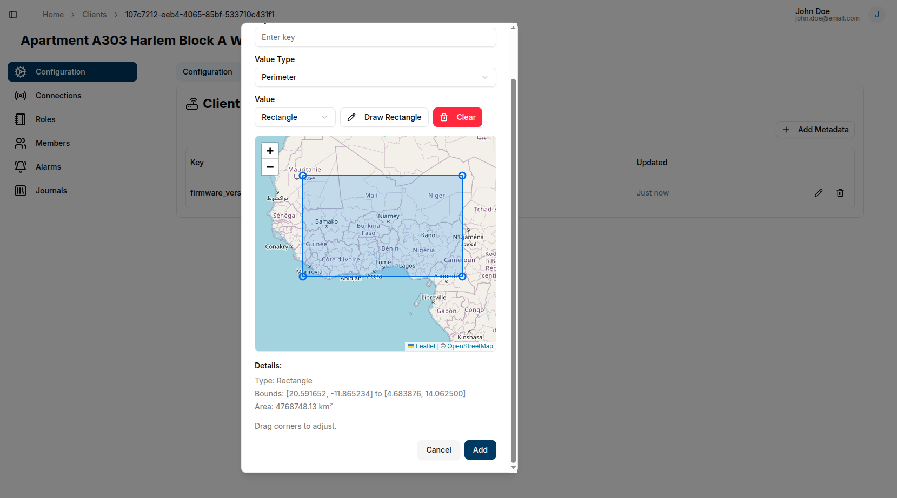

## Overview

Metadata provides additional context and information for entities (clients, channels, groups, and domains) in Magistrala. The metadata system supports various value types including text, numbers, booleans, JSON objects, locations, and perimeters.

## Managing Metadata

### Accessing Metadata

1. Navigate to any entity's view page
2. Click the **Metadata** tab
3. View existing metadata or add new entries

### Adding Metadata

1. Click **+ Add Metadata** button
2. Configure the metadata entry:
   - **Key**: Unique identifier for the metadata field
   - **Value Type**: Select the appropriate data type
   - **Value**: Enter or configure the value based on the selected type

## Value Types

### Text and Number

Standard input fields for text strings and numeric values.

### Boolean

Dropdown selector with True/False options.

### JSON

Code editor with syntax highlighting for JSON objects. Validates JSON structure automatically.

### Location

Interactive map interface for setting geographic coordinates.

#### Setting a Location

1. Select **Location** as the value type
2. Use one of these methods:
   - **Map Interaction**: Click and drag the marker to the desired location
   - **Search**: Type a location name in the search field and select from up to 5 recommendations

### Perimeter

Interactive map for defining geographic boundaries using polygons, circles, or rectangles.

#### Polygon Perimeter

1. Select **Perimeter** as the value type
2. Choose **Polygon** from the perimeter options
3. Click **Draw** to enable drawing mode
4. Place points by clicking on the map
5. Complete the polygon by:
   - Clicking **Complete** button, or
   - Clicking the first point (works best when zoomed in)

**Editing Polygons:**

- Drag points to adjust the shape
- Click **Clear** to delete and start over

#### Circle Perimeter

1. Select **Perimeter** as the value type
2. Choose **Circle** from the perimeter options
3. Click **Draw Circle**
4. Click to place the center point
5. Move the cursor away from center to set the radius

**Editing Circles:**

- Drag the center to move the circle
- Drag points on the circumference to adjust radius

#### Rectangle Perimeter

1. Select **Perimeter** as the value type
2. Choose **Rectangle** from the perimeter options
3. Click **Draw Rectangle**
4. Click to place the first corner
5. Click to place the opposite corner

**Editing Rectangles:**

- Drag any of the 4 corner points to resize

## Editing Metadata

1. Click the **pencil** icon next to any metadata entry
2. Modify the key, value type, or value as needed
3. Click **Save** to confirm changes or **Cancel** to discard

## Deleting Metadata

1. Click the **trash** icon next to the metadata entry
2. Confirm deletion in the dialog

## Best Practices

- Use descriptive keys that clearly identify the metadata purpose
- Choose appropriate value types to ensure data integrity
- For location data, verify coordinates are accurate before saving
- When creating perimeters, ensure adequate zoom level for precision
- Use JSON metadata for complex structured data that doesn't fit other types
