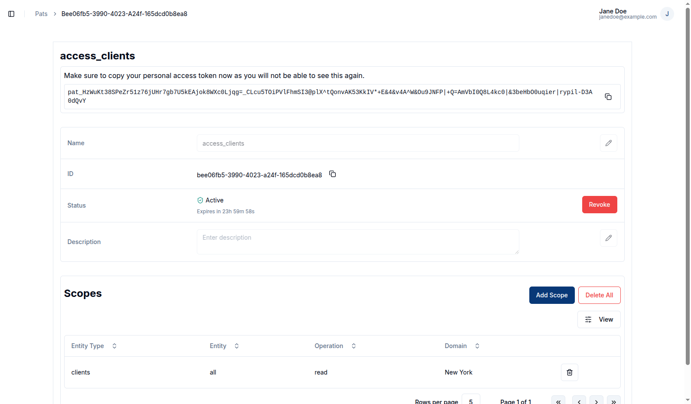
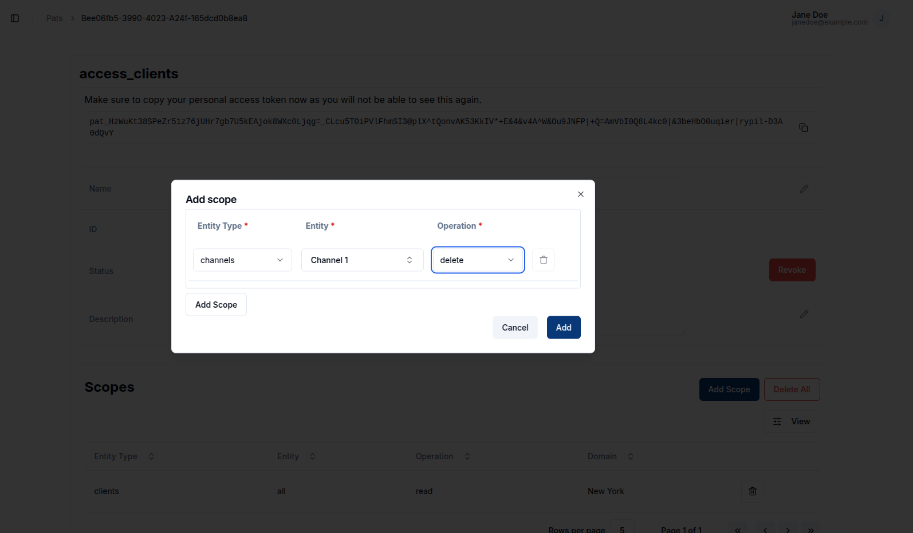
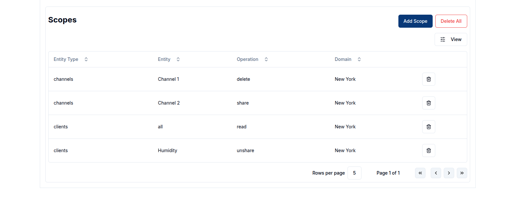
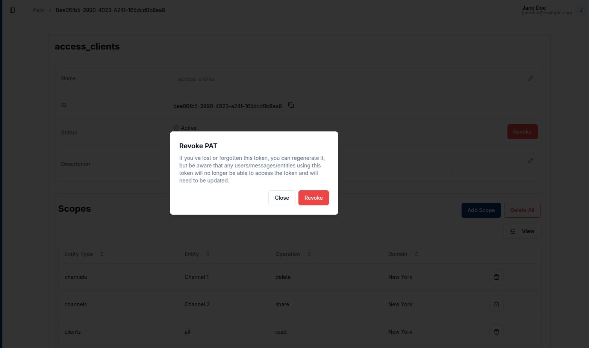
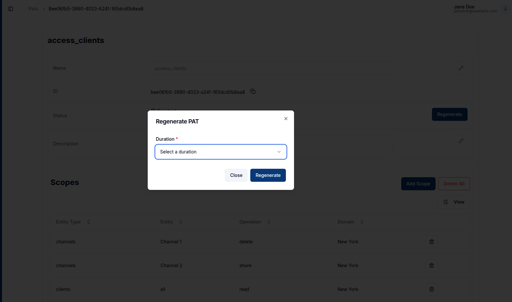
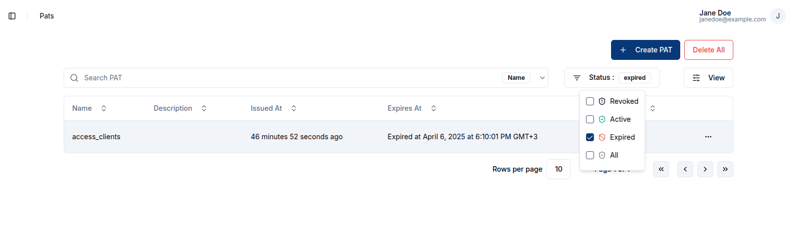
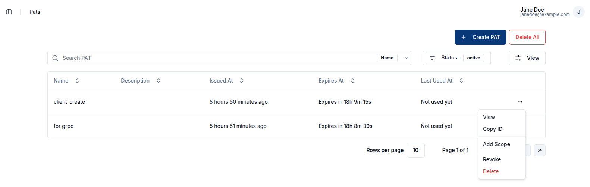

## Overview
Personal access tokens are an alternative to using bearer tokens to perform various operations on the entities.
To access personal access tokens (PATs) click on `Personal Access Token` tab on the `user profile picture` or `avatar` at the top right.

## Create a PAT
To create a PAT, click on the `+ Create PAT` button. 

This action redirects the user to the PAT creation page, where required details can be provided. The **name** should be a recognizable label for the token, and the **duration** sets the period for which the token will remain valid. Additionally, the user can enter an optional **description** and define **scopes**, which specify the operations the PAT is allowed to perform. Each PAT can be restricted to specific operations on particular entities, providing fine-grained access control.

The available operations include:
| Operation   | Description                          |
| ----------- | ------------------------------------ |
| `create`    | Create a new entity                  |
| `read`      | Read/view an entity                  |
| `list`      | List entities                        |
| `update`    | Update/modify an entity              |
| `delete`    | Delete an entity                     |
| `share`     | Share an entity with others          |
| `unshare`   | Remove sharing permissions           |
| `publish`   | Publish messages to a channel        |
| `subscribe` | Subscribe to messages from a channel |

## View a PAT
After a PAT is created, the user is redirected to the PAT detail page. Alternatively, the user can view an existing PAT by clicking on the row or the `View` button in the row actions.

Upon creation, the PAT secret is displayed **once**, allowing the user to copy it. This secret will not be shown again once the page is reloaded.

## Manage scopes
### Add a scope
To add a new scope to an existing PAT, the user can click the `Add Scope` button. This allows the user to define additional permissions for the token.

### Delete a scope
The user can delete a specific scope from a PAT by clicking the `trash` icon in the scopes table. 
To remove all scopes associated with a PAT, the user can click the `Delete All` button.

## Revoke a PAT
To revoke a PAT, click on the `Revoke` button  located in the status row of the PAT detail page.   
Once a PAT is revoked, it becomes inactive and can no longer be used to perform any of the scoped operations.

## Regenerate a PAT
After revocation, the user can regenerate the PAT by clicking the `Regenerate` button. A dialog will appear, allowing the user to select a new validity duration. This creates a new secret while preserving all other PAT details such as the name, description, and scopes.

Expired tokens can also be regenerated. To do this, the user should navigate to the PATs page and change the status filter to **Expired** to view all expired tokens. 

The user must then click on the expired PAT to view its details, and from there, click the `Regenerate` button. A dialog will appear, allowing the user to select a new duration. This process reactivates the PAT and generates a new secret, while maintaining the original configuration.

## Delete a PAT
The user can delete an individual PAT by clicking `Delete` in the row actions.  

To remove all PATs, the user can click the `Delete All` button located on the PATs table.
