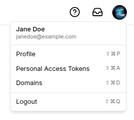
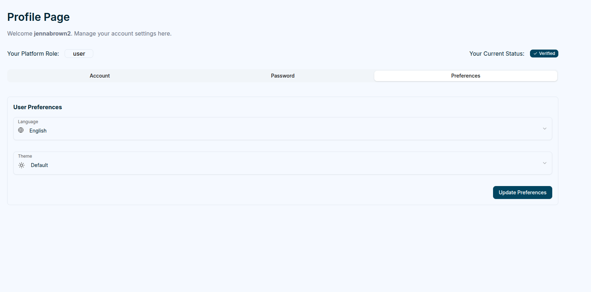

## User Profile

Each user has access to a **Profile Page**, where personal information, security settings, and preferences can be updated.

Clicking the `user profile picture` or `avatar` at the top right opens a popover.

## Standard User Menu

- **Profile**
- **Personal Access Tokens**
- **Domains**
- **Logout**

Selecting the Profile option reveals three main tabs:

### Account

The **Account** tab allows users to update their names, email and upload a profile picture.

### Password

The **Password** tab focuses on security. Users can change their password by entering their current password, followed by the new password (which **must** pass verification) and its confirmation.

### Preferences

The **Preferences** tab enables users to customize language and theme settings.

Magistrala currently supports **English**, **German**, and **Serbian** languages and offers four different themes to choose from.

## Password Recovery

Users who forget their password can click the `Forgot Password` link on the login page.

They’ll be prompted to enter their email address to receive a reset link.

The link includes a unique token and redirects the user to a **Reset Password** page, where they can create and confirm a new password. Once updated, they can log in with their new credentials.
