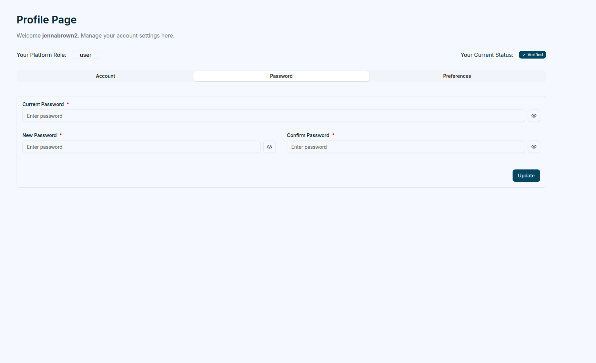
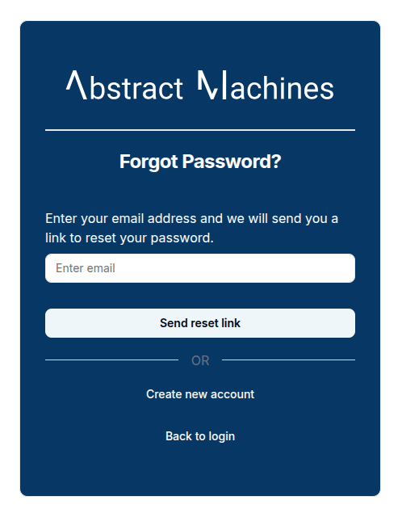

## User Profile

Each user has access to a **Profile Page**, where personal information, security settings, and preferences can be updated.

Clicking the `user profile picture` or `avatar` at the top right opens a popover.

## Standard User Menu

- **Profile**
- **Personal Access Tokens**
- **Domains**
- **Logout**

Selecting the Profile option reveals three main tabs:

### Account

The **Account** tab allows users to update their names, email and upload a profile picture.

### Password

The **Password** tab focuses on security. Users can change their password by entering their current password, followed by the new password (which **must** pass verification) and its confirmation.

### Preferences

The **Preferences** tab enables users to customize language and theme settings.

Magistrala currently supports **English**, **German**, and **Serbian** languages and offers four different themes to choose from.

## Password Recovery

Users who forget their password can initiate a password reset through the **Forgot Password** feature on the login page.

Clicking the **Forgot Password?** link redirects the user to a dedicated **Forgot Password** page, where they must enter their registered email address.

After submitting the request, Magistrala displays a success notification confirming that the reset link has been sent.

> **Password reset link sent successfully. Check your email.**

A password reset email is then delivered to the user’s inbox.  
The email includes a personalized greeting and a button that directs the user to the password reset page.

By clicking **Create a New Password**, the user is redirected to the **Reset Password** page, where they can create and confirm a new password.  
If the button does not work, the email also contains a fallback link that can be copied and pasted into a web browser.

> **Important:** The password reset link is valid for **24 hours** from the time of issue.

Once the password has been successfully updated, the user can return to the **Sign In** page and log in with the new credentials.
