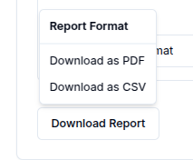

## Overview

The **Reports** service enables a user to generate, schedule and download data reports from the connected devices and sensors. 

## Create a report
To create a report, click on `Create Report` button at the top right of the reports page.

This action redirects the user to reports creation page where required details can be provided. There are two main sections **Configuration** and **Metrics**.

In the Configuration section, the user is required to input general settings for the report such as:

|Property |	Description	| Required |
|-----------------|------------------------------------------|----------|
|Name | 	Descriptive name for the report	| ✅ |
|Description | 	Provides more context about the report.	| Optional |
|Start Time | The start time of the report	| ✅ |
|End Time | The end time for the report	| Optional |
|Aggregation Method | 	The aggregation method e.g Maximum, Minimum e.t.c	| Optional |
|Aggregation Interval |  The aggregation interval for the message | Optional |

In the Metrics section, users can define specific filters they want to include in the report such as:

|Property |	Description	| Required |
|-----------------|------------------------------------------|----------|
|Name | 	The subtopic of the message| ✅ |
|Channel | 	The channel that subscribed to the message|  ✅ |
|Client | 	The client used to send the message the user is creating a report of	| Optional |
|Subtopic | The subtopic of the message, the user is creating a report of	|  Optional |
|Protocol | The protocol used to send the message can be HTTP, MQTT, WebSocket or COAP 	| Optional |

Users can click the `Add Metric` button to add multiple metrics to a single report.

### Generate an instant report
To generate an instant report, click on `Generate Instant Report` button and the report is generated.

### Schedule a report
To schedule a report, click on `Schedule Report` button and two sections (**Email Configuration** and **Schedule Configuration** )appear.

In Email Configuration, users can configure the email setting to determine how and where the generated report will be sent.
The fields to be filled include:
|Property |	Description	| Required |
|-----------------|------------------------------------------|----------|
|Recipient(s) Email | 	The recipient's email	| ✅ |
|Email Subject | The subject line of the email  |  ✅ |
|Report Format | The file format for the report (PDF or CSV).		| ✅ |

In Schedule Configuration, users can configure when the generated report should be sent.
The fields to be filled include:
|Property |	Description	| Required |
|-----------------|------------------------------------------|----------|
|Start Date  | 	The start date for the report	| ✅ |
|Time | The time of the report should be sent  |  ✅ |
|Recurring Interval | How often the report should repeat (e.g., daily, weekly). 	| ✅ |
|Recurring Interval | How many intervals to skip between executions (e.g., 1 = every interval, 2 = every second interval, etc.).	|  Optional |

### Download a report
To download a report, click the `Download Report` button and select either **Download as PDF** or **Download as CSV** to download the report in your preferred format.

## View a report.
After a report is created, the report is added to reports table. To view a report, the user can click on the row or `View` button in the row actions.

## Update a report
While on the View Report Page, the user can be able to update the details of the report, update the schedule as, add metric or recipient or download the report. 

## Delete a report
The user can delete an individual report by clicking `Delete` in the row actions.

